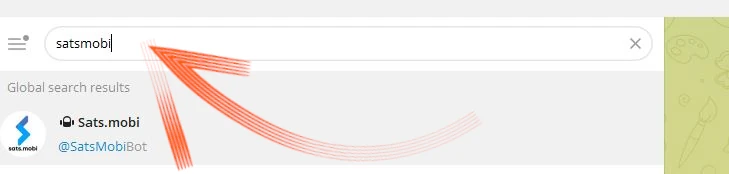

этот учебник написан_ [Кампус Bitcoin](https://linktr.ee/bitcoincampus_)

# Sats.Mobi

SatsMobi - это Wallet, работающий на Telegram, который обладает всеми функциями Wallet Lightning Network (custodial) и, кроме того, предлагает ряд очень забавных возможностей. Он произошел от Fork из LightningTipBot, ныне снятого с производства, и унаследовал все его функции, добавив более актуальные, что делает его более современным. В Sats.Mobi от LNTipBot также прослеживается философия открытого исходного кода. Wallet можно настроить и управлять самостоятельно, клонировав его из этого [репозитория](https://github.com/massmux/SatsMobiBot).

Если, с другой стороны, вы предпочитаете использовать его простым способом, просто начните чат в Telegram, и вы увидите, что это бот.

# Настройки

В строке поиска Telegram найдите "satsmobi", и появится ссылка на [бота] (@SatsMobiBot).

**Внимание**: Если вы не уверены в поиске через Telegram, получите безопасный доступ к боту по следующей [ссылке](https://t.me/SatsMobiBot)

Чтобы запустить его, достаточно нажать кнопку _START_

Чтобы изучить Wallet, вы можете выбрать _Меню_ в левом нижнем углу.

Теперь выберите _/help_ среди основных команд.

Sats.Mobi приветствует нас сообщением, в котором перечислены все основные возможности. При запуске бот также создал LN Address, привязанный к выбранному в Telegram хэндлу (который по умолчанию уникален). Видны команды для отправки и получения Sats с помощью этого Wallet, а также другие функции, которые мы рассмотрим позже. Интересно также сразу взглянуть на меню _/advanced_

Выяснилось, что Sats.Mobi также создал анонимного LN Address, которого можно использовать для получения приватности. Бот работает с командами: просто нажмите на соответствующее слово или наберите в строке сообщения слэш "/", а затем команду, которую вы хотите выполнить. Даже если Wallet только что создан, выберите, например, _/transactions_

Эта команда показывает список последних транзакций, в данном случае нулевых.

# Получение Sats

Команда для создания Invoice и получения Sats - _/invoice_. Причины Sats.Mobi исключительно в Satoshi, самой мелкой единице в Bitcon, поэтому для создания Invoice необходимо написать сумму в Sats в строке сообщений, а затем отправить ее в чат с ботом.

В следующем примере для получения было выбрано количество 210 Sats.

После нескольких минут ожидания, пока Invoice будет подготовлен, последний становится доступен в виде текста и QR-кода. После оплаты Invoice в Wallet отображается баланс. Если по какой-то причине сумма не актуальна, напишите _/баланс_ и нажмите клавишу `send`.

# Отправить Sats

Хотя саты - это бесценный актив, с которым не стоит расставаться, Sats.Mobi делает эту часть привлекательной, проведение коротких тестов (например, пары тестовых транзакций) не будет проблемой.

## Оплата Invoice

Самый простой способ заплатить Invoice - скопировать строку сообщения `lnbc1xxxxx` и вставить ее в строку сообщений после ввода команды _/pay_. **Правильный синтаксис** подразумевает оставление пробела после команды.

Wallet отправляет сообщение с запросом на подтверждение. При нажатии на кнопку _Оплатить_ Invoice получает оплату.

Sats.Mobi может положиться на эффективный и хорошо связанный узел Lightning, и его платежи редко терпят неудачу, потому что он всегда может найти правильную маршрутизацию.

## Удобная оплата с мобильного

Перейдя в Telegram, Sats.Mobi также доступен на мобильном. Наиболее удобной функцией для мобильных платежей является рамка QR-кода, но в Wallet этого нет, так как он не является отдельным приложением, а находится в социалке. Поэтому Sats.Mobi запрограммирован так, чтобы максимально упростить мобильный опыт: он действительно может декодировать изображение, например, фотографию QR-кода Invoice, который вы хотите оплатить.

Предположим, например, что мы хотим заплатить за Invoice 50 Sats.

Когда нам покажут это, мы сможем сфотографировать соответствующий QR-код.

Затем мы открываем Telegram на мобильном телефоне и в чате с Sats.Mobi прикрепляем только что сделанную фотографию к QR-коду

После выбора мы отправляем его боту:

Sats.Mobi расшифровывает фотографию и **представляет запрос на оплату** сразу же, с правильным описанием. Чат запрашивает подтверждение, чтобы продолжить, необходимо нажать _/pay_

Мы подождем несколько минут, чтобы платеж был обработан.

Invoice на 50 Sats был оплачен - результат, достигнутый без использования фотоаппарата и его встроенной функции сканирования.

## Sats.Mobi в Telegram-группах

Среди функций, которые сделали LNTipBot знаменитым и которые Sats.Mobi возвращает в Telegram, есть та, которая делает опыт участников в группе веселым и интерактивным.

Владельцы могут пригласить бота присоединиться к групповому чату, а затем назначить Sats.Mobi администратором. С этого момента начинается веселье, ведь участники могут начать награждать других пользователей за их вклад в работу группы.

- _/tip_ добавляет чаевые, отвечая на сообщение;
- _/send_ отправляет средства, указывая в качестве получателя хэндл LN Address или Telegram;
- _/faucet_ (в меню _/advanced_) позволяет создать набор подсказок, которые самые быстрые участники группы могут собирать, нажимая _/collect_;
- _/Типжар_ (в меню _/Дополнительно_) создает еще один тип рассылки, которую можно отправить пользователям в группе.

Каждая из этих команд имеет свой собственный синтаксис, который объясняется в главном меню команд.

Что делать, если мы не являемся владельцем группы? Нет проблем: просто попросите основателя пригласить Sats.Mobi, добавьте его/ее в качестве администратора, и все готово!

# Точка продажи (POS)

При первом запуске Sats.Mobi бот также создает для пользователя еще одну функцию: **касса**. "Устройство" активируется пользователем командой _/pos_ или нажатием на соответствующую кнопку из консоли в правом нижнем углу. По сути, POS - это веб-приложение, которое открывается как всплывающее окно в чате Telegram

На Interface в левом верхнем углу размещена личная ручка Telegram, а используется она так же, как и все кассовые аппараты: путем ввода суммы на клавиатуре. Теперь предположим, что мы хотим собрать 21 цент за услугу. Зная, что Sats.Mobi нативно работает только с сатами, нелегко произвести конвертацию в голове. Вместо этого POS отображает евро в качестве расчетной единицы, а эквивалент в Satoshi.

При нажатии на _/OK_ появляется Invoice, который можно показать клиенту с помощью QR-кода или отправить в виде строки через систему мгновенного обмена сообщениями, чтобы оплатить его

Разумеется, кассовый аппарат доступен и на мобильном телефоне, если вызвать его тем же способом, как показано выше.

Он также хорошо просматривается с дисплея мобильного телефона:

# Дополнительные возможности

Есть и другие функции, дополняющие предложение Wallet Sats.Mobi, которое, как мы видели, расширяет концепцию Wallet за пределы операций по приему и отправке платежей:

- _/nostr_: соединить Wallet с его пользователем Nostr для получения запов;
- _/cashback_: показывает код, который вы можете предъявить продавцу, чтобы получить cashback на расходы;
- _/buy_: запускает мастер внутри бота, который позволяет приобрести Sats за евро:
- _/activatecard_: запрос на активацию дебетовой карты NFC, которую можно пополнить через Wallet Sats.Mobi и для которой можно активировать уведомления;
- _/link_: создает ссылку для вашего собственного Wallet Zeus или Blue Wallet, которые вы можете использовать в качестве пультов дистанционного управления этим Wallet.

# Заключение

Sats.Mobi - это Wallet, которым приятно и весело пользоваться, возвращая опыт, полученный с LNTipBot, используя более продвинутые возможности LNBits. Однако важно помнить, что **это хранительский сервис**. Поэтому он должен использоваться для хранения очень небольшого количества сатов; это не Wallet principal для собственных средств Lightning Network. Кроме того, существует ограничение по вместимости в 500 000 сатов, которое не рекомендуется превышать.

Если вы ищите Wallet Lightning Network без содержания, то вам обязательно стоит обратить внимание на другие товары.

---
### Документация

- [Github](https://github.com/massmux/SatsMobiBot)
- Плейлист демонстрационных роликов [video](https://www.youtube.com/results?search_query=Sats.mobi)