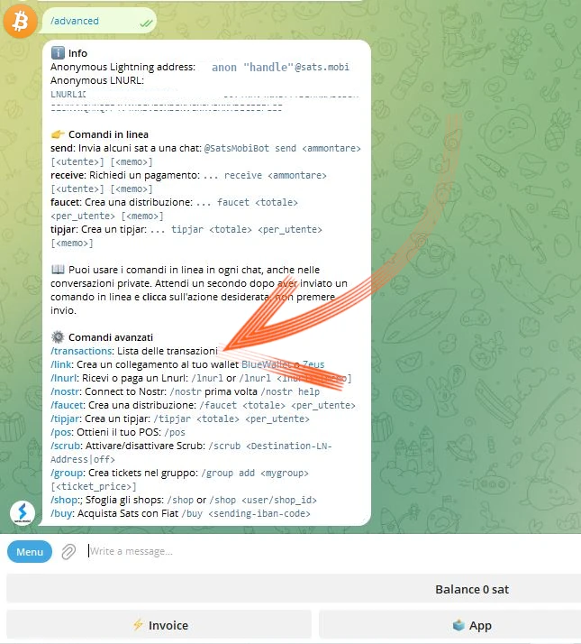
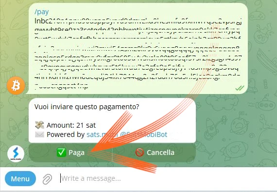

_Hướng dẫn này được viết bởi_ [Bitcoin Campus](https://linktr.ee/bitcoincampus_)

# Sats.Mobi

SatsMobi là Wallet chạy trên Telegram, có tất cả các chức năng của Wallet Lightning Network (bảo vệ) và cung cấp thêm một số tính năng rất thú vị. Nó bắt nguồn từ Fork của LightningTipBot, hiện đã ngừng hoạt động, kế thừa tất cả các tính năng của nó trong khi bổ sung thêm nhiều tính năng hiện tại, khiến nó trở nên hiện đại hơn. Trong số LNTipBot, Sats.Mobi cũng theo triết lý nguồn mở. Trên thực tế, Wallet có thể được cấu hình và quản lý riêng bằng cách sao chép nó từ [kho lưu trữ] này (https://github.com/massmux/SatsMobiBot).

Mặt khác, nếu bạn thích sử dụng theo cách đơn giản hơn, chỉ cần bắt đầu trò chuyện trên Telegram và bạn sẽ thấy đó là một bot.

# Cài đặt

Từ thanh tìm kiếm của Telegram, hãy tìm kiếm "satsmobi" và liên kết đến [bot](@SatsMobiBot) sẽ xuất hiện.

**Lưu ý**: Nếu bạn không chắc chắn về việc tìm kiếm qua Telegram, hãy truy cập bot một cách an toàn bằng [liên kết](https://t.me/SatsMobiBot) sau

Tất cả những gì bạn cần để bắt đầu là nhấn _START_

Để khám phá Wallet, bạn có thể chọn _Menu_ ở góc dưới bên trái.

Chọn _/help_ trong số các lệnh chính.

Sats.Mobi chào đón chúng ta bằng cách hiển thị một thông báo, liệt kê tất cả các tính năng chính. Khi khởi động, bot cũng đã tạo ra một LN Address, được liên kết với tên người dùng đã chọn trên Telegram (mặc định là duy nhất). Các lệnh để gửi và nhận Sats bằng Wallet này đều có thể nhìn thấy, cũng như các chức năng khác mà chúng ta sẽ thấy sau. Cũng rất thú vị khi xem ngay menu _/advanced_

Nó bật ra rằng Sats.Mobi cũng đã tạo ra một LN Address ẩn danh, có thể được sử dụng để giành quyền riêng tư. Bot hoạt động với các lệnh: chỉ cần nhấp vào từ tương ứng hoặc nhập dấu gạch chéo "/" vào thanh thông báo, theo sau là lệnh bạn muốn thực thi. Ngay cả khi Wallet vừa được tạo, hãy chọn, ví dụ, _/transactions_

Lệnh này hiển thị danh sách các giao dịch gần đây nhất, trong trường hợp cụ thể này là số không.

# Nhận Sats

Lệnh để tạo Invoice và nhận Sats là _/invoice_. Lý do Sats.Mobi chỉ sử dụng Satoshi, đơn vị nhỏ nhất trong Bitcon; do đó, để tạo Invoice, cần phải viết số tiền trong Sats vào thanh tin nhắn và sau đó gửi vào phần trò chuyện với bot.

Trong ví dụ sau, số tiền được chọn để nhận là 210 Sats.

Sau một vài phút chờ Invoice được chuẩn bị, mã sau có sẵn dưới dạng văn bản và mã QR. Khi thanh toán Invoice, Wallet sẽ hiển thị số dư. Nếu vì lý do nào đó mà tổng số tiền đã hết hạn, hãy viết _/balance_ và nhấn phím `send`.

# Gửi Sats

Mặc dù Satss là tài sản vô giá mà chúng ta không nên chia tay một cách hời hợt, Sats.Mobi khiến phần này trở nên hấp dẫn, thực hiện một số thử nghiệm ngắn (tức là một vài giao dịch thử nghiệm) sẽ không thành vấn đề.

## Thanh toán Invoice

Cách dễ nhất để thanh toán Invoice là sao chép chuỗi tin nhắn `lnbc1xxxxx` và dán vào thanh tin nhắn sau khi nhập lệnh _/pay_. **Cú pháp đúng** bao gồm việc để lại một khoảng trắng sau lệnh.

Wallet gửi tin nhắn yêu cầu xác nhận. Bằng cách nhấp vào _Pay_, Invoice sẽ được thanh toán.

Sats.Mobi có thể dựa vào một nút Lightning hiệu quả và được kết nối tốt, hiếm khi thanh toán thất bại vì nó luôn có thể tìm ra tuyến đường chính xác.

## Thanh toán thuận tiện từ điện thoại di động

Quay lại Telegram, Sats.Mobi cũng có sẵn trên thiết bị di động. Chức năng thuận tiện nhất cho thanh toán di động là tạo mã QR, nhưng Wallet này không có chức năng này theo thiết kế, vì nó không phải là ứng dụng độc lập mà được chứa trong mạng xã hội. Do đó, Sats.Mobi được lập trình để giúp trải nghiệm trên thiết bị di động trở nên dễ dàng nhất có thể: trên thực tế, nó có thể giải mã hình ảnh, chẳng hạn như ảnh chụp mã QR của Invoice mà bạn muốn thanh toán.

Ví dụ, giả sử chúng ta muốn trả Invoice là 50 Sats.

Khi được hiển thị, chúng tôi có thể chụp ảnh mã QR có liên quan.

Sau đó, chúng tôi mở Telegram trên điện thoại di động và trong cuộc trò chuyện với Sats.Mobi, đính kèm ảnh chúng tôi vừa chụp vào mã QR

Sau khi được chọn, chúng tôi sẽ gửi nó tới bot:

Sats.Mobi giải mã ảnh và **trình bày yêu cầu thanh toán** ngay lập tức, với mô tả chính xác. Trò chuyện yêu cầu xác nhận, để tiếp tục, bạn phải nhấn _/pay_

Chúng tôi chờ vài phút để xử lý thanh toán.

Invoice x 50 Sats đã được trả tiền, một kết quả đạt được mà không cần sử dụng máy ảnh và chức năng quét tích hợp của nó.

## Sats.Mobi trong Nhóm Telegram

Trong số những tính năng làm nên sự nổi tiếng của LNTipBot và được Sats.Mobi mang trở lại Telegram, có một tính năng giúp các thành viên trong nhóm có trải nghiệm thú vị và tương tác hơn.

Chủ sở hữu có thể mời bot tham gia trò chuyện nhóm và sau đó chỉ định Sats.Mobi làm quản trị viên. Từ đó, trò vui bắt đầu, vì các thành viên có thể bắt đầu thưởng cho những người dùng khác vì những đóng góp của họ trong nhóm.

- _/tip_ thêm mẹo bằng cách trả lời tin nhắn;
- _/send_ gửi tiền bằng cách chỉ định LN Address hoặc Telegram làm người nhận;
- _/faucet_ (trong menu _/advanced_) cho phép bạn tạo một bộ mẹo mà các thành viên nhóm nhanh nhất có thể thu thập bằng cách nhấp vào _/collect_;
- _/tipjar_ (trong menu _/advanced_) tạo ra một loại phân phối khác có thể được gửi tới người dùng trong nhóm.

Mỗi lệnh này đều có cú pháp riêng, được giải thích trong menu lệnh chính.

Nếu chúng ta không phải là chủ sở hữu của một nhóm thì sao? Không vấn đề gì: chỉ cần yêu cầu người sáng lập mời Sats.Mobi, thêm người đó làm quản trị viên của nhóm đó và thế là xong!

# Điểm bán hàng (POS)

Khi khởi động Sats.Mobi lần đầu tiên, bot cũng tạo một tính năng khác cho người dùng: **POS**. "Thiết bị" được người dùng kích hoạt bằng lệnh _/pos_ hoặc bằng cách nhấp vào nút có liên quan từ bảng điều khiển ở góc dưới bên phải. Trên thực tế, POS là một ứng dụng web, mở dưới dạng cửa sổ bật lên trên trò chuyện Telegram

Interface mang tên người dùng cá nhân của Telegram ở góc trên bên trái và được sử dụng đơn giản như cách người ta sử dụng tất cả POS: bằng cách nhập số tiền trên bàn phím. Bây giờ giả sử chúng ta muốn thu 21 xu cho một dịch vụ. Biết rằng Sats.Mobi chỉ xử lý Satss, không dễ để thực hiện phép chuyển đổi trong đầu. Thay vào đó, POS hiển thị euro là đơn vị tính toán trong khi hiển thị giá trị tương đương trong Satoshi.

Nhấp vào _/OK_ sẽ hiển thị Invoice có thể hiển thị cho khách hàng thông qua mã QR hoặc có thể được gửi dưới dạng chuỗi qua tin nhắn tức thời để có thể thanh toán.

Tất nhiên, POS cũng có sẵn trên điện thoại di động bằng cách gọi điện theo cách tương tự như hướng dẫn ở trên.

Nó cũng hiển thị tốt trên màn hình điện thoại di động:

# Các tính năng bổ sung

Có những tính năng khác bổ sung cho dịch vụ Wallet Sats.Mobi, như chúng ta đã thấy, mở rộng khái niệm Wallet vượt ra ngoài các hoạt động nhận và gửi thanh toán:

- _/nostr_: kết nối Wallet với người dùng Nostr để nhận zap;
- _/cashback_: hiển thị mã mà bạn có thể hiển thị cho người bán để được hoàn tiền cho một khoản chi phí;
- _/buy_: khởi chạy trình hướng dẫn trong bot, cho phép bạn mua Sats bằng euro:
- _/activatecard_: để yêu cầu kích hoạt thẻ ghi nợ NFC, có thể nạp tiền thông qua Wallet Sats.Mobi và có thể kích hoạt thông báo;
- _/link_: tạo liên kết đến Wallet Zeus hoặc Blue Wallet của bạn, mà bạn có thể sử dụng làm điều khiển từ xa cho Wallet này.

# Phần kết luận

Sats.Mobi là Wallet dễ sử dụng và thú vị, đưa trở lại những trải nghiệm đã có với LNTipBot bằng cách sử dụng các tính năng tiên tiến hơn của LNBits. Tuy nhiên, điều quan trọng cần nhớ là **đây là dịch vụ lưu ký**. Do đó, nó được sử dụng để lưu ký rất ít Satss; nó không phải là chủ sở hữu Wallet cho các quỹ Lightning Network của chính nó. Ngoài ra còn có giới hạn dung lượng cố hữu là 500.000 Satss, một giới hạn không được khuyến nghị vượt quá.

Nếu bạn đang tìm kiếm Wallet Lightning Network không lưu ký, bạn chắc chắn nên xem xét các sản phẩm khác.

---
### Tài liệu

- [Github](https://github.com/massmux/SatsMobiBot)
- Danh sách phát các bản demo [video](https://www.youtube.com/results?search_query=Sats.mobi)