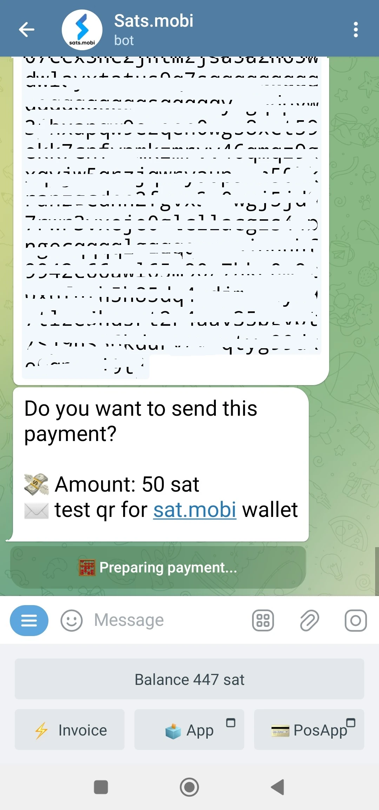
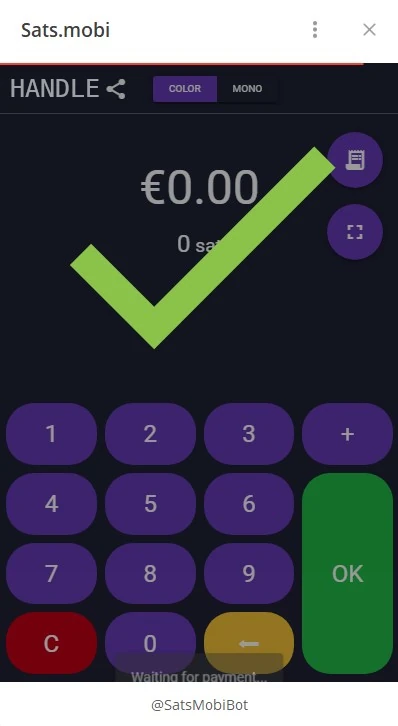

_本教程由_ [Bitcoin 校园](https://linktr.ee/bitcoincampus_) 编写

# Sats.Mobi

SatsMobi 是在 Telegram 上运行的 Wallet，它具有 Wallet Lightning Network（托管）的所有功能，此外还提供许多非常有趣的功能。它源于 LightningTipBot 的 Fork（现已停产），继承了其所有功能，同时添加了更多最新功能，使其更加现代化。在 LNTipBot 中，Sats.Mobi 也秉承了开源理念。事实上，Wallet 可以通过从这个 [资源库](https://github.com/massmux/SatsMobiBot)中克隆来自行配置和管理。

另一方面，如果你想简单地使用它，只需在 Telegram 上开始聊天，你就会发现它是一个机器人。

# 设置

在 Telegram 搜索栏中搜索 "satsmobi"，就会出现 [机器人]（@SatsMobiBot）的链接。

**注意**：如果您不确定是否可以通过 Telegram 进行搜索，请使用以下 [链接](https://t.me/SatsMobiBot) 安全访问机器人

要启动它，只需按_START_键。

要探索 Wallet，可以选择左下角的 _Menu_（菜单）。

现在选择主要命令中的 _/help_。

Sats.Mobi 通过显示一条信息欢迎我们，并列出了所有主要功能。启动时，机器人还创建了一个 LN Address，与 Telegram 上选择的句柄相连（默认情况下是唯一的）。通过这个 Wallet 发送和接收 Sats 的命令以及其他功能都可以看到，我们稍后会看到。马上看看_/高级_菜单也很有趣

Sats.Mobi 还创建了一个匿名的 LN Address，可用于获取隐私。该机器人使用命令工作：只需点击相应的单词，或在信息栏中输入斜线"/"，然后输入您希望执行的命令。即使 Wallet 刚刚创建，也可以选择_/transactions_等命令。

该命令显示最近的交易列表，此处为零。

# 接收 Sats

创建 Invoice 和接收 Sats 的命令是 _/invoice_。Sats.Mobi的原因完全在Satoshi中，这是Bitcon中最小的单位；因此，为了创建Invoice，有必要在消息栏中用Sats写入金额，然后在与机器人的聊天中发送。

在下面的例子中，选择接收 210 Sats 的金额。

等待片刻后，Invoice 将以文本和 QR 码的形式显示。支付 Invoice 后，Wallet 将显示余额。如果由于某种原因总金额过时了，请写入 _/余额_，然后按 "发送 "键。

# 发送 Sats

尽管 Sats 是一笔宝贵的财富，但我们不应浅尝辄止，Sats.Mobi 使这一部分变得非常吸引人，执行一些简短的测试（即几个测试交易）不成问题。

## 支付 Invoice

支付 Invoice 的最简单方法是复制信息字符串 `lnbc1xxxxx` 并在输入 _/pay_ 命令后将其粘贴到信息栏中。 **正确的语法**是在命令后留一个空格。

Wallet 发送信息要求确认。点击 _Pay_ 后，Invoice 即可付款。

Sats.Mobi 可以依靠高效、连接良好的 Lightning 节点，很少出现支付失败，因为它总能找到正确的路由。

## 通过手机轻松支付

说到 Telegram，Sats.Mobi 也可以在手机上使用。移动支付最方便的功能是框选二维码，但 Wallet 在设计上缺少这一功能，因为它不是一个独立的应用程序，而是包含在一个社交软件中。因此，Sats.Mobi 的程序设计尽可能简化了移动体验：事实上，它可以解码图像，例如您要支付的 Invoice 的二维码照片。

例如，假设我们要支付 50 Sats 的 Invoice。

当我们看到这些信息时，就可以拍摄相关 QR 码的照片。

然后，我们打开手机上的 Telegram，在与 Sats.Mobi 的聊天中，将刚才拍摄的照片附加到二维码上

选定后，我们将其发送给机器人：

Sats.Mobi 会立即解码照片并**显示付款请求**和正确的描述。聊天会要求确认，您必须按_/pay_键才能继续。

我们会等待片刻，以便处理付款。

Invoice 乘以 50 Sats，这一结果是在没有使用照相机及其内置扫描功能的情况下取得的。

## Sats.Mobi in Telegram 群组

让 LNTipBot 声名鹊起的功能中，有一项是 Sats.Mobi 为 Telegram 带来的，那就是让群组成员体验到乐趣和互动。

群主可以邀请机器人加入群聊，然后任命 Sats.Mobi 为管理员。从那时起，乐趣就开始了，因为成员可以开始奖励其他用户在群组中的贡献。

- _/tip_ 通过回复消息添加小费；
- _/send_ 通过指定 LN Address 或 Telegram 句柄作为收件人来发送资金；
- 通过 _/fucet_（在 _/Advanced_（高级）菜单中），您可以创建一组提示，最快的小组成员可以通过点击 _/collect_（收集）来收集这些提示；
- _/tipjar_（在 _/Advanced_（高级）菜单中）创建了另一种可发送给组内用户的分发类型。

每个命令都有自己的语法，在主命令菜单中都有解释。

如果我们不是群组的所有者怎么办？没问题：只需要求创始人邀请 Sats.Mobi，并将他/她添加为该群组的管理员即可！

# 销售点 (POS)

首次启动 Sats.Mobi 时，机器人还会为用户创建另一项功能： **POS**。用户可通过_/pos_命令或点击右下角控制台的相关按钮激活 "设备"。事实上，POS 是一个网络应用程序，会在 Telegram 聊天工具上以弹出式窗口打开

Interface 的左上角带有 Telegram 的个人手柄，使用方法与使用所有 POS 一样简单：在键盘上键入金额。现在假设我们要收取 21 美分的服务费。由于 Sats.Mobi 本机只能处理萨特，因此在头脑中进行转换并不容易。相反，POS 会显示欧元作为记账单位，同时显示 Satoshi.Mobi 中的等值单位。

点击 _/OK_ 会弹出 Invoice，可通过二维码向客户展示，或通过即时消息以字符串形式发送，以便付款

当然，也可以通过手机调用 POS 机，方法如上。

从手机显示屏上也能很好地看到它：

# 附加功能

Wallet Sats.Mobi 还具有其他补充功能，正如我们所看到的那样，这些功能将 Wallet 的概念扩展到了接收和发送付款操作之外：

- _/nostr_：将 Wallet 连接到用户 Nostr，以接收斩击；
- _/cashback_：显示一个代码，您可以向商家出示该代码，以获得费用返现；
- _/buy_：在机器人中启动一个向导，可以用欧元购买 Sats：
- _/activatecard_：请求激活 NFC 借记卡，该卡可通过 Wallet Sats.Mobi 重新充值，并可激活通知；
- _/link_：为您自己的 Wallet Zeus 或 Blue Wallet 创建链接，您可以将它们用作此 Wallet 的遥控器。

# 结论

Sats.Mobi 是一款使用起来愉快而有趣的 Wallet，它利用 LNBits 的更高级功能，将 LNTipBot 的使用体验重新带回了人们的生活中。不过，重要的是要记住，**它是一种托管服务**。因此，它只能用于托管极少数的 Sats，而不是用于托管自己的 Lightning Network 基金的 Wallet 本金。此外，它的固有容量限制为 500 000 个 Satss，建议不要超过这个限额。

如果您正在寻找 Wallet Lightning Network 非监护型产品，那么您肯定应该寻找其他产品。

---
### 文件

- [Github](https://github.com/massmux/SatsMobiBot)
- 视频](https://www.youtube.com/results?search_query=Sats.mobi) 演示播放列表