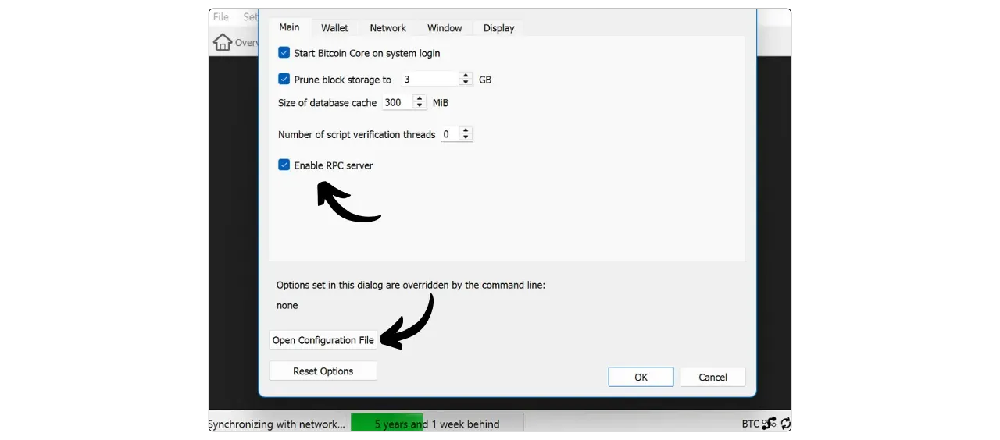

Sparrow Wallet ist eine von Craig Raw entwickelte Bitcoin-Portfolioverwaltungssoftware zur Selbstverwahrung. Diese Open-Source-Software wird von Bitcoinern für ihre vielen Funktionen und intuitive Interface geschätzt.

Es gibt zwei Möglichkeiten, Sparrow zu verwenden:


- Wie ein Hot Wallet, bei dem Ihre privaten Schlüssel auf Ihrem PC gespeichert sind.
- Als Cold-Wallet-Manager, bei dem die privaten Schlüssel auf einem Hardware Wallet gespeichert sind. In diesem Modus manipuliert Sparrow nur öffentliche Wallet-Informationen, verfolgt Gelder, generiert Adressen und baut Transaktionen auf, aber die Hardware Wallet-Signatur ist erforderlich, um diese Transaktionen gültig zu machen. Es kann daher Anwendungen wie Ledger Live oder Trezor Suite ersetzen.

Sparrow unterstützt Geldbörsen mit einer und mehreren Unterschriften und ermöglicht eine flüssige Verwaltung mehrerer Geldbörsen. Sie können zum Beispiel gleichzeitig einen Wallet steuern, der mit einem Ledger verbunden ist, einen anderen mit einem Trezor, und auch einen Hot Wallet.

Die Software bietet auch fortschrittliche Münzkontrollfunktionen, mit denen Sie genau auswählen können, welche UTXOs in Ihren Transaktionen verwendet werden sollen, um Ihre Vertraulichkeit zu optimieren.

Was die Verbindung angeht, so können Sie mit Sparrow eine Verbindung zu Ihrem eigenen Bitcoin-Knoten herstellen, entweder aus der Ferne über einen Electrum-Server oder mit Bitcoin Core. Es ist auch möglich, einen öffentlichen Knoten zu verwenden, wenn Sie noch nicht Ihre eigene haben. Fernverbindungen werden über Tor hergestellt.

## Sperling Wallet einbauen

Rufen Sie [die offizielle Sparrow Wallet-Downloadseite] (https://sparrowwallet.com/download/) auf und wählen Sie die Softwareversion aus, die Ihrem Betriebssystem entspricht.


Es ist wichtig, die Integrität und Authentizität der Software zu überprüfen, bevor Sie sie installieren. Wenn Sie nicht wissen, wie man das macht, finden Sie hier eine vollständige Anleitung:

https://planb.network/tutorials/computer-security/data/integrity-authenticity-21d0420a-be02-4663-94a3-8d487f23becc
Sobald Sparrow installiert ist, können Sie die anfänglichen Erklärungsbildschirme überspringen und direkt zum Bildschirm für die Verbindungsverwaltung gehen.


## Verbindung mit dem Bitcoin-Netzwerk

Um mit dem Bitcoin-Netzwerk zu interagieren und Ihre Transaktionen zu übertragen, muss Sparrow mit einem Bitcoin-Knoten verbunden sein. Es gibt drei Hauptmöglichkeiten, diese Verbindung herzustellen:


- 🟡 Verwendung eines öffentlichen Knotens, d. h. Verbindung mit einem Knoten eines Drittanbieters, der solche Verbindungen zulässt. Wenn Sie keinen eigenen Bitcoin-Knoten haben, können Sie mit dieser Option schnell mit Sparrow beginnen. Allerdings sieht der Knoten, mit dem Sie sich verbinden, alle Ihre Transaktionen, was Ihre Vertraulichkeit gefährden könnte. Die Kontrolle über Ihre Schlüssel ist wichtig, aber ein eigener Knoten ist noch besser. Verwenden Sie diese Option also nur, wenn Sie gerade erst anfangen, und seien Sie sich der Risiken für Ihre Privatsphäre bewusst.
- 🟢 Verbindung mit einem Bitcoin Core-Knoten. Wenn Sie einen eigenen Bitcoin Core-Knoten haben, können Sie ihn mit Sparrow Wallet verbinden, entweder lokal, wenn Bitcoin Core auf demselben Computer installiert ist, oder per Fernzugriff.
- 🔵 Verbindung über einen Electrum-Server. Wenn Ihr Bitcoin-Knoten mit Electrs ausgestattet ist, wie es bei Node-in-a-Box-Lösungen wie Umbrel oder Start9 der Fall ist, können Sie sich von Sparrow aus mit ihm verbinden.

**Es ist vorzuziehen, eine Verbindung über Electrs oder Bitcoin Core auf Ihrem eigenen Knoten zu verwenden, um die Notwendigkeit, einem Dritten zu vertrauen, zu verringern und Ihre Vertraulichkeit zu optimieren**

### Verbindung zu einem öffentlichen Knoten 🟡

Die Verbindung zu einem öffentlichen Knoten ist sehr einfach. Klicken Sie auf die Registerkarte "*Public Server*".


Wählen Sie einen Knoten aus der Dropdown-Liste aus.


Klicken Sie dann auf "*Verbindung testen*".


Sobald die Verbindung hergestellt ist, zeigt Sparrow Wallet ein gelbes Häkchen in der unteren rechten Ecke von Interface an, um anzuzeigen, dass Sie mit einem öffentlichen Knoten verbunden sind.


### Anschließen an einen Bitcoin-Kern 🟢

Die zweite Methode zur Verbindung mit einem Bitcoin-Knoten besteht darin, Sparrow mit einem Bitcoin Core zu verbinden. Wenn Bitcoin Core auf demselben Rechner installiert ist, erfolgt die Authentifizierung über die Cookie-Datei. Wenn sich Bitcoin Core auf einem entfernten Rechner befindet, müssen Sie das in der Datei "Bitcoin.conf" definierte Passwort verwenden.

Bitte beachten Sie, dass Sie, wenn Sie einen beschnittenen Bitcoin-Kernknoten verwenden, nicht in der Lage sein werden, einen Wallet wiederherzustellen, der Transaktionen enthält, die vor den lokal gespeicherten Blöcken liegen. Für einen neuen Wallet, der auf Sparrow erstellt wurde, stellt dies jedoch kein Problem dar: Ihre neuen Transaktionen sind sichtbar, selbst bei einem beschnittenen Knoten.

Um einen Bitcoin Core-Knoten zu konfigurieren, können Sie je nach Betriebssystem eine der folgenden Anleitungen zu Rate ziehen:

https://planb.network/tutorials/node/bitcoin/bitcoin-core-mac-windows-9684ab02-e0af-41c9-8102-86ac7c7727f3
https://planb.network/tutorials/node/bitcoin/bitcoin-core-linux-568c13a6-8746-4d63-8e95-f4a61c5ae0ed
Gehen Sie auf Sparrow auf die Registerkarte "*Bitcoin Core*".


**Mit Bitcoin Core lokal:**

Wenn Bitcoin Core auf Ihrem Computer installiert ist, suchen Sie die Datei `Bitcoin.conf` unter den Softwaredateien. Wenn diese Datei nicht vorhanden ist, können Sie sie erstellen. Öffnen Sie sie mit einem Texteditor und fügen Sie die folgende Zeile ein:

```ini
server=1
````
Sauvegardez ensuite vos modifications.
Vous pouvez également effectuer cette configuration via l'interface graphique de Bitcoin-QT en naviguant dans "*Settings*" > "*Options...*" et en activant l'option "*Enable RPC server*".
N'oubliez pas de redémarrer le logiciel après ces modifications.

Revenez ensuite à Sparrow Wallet et renseignez le chemin vers votre fichier de cookie, généralement situé dans le même dossier que le `bitcoin.conf`, selon votre système d'exploitation :
| **macOS**   | ~/Library/Application Support/Bitcoin |
| ----------- | ------------------------------------- |
| **Windows** | %APPDATA%\Bitcoin                     |
| **Linux**   | ~/.bitcoin                            |

Laissez les autres paramètres par défaut, l'URL `127.0.0.1` et le port `8332`, puis cliquez sur "*Test Connection*".

La connexion est établie. Une coche verte apparaîtra en bas à droite pour indiquer que vous êtes connecté à un nœud Bitcoin Core.

**Avec Bitcoin Core à distance :**
Si Bitcoin Core est installé sur une autre machine connectée sur le même réseau, commencez par localiser le fichier `bitcoin.conf` parmi les fichiers du logiciel. Si ce fichier n'existe pas encore, vous pouvez le créer. Ouvrez ce fichier avec un éditeur de texte et ajoutez la ligne suivante :
```

server=1

```
Après avoir modifié le fichier, assurez-vous de l'enregistrer dans le dossier approprié selon votre système d'exploitation :
| **macOS**   | ~/Library/Application Support/Bitcoin |
| ----------- | ------------------------------------- |
| **Windows** | %APPDATA%\Bitcoin                     |
| **Linux**   | ~/.bitcoin                            |
Il est également possible de réaliser cette manipulation via l'interface graphique de Bitcoin-QT. Accédez au menu "*Settings*", puis "*Options...*", et activez l'option "*Enable RPC server*" en cochant la case correspondante. Si le fichier `bitcoin.conf` n'existe pas, vous pouvez le créer directement depuis cette interface en cliquant sur "*Open Configuration File*".

Trouvez l'adresse IP de la machine qui héberge Bitcoin Core dans votre réseau local. Pour cela, vous pouvez utiliser un outil tel que [Angry IP Scanner](https://angryip.org/). Supposons, pour l'exemple, que l'adresse IP de votre nœud soit `192.168.1.18`.
Dans le fichier `bitcoin.conf`, ajoutez les lignes suivantes, en configurant `rpcbind=192.168.1.18` pour correspondre à l'adresse IP de votre nœud.
```

[Hand]

rpcbind=127.0.0.1

rpcbind=192.168.1.18

rpcallowip=127.0.0.1

rpcallowip=192.168.1.0/24

```

Ajoutez également dans le fichier `bitcoin.conf` un identifiant et un mot de passe pour les connexions à distance. Assurez-vous de remplacer `loic` par votre nom d'utilisateur et `my_password` par un mot de passe fort :
```

rpcuser=loic

rpcpassword=mein_passwort

```