Sparrow Wallet est un logiciel de gestion de portefeuille Bitcoin en self-custody développé par Craig Raw. Ce logiciel open-source est apprécié par les bitcoiners pour ses nombreuses fonctionnalités et son interface intuitive.

Il existe deux manières d'utiliser Sparrow :
- Comme un portefeuille chaud, où vos clés privées sont stockées sur votre PC.
- Comme un gestionnaire pour un portefeuille froid, où les clés privées sont conservées sur un hardware wallet. Dans ce mode, Sparrow manipule uniquement les informations publiques de votre portefeuille, trace les fonds, génère des adresses, et construit des transactions, mais la signature du hardware wallet est nécessaire pour rendre ces transactions valides. Il peut ainsi remplacer des applications comme Ledger Live ou Trezor Suite.

Sparrow supporte les portefeuilles à signature unique et multi-signatures, et permet une gestion fluide de plusieurs portefeuilles. Vous pouvez par exemple contrôler simultanément un portefeuille connecté à une Ledger, un autre à une Trezor, et avoir en plus un portefeuille chaud.

Le logiciel offre également des fonctionnalités avancées de contrôle des pièces (*coin control*), permettant de choisir précisément quels UTXO utiliser dans vos transactions pour optimiser votre confidentialité.

En termes de connexion, Sparrow vous permet de vous connecter à votre propre nœud Bitcoin, soit à distance via un Electrum Server, soit avec Bitcoin Core. Il est également possible d'utiliser un nœud public si vous ne disposez pas encore de votre propre nœud. Les connexions à distance se font via Tor.

## Installer Sparrow Wallet

Rendez-vous sur [la page de téléchargement officielle de Sparrow Wallet](https://sparrowwallet.com/download/) et choisissez la version du logiciel qui correspond à votre système d'exploitation.

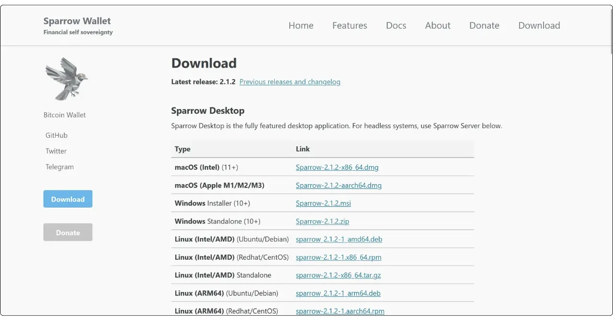

Il est important de vérifier l'intégrité et l'authenticité du logiciel avant son installation. Si vous ne savez pas comment le faire, vous trouverez un tutoriel complet ici :

https://planb.network/tutorials/computer-security/data/integrity-authenticity-21d0420a-be02-4663-94a3-8d487f23becc

Une fois Sparrow installé, vous pouvez ignorer les premiers écrans explicatifs pour accéder directement à l'écran de gestion des connexions.

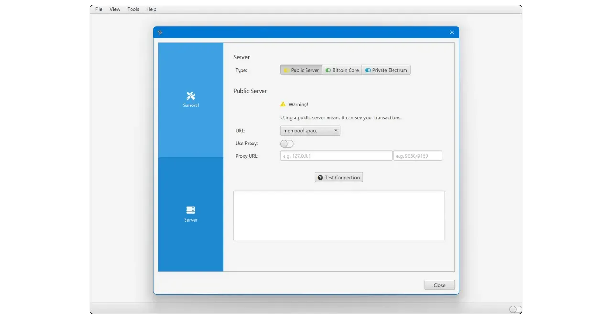

## Se connecter au réseau Bitcoin

Pour interagir avec le réseau Bitcoin et diffuser vos transactions, Sparrow doit être connecté à un nœud Bitcoin. Il y a trois méthodes principales pour établir cette connexion :

- 🟡 Utilisation d'un nœud public, c'est-à-dire la connexion au nœud d'un tiers qui autorise de telles connexions. Si vous ne possédez pas votre propre nœud Bitcoin, cette option vous permet de démarrer rapidement avec Sparrow. Toutefois, le nœud auquel vous vous connectez verra toutes vos transactions, ce qui pourrait compromettre votre confidentialité. Avoir le contrôle de vos clés est essentiel, mais posséder votre propre nœud est encore mieux. Utilisez donc cette option seulement si vous débutez, tout en étant conscient des risques pour votre confidentialité.

- 🟢 Connexion à un nœud Bitcoin Core. Si vous disposez de votre propre nœud Bitcoin Core, vous pouvez le connecter à Sparrow Wallet, que ce soit localement si Bitcoin Core est installé sur la même machine, ou à distance.

- 🔵 Connexion via un serveur Electrum. Si votre nœud Bitcoin est équipé d'Electrs, comme c'est le cas pour des solutions node-in-a-box telles que Umbrel ou Start9, vous pouvez vous y connecter à distance depuis Sparrow.

**Il est préférable d'utiliser une connexion via Electrs ou Bitcoin Core sur votre propre nœud pour réduire le besoin de confiance envers un tiers et optimiser votre confidentialité.**

### Se connecter à un nœud public 🟡

La connexion à un nœud public est très simple. Cliquez sur l'onglet "*Public Server*".

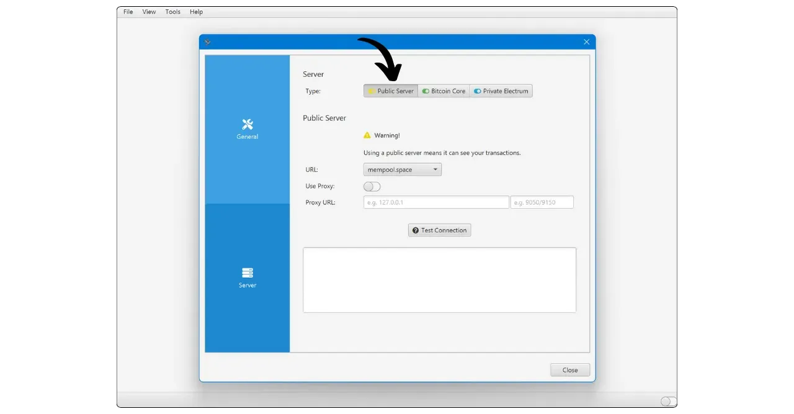

Sélectionnez un nœud dans la liste déroulante.

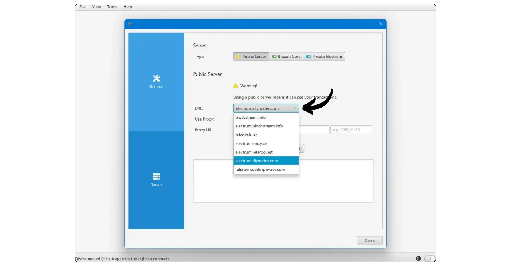

Ensuite, cliquez sur "*Test Connection*".

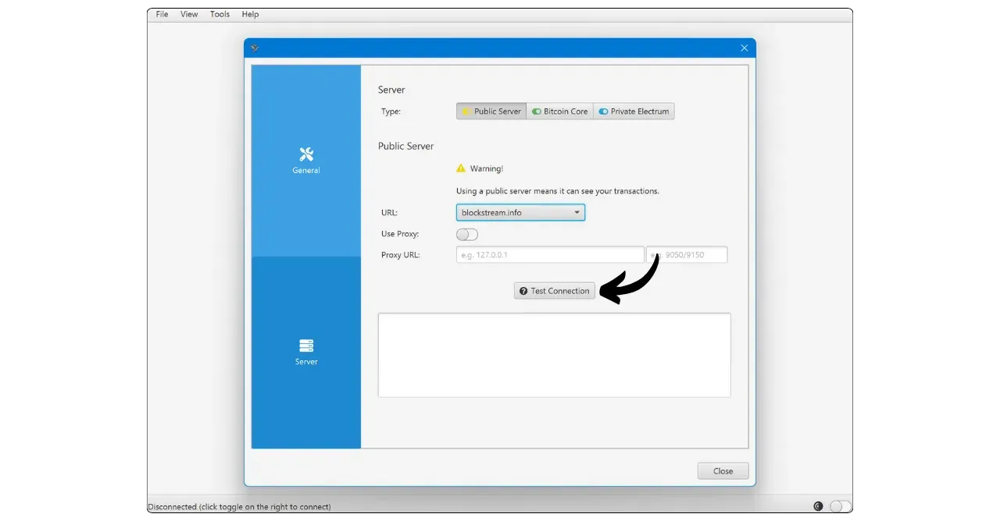

Une fois connecté, Sparrow Wallet affichera une coche jaune en bas à droite de l'interface pour indiquer que vous êtes connecté à un nœud public.


### Se connecter à un Bitcoin Core 🟢

La deuxième méthode pour se connecter à un nœud Bitcoin consiste à lier Sparrow à un Bitcoin Core. Si Bitcoin Core est installé sur la même machine, l'authentification se fera via le fichier cookie. Si Bitcoin Core est sur une machine distante, vous devrez utiliser le mot de passe défini dans le fichier `bitcoin.conf`.

Notez bien que si vous utilisez un nœud Bitcoin Core élagué, vous ne pourrez pas restaurer un portefeuille contenant des transactions antérieures aux blocs conservés localement. Toutefois, pour un nouveau portefeuille créé sur Sparrow, il n'y aura pas de problème : vos nouvelles transactions seront visibles, même avec un nœud élagué.

Pour configurer un nœud Bitcoin Core, vous pouvez consulter l'un des tutoriels suivants, selon votre système d'exploitation :

https://planb.network/tutorials/node/bitcoin/bitcoin-core-mac-windows-9684ab02-e0af-41c9-8102-86ac7c7727f3

https://planb.network/tutorials/node/bitcoin/bitcoin-core-linux-568c13a6-8746-4d63-8e95-f4a61c5ae0ed

Sur Sparrow, rendez-vous dans l'onglet "*Bitcoin Core*".

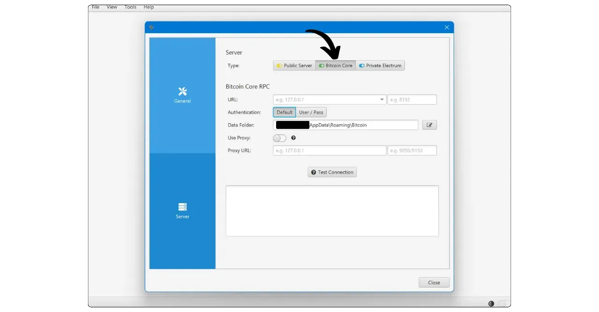

**Avec Bitcoin Core en local :**

Si Bitcoin Core est installé sur votre ordinateur, localisez le fichier `bitcoin.conf` parmi les fichiers du logiciel. Si ce fichier n'existe pas, vous pouvez le créer. Ouvrez-le avec un éditeur de texte et insérez la ligne suivante :

```ini
server=1
````

Sauvegardez ensuite vos modifications.

Vous pouvez également effectuer cette configuration via l'interface graphique de Bitcoin-QT en naviguant dans "*Settings*" > "*Options...*" et en activant l'option "*Enable RPC server*".

N'oubliez pas de redémarrer le logiciel après ces modifications.

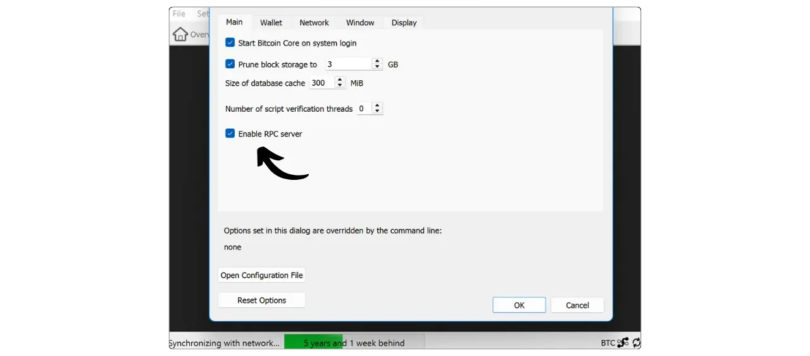

Revenez ensuite à Sparrow Wallet et renseignez le chemin vers votre fichier de cookie, généralement situé dans le même dossier que le `bitcoin.conf`, selon votre système d'exploitation :

| **macOS**   | ~/Library/Application Support/Bitcoin |
| ----------- | ------------------------------------- |
| **Windows** | %APPDATA%\Bitcoin                     |
| **Linux**   | ~/.bitcoin                            |

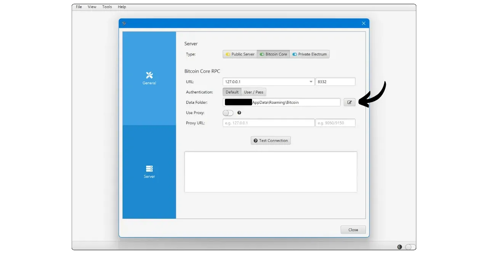

Laissez les autres paramètres par défaut, l'URL `127.0.0.1` et le port `8332`, puis cliquez sur "*Test Connection*".

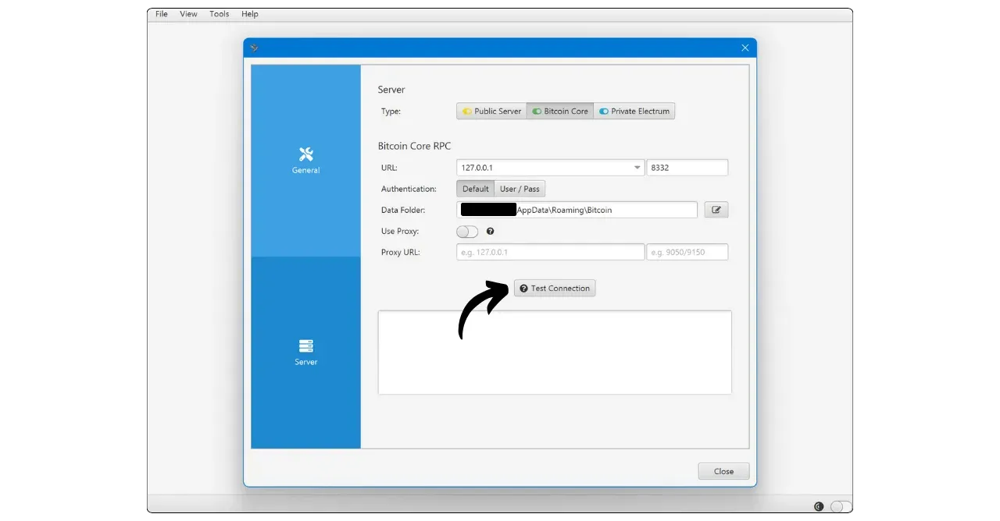

La connexion est établie. Une coche verte apparaîtra en bas à droite pour indiquer que vous êtes connecté à un nœud Bitcoin Core.

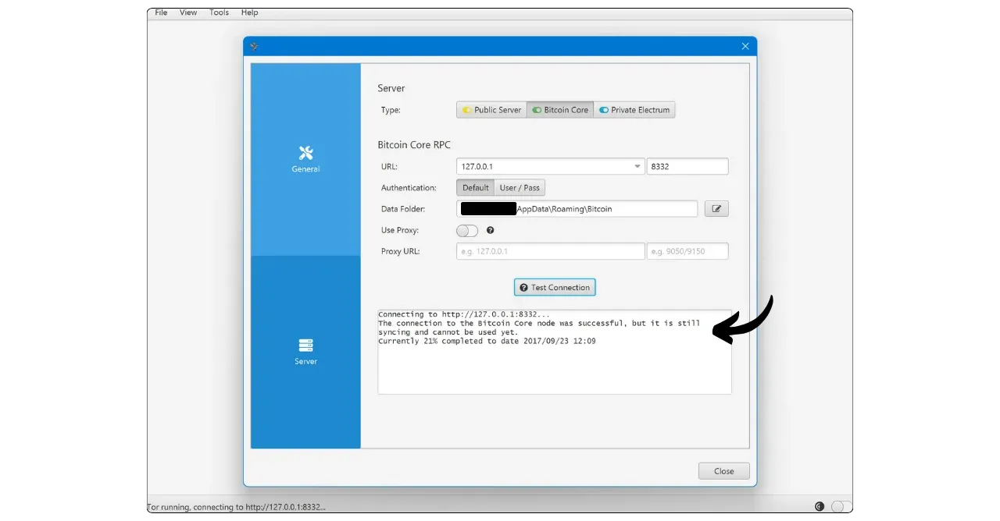

**Avec Bitcoin Core à distance :**

Si Bitcoin Core est installé sur une autre machine connectée sur le même réseau, commencez par localiser le fichier `bitcoin.conf` parmi les fichiers du logiciel. Si ce fichier n'existe pas encore, vous pouvez le créer. Ouvrez ce fichier avec un éditeur de texte et ajoutez la ligne suivante :

```ini
server=1
```

Après avoir modifié le fichier, assurez-vous de l'enregistrer dans le dossier approprié selon votre système d'exploitation :

| **macOS**   | ~/Library/Application Support/Bitcoin |
| ----------- | ------------------------------------- |
| **Windows** | %APPDATA%\Bitcoin                     |
| **Linux**   | ~/.bitcoin                            |

Il est également possible de réaliser cette manipulation via l'interface graphique de Bitcoin-QT. Accédez au menu "*Settings*", puis "*Options...*", et activez l'option "*Enable RPC server*" en cochant la case correspondante. Si le fichier `bitcoin.conf` n'existe pas, vous pouvez le créer directement depuis cette interface en cliquant sur "*Open Configuration File*".

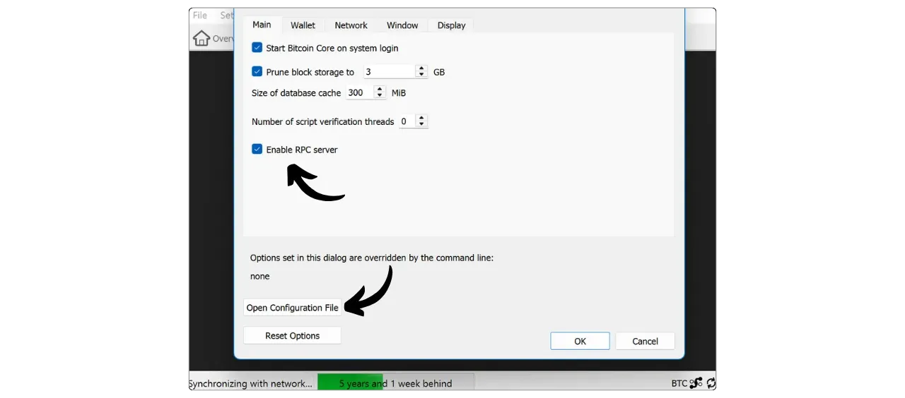

Trouvez l'adresse IP de la machine qui héberge Bitcoin Core dans votre réseau local. Pour cela, vous pouvez utiliser un outil tel que [Angry IP Scanner](https://angryip.org/). Supposons, pour l'exemple, que l'adresse IP de votre nœud soit `192.168.1.18`.

Dans le fichier `bitcoin.conf`, ajoutez les lignes suivantes, en configurant `rpcbind=192.168.1.18` pour correspondre à l'adresse IP de votre nœud.

```ini
[main]
rpcbind=127.0.0.1
rpcbind=192.168.1.18
rpcallowip=127.0.0.1
rpcallowip=192.168.1.0/24
```

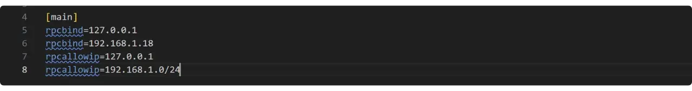

Ajoutez également dans le fichier `bitcoin.conf` un identifiant et un mot de passe pour les connexions à distance. Assurez-vous de remplacer `loic` par votre nom d'utilisateur et `my_password` par un mot de passe fort :

```ini
rpcuser=loic
rpcpassword=my_password
``` 

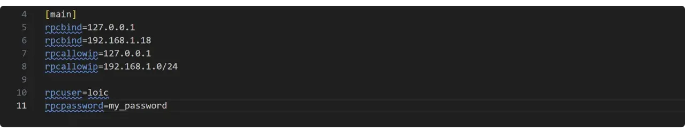

Après avoir modifié et sauvegardé le fichier, redémarrez le logiciel Bitcoin-QT.

Vous pouvez maintenant retourner sur Sparrow Wallet. Accédez à l'onglet "*User / Pass*". Saisissez le nom d'utilisateur et le mot de passe que vous avez configurés dans le fichier `bitcoin.conf`. Laissez les autres paramètres par défaut, à savoir l'URL `127.0.0.1` et le port `8332`. Cliquez ensuite sur "*Test Connection*".

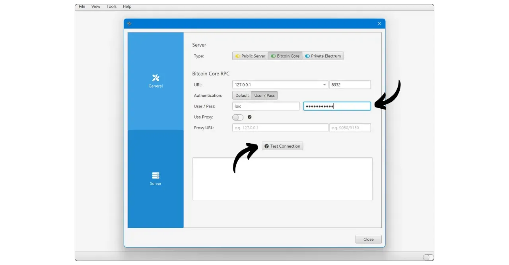

La connexion est établie. Une coche verte apparaîtra en bas à droite pour indiquer que vous êtes connecté à un nœud Bitcoin Core.

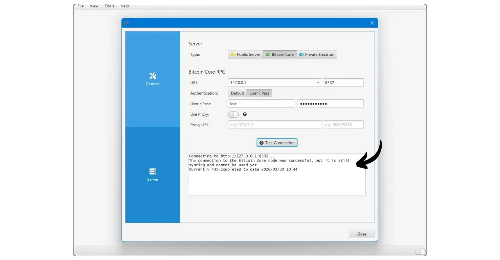

### Se connecter à un serveur Electrum 🔵

La dernière option pour se connecter est d'utiliser un serveur Electrum distant. Cette méthode vous permet de vous connecter à votre nœud via Tor depuis un autre appareil et profite d'un indexeur pour parcourir plus rapidement vos portefeuilles sur Sparrow. Elle est particulièrement adaptée si vous disposez d'une solution node-in-a-box comme Umbrel ou Start9, qui permettent d'installer Electrs en un clic.

Pour ce faire, obtenez l'adresse Tor en `.onion` de votre serveur Electrum. Par exemple, avec Umbrel, vous la trouverez dans l'application Electrs.

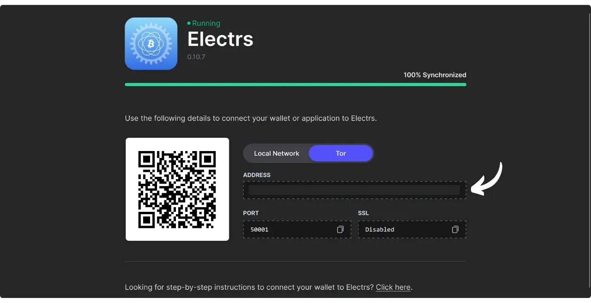

Sur Sparrow Wallet, accédez à l'onglet "*Private Electrum*".

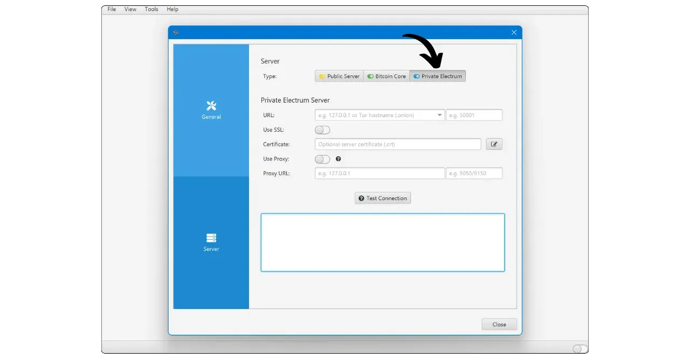

Entrez votre adresse Tor dans l'espace prévu à cet effet. Les autres paramètres peuvent rester par défaut. Cliquez ensuite sur "*Test Connection*".

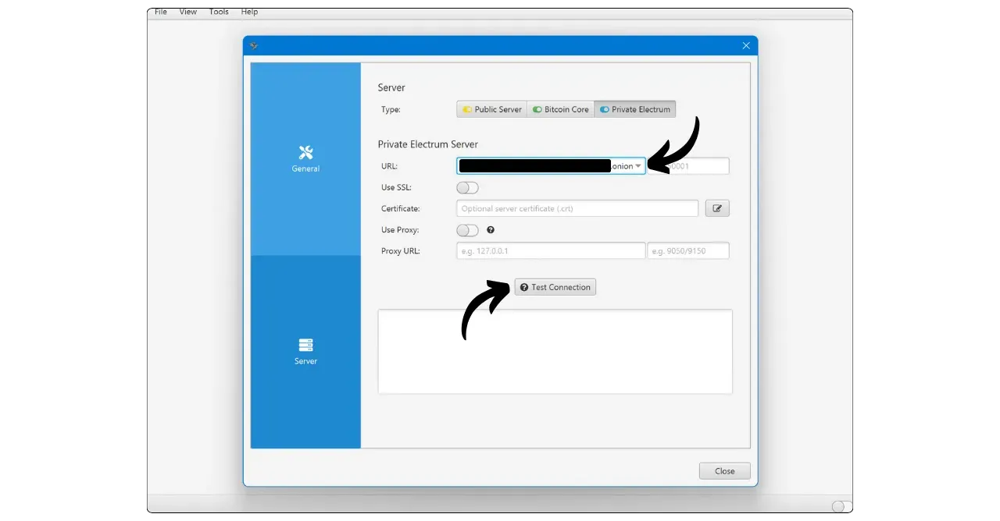

La connexion est confirmée. Si vous fermez cette fenêtre, une coche bleue s'affichera en bas à droite, indiquant que vous êtes connecté à un serveur Electrum.

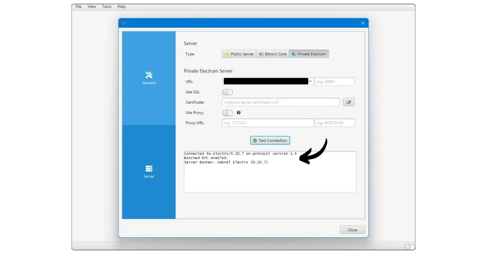

## Créer un portefeuille chaud

Maintenant que Sparrow Wallet est configuré pour communiquer avec le réseau Bitcoin, vous êtes prêt à créer un premier portefeuille. Cette section vous guide dans la création d'un portefeuille chaud, c'est-à-dire un portefeuille dont les clés privées sont stockées sur votre ordinateur. Étant donné que celui-ci est une machine complexe connectée à Internet, il présente une très grande surface d'attaque. Par conséquent, un portefeuille chaud devrait être utilisé uniquement pour des montants limités de bitcoins. Pour stocker des montants plus importants, privilégiez un portefeuille sécurisé avec un hardware wallet. Si c'est ce que vous recherchez, vous pouvez passer directement à la section suivante.

Pour créer un portefeuille chaud, depuis l'écran d'accueil de Sparrow Wallet, cliquez sur l'onglet "*File*" puis sur "*New Wallet*".

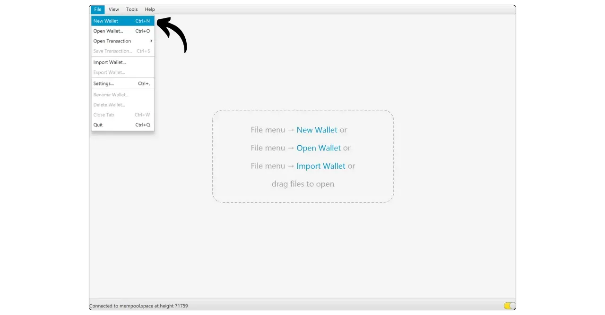

Entrez un nom pour votre portefeuille et cliquez sur "*Create Wallet*".

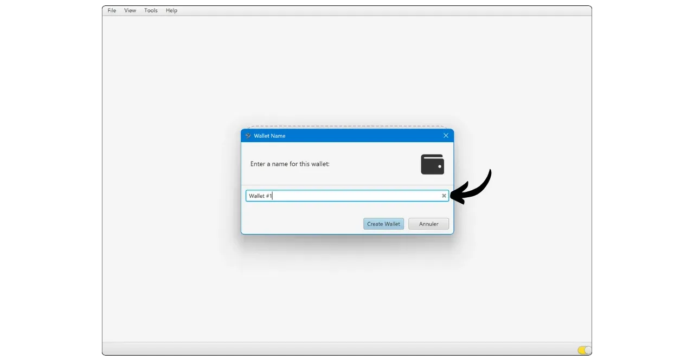

En haut de l'interface, vous avez le choix entre créer un portefeuille "*Single Signature*" ou "*Multi Signature*". Juste en dessous, sélectionnez le type de script pour verrouiller vos UTXOs. Je vous recommande d'utiliser la norme la plus récente : "*Taproot (P2TR)*".


Cliquez ensuite sur "*New or Imported Software Wallet*".

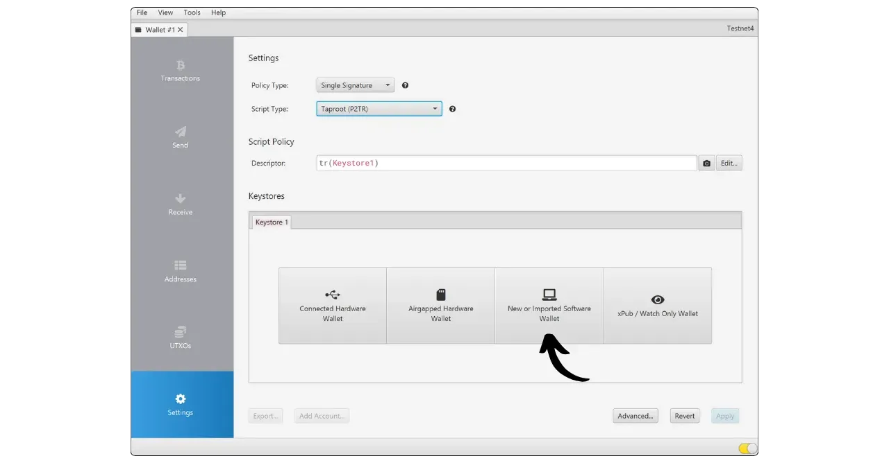

Choisissez le standard BIP39, car il est supporté par quasiment tous les logiciels de portefeuilles Bitcoin. Choisissez ensuite la longueur de votre phrase de récupération. Actuellement, une phrase de 12 mots est suffisante, car les deux offrent une sécurité similaire, mais la phrase de 12 mots est plus simple à sauvegarder.

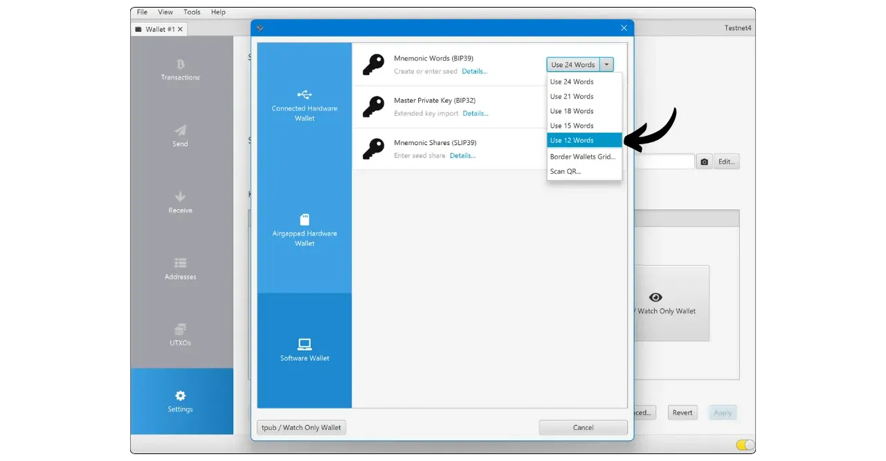

Cliquez sur le bouton "*Generate New*" pour générer la phrase mnémonique de votre portefeuille. Cette phrase donne un accès complet et non restreint à tous vos bitcoins. N'importe qui en possession de cette phrase peut subtiliser vos fonds, même sans accès physique à votre ordinateur.

La phrase de 12 mots permet de restaurer l'accès à vos bitcoins en cas de perte, vol ou casse de votre ordinateur. Il est donc très important de la sauvegarder soigneusement et de la stocker dans un endroit sécurisé.

Vous pouvez l'inscrire un papier, ou éventuellement, pour plus de sécurité, la graver sur un support en acier inoxydable afin de la protéger contre les risques d'incendies, d'inondations ou d'écroulements. Le choix du support pour votre phrase mnémonique dépendra de votre stratégie de sécurisation, mais si vous utilisez Sparrow comme un portefeuille chaud de dépenses contenant des montants modérés, le support papier devrait être suffisant.

Pour plus d'informations sur la manière adéquate de sauvegarder et de gérer votre phrase mnémonique, je vous recommande vivement de suivre cet autre tutoriel, particulièrement si vous êtes débutant :

https://planb.network/tutorials/wallet/backup/backup-mnemonic-22c0ddfa-fb9f-4e3a-96f9-46e2a7954270

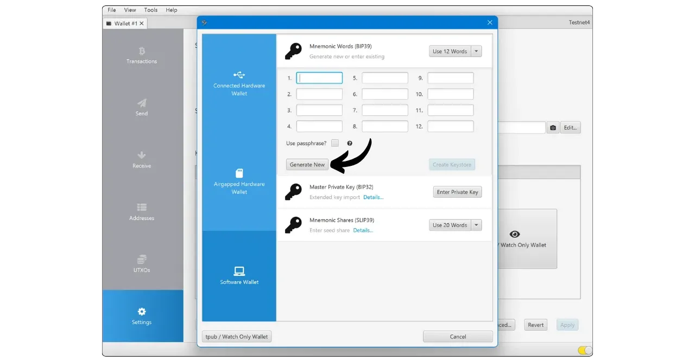

**Évidemment, vous ne devez jamais partager ces mots sur internet, contrairement à ce que je fais dans ce tutoriel. Ce portefeuille en exemple sera utilisé uniquement sur le Testnet et sera supprimé à l'issue du tutoriel.**

Vous pouvez également choisir d'ajouter une passphrase BIP39 en cliquant sur la case "*Use passphrase*". Attention, utiliser une passphrase peut être très utile, mais si vous ne comprenez pas comment cela fonctionne, cela peut être très risqué. C'est pourquoi je vous conseille fortement de lire ce petit article théorique sur le sujet :

https://planb.network/tutorials/wallet/backup/passphrase-a26a0220-806c-44b4-af14-bafdeb1adce7

Après avoir enregistré votre phrase mnémonique et votre éventuelle passphrase sur un support physique, cliquez sur "*Confirm Backup*".


Saisissez de nouveau vos 12 mots pour confirmer leur sauvegarde correcte, puis cliquez sur "*Create Keystore*".

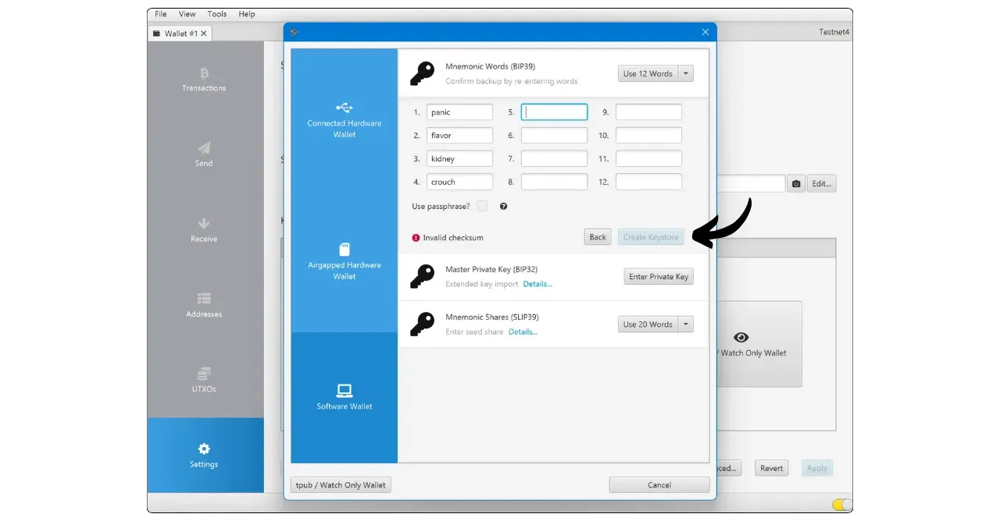

Cliquez ensuite sur "*Import Keystore*" pour générer les clés de votre portefeuille à partir de la phrase mnémonique.

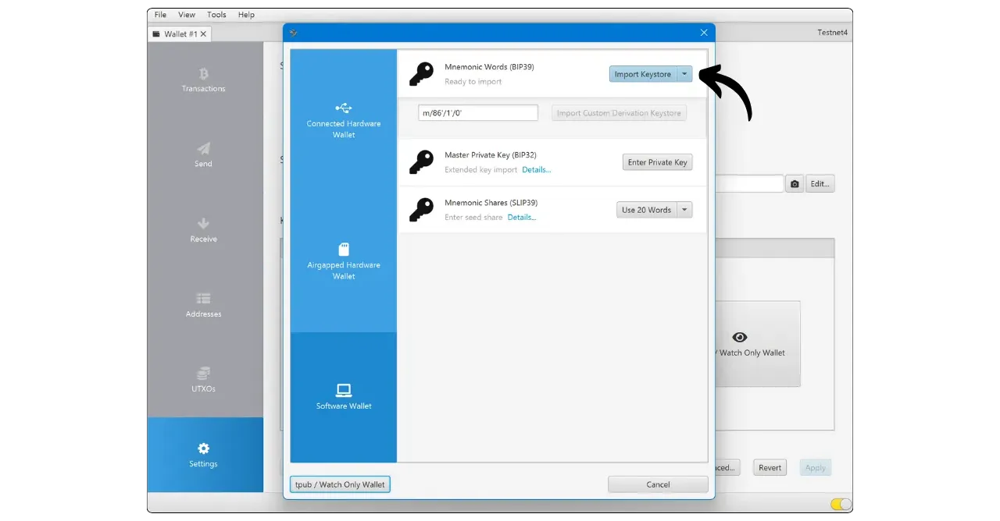

Cliquez sur "*Apply*" pour finaliser la création du portefeuille.


Définissez un mot de passe fort pour sécuriser l'accès à votre portefeuille dans Sparrow. Il est recommandé de conserver ce mot de passe dans un gestionnaire de mots de passe pour ne pas l'oublier. Notez que ce mot de passe ne joue aucun rôle dans la dérivation de vos clés. Il sert uniquement à accéder à votre portefeuille via Sparrow Wallet. Ainsi, même sans ce mot de passe, votre phrase mnémonique suffira à accéder à vos bitcoins depuis n'importe quelle application compatible BIP39.

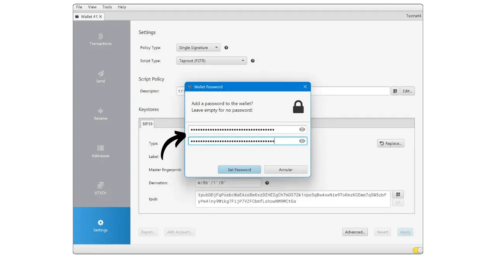

Votre portefeuille chaud est maintenant créé. Vous pouvez passer directement à la section *Recevoir des Bitcoins* de ce tutoriel si vous ne prévoyez pas d'utiliser un hardware wallet avec Sparrow.

## Gérer un portefeuille froid

La seconde méthode pour utiliser Sparrow Wallet est de le configurer comme gestionnaire de portefeuilles avec un hardware wallet. Dans cette configuration, les clés privées de votre portefeuille Bitcoin restent exclusivement sur le hardware wallet, tandis que Sparrow n'accède qu'aux informations publiques. Cette approche offre un niveau de sécurité supérieur aux portefeuilles chauds abordés précédemment, car les clés privées sont conservées sur un dispositif spécialisé, souvent doté d'une puce sécurisée, qui n'est pas connecté à Internet et présente donc une surface d'attaque très réduite par rapport à un ordinateur traditionnel.

Il y a deux principales méthodes pour connecter votre hardware wallet à Sparrow :
- Par câble, communément utilisé avec des modèles d'entrée de gamme tels que le Trezor Safe 3 ou le Ledger Nano S Plus ;
- En mode Air-Gap, c'est-à-dire sans connexion filaire directe, réalisée via une carte MicroSD ou par échange de QR codes.

Sparrow supporte toutes ces méthodes de communication et est compatible avec la plupart des hardware wallets disponibles sur le marché.

Pour ce tutoriel, je vais utiliser une Ledger Nano S avec un câble, mais la procédure est similaire en mode Air-Gap. Vous trouverez les détails spécifiques à votre hardware wallet dans son tutoriel dédié sur Plan ₿ Network.

Avant de démarrer, assurez-vous que le portefeuille est déjà configuré sur votre hardware wallet. Si vous utilisez une connexion filaire, connectez-le à votre ordinateur par le câble.

Pour importer ce qu'on appelle le "*Keystore*" (les informations publiques nécessaires à la gestion du portefeuille) dans Sparrow Wallet, cliquez sur l'onglet "*File*", puis sur "*New Wallet*".

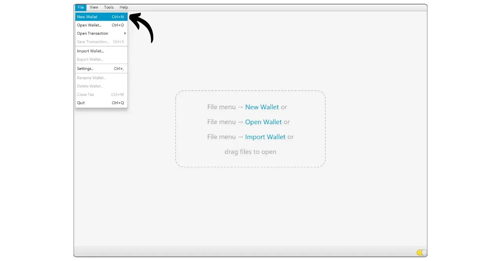

Nommez votre portefeuille et cliquez sur "*Create Wallet*". Je vous conseille de mettre le nom de votre hardware wallet pour l'identifier facilement par la suite.

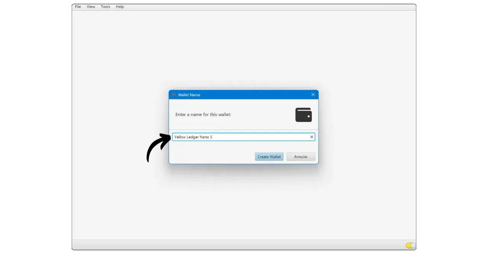

En haut de l'interface, choisissez entre un portefeuille "*Single Signature*" ou "*Multi Signature*". Pour notre exemple, nous allons configurer un portefeuille single-sig.

Juste en dessous, sélectionnez le type de script pour verrouiller vos UTXOs. Si votre hardware wallet le prend en charge, je vous conseille de choisir "*Taproot (P2TR)*".

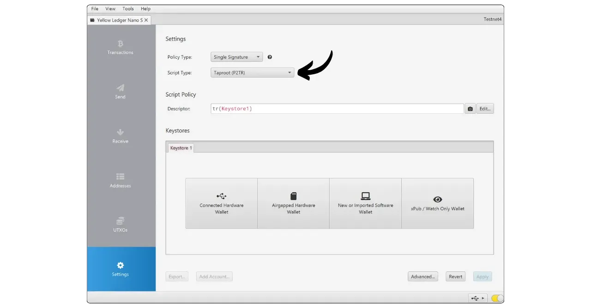

Ensuite, la procédure diffère selon votre mode de connexion. Si vous utilisez une méthode Air-Gap, sélectionnez "*Airgapped Hardware Wallet*". Suivez ensuite les instructions propres à votre appareil.

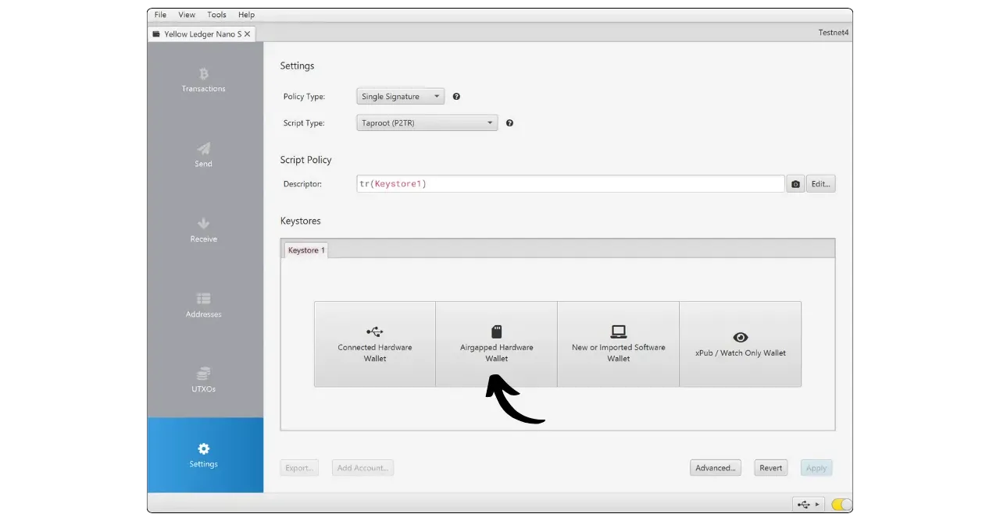

Si vous utilisez une connexion par câble, comme dans mon cas, choisissez "*Connected Hardware Wallet*".

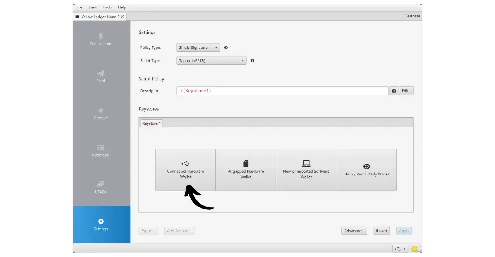

Cliquez sur "*Scan*" pour que Sparrow détecte votre appareil. Assurez-vous qu'il soit branché et déverrouillé. Pour certains modèles, comme les Ledger, il est nécessaire d'ouvrir l'application "*Bitcoin*" pour que la détection soit possible.

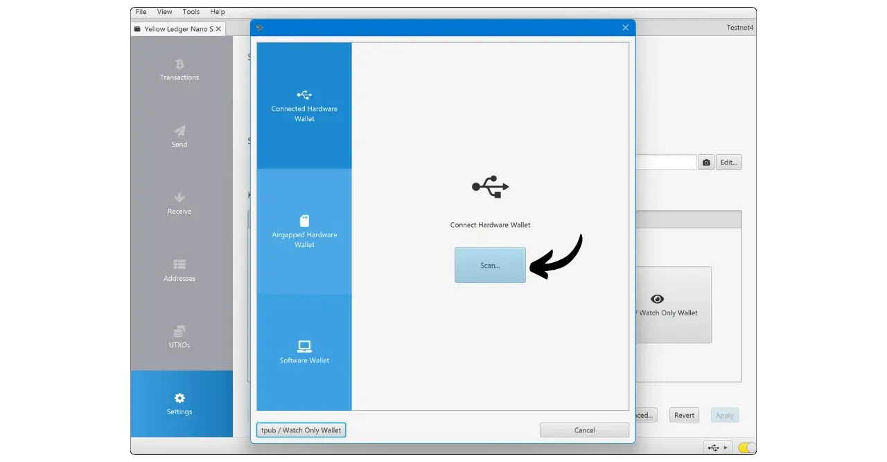

Sélectionnez "*Import Keystore*".

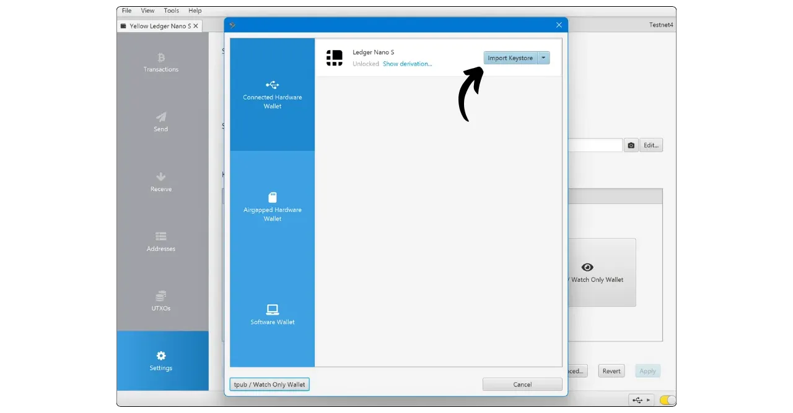

Cliquez sur "*Apply*" pour finaliser la création du portefeuille.

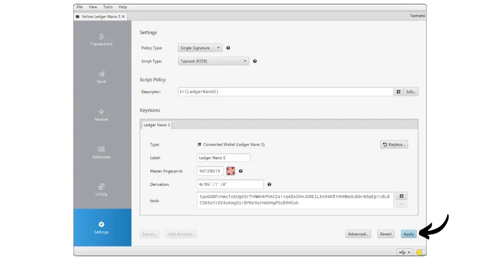

Définissez un mot de passe fort pour sécuriser l'accès à votre portefeuille dans Sparrow. Ce mot de passe protégera vos clés publiques, vos adresses et l'historique de vos transactions. Il est recommandé de le sauvegarder dans un gestionnaire de mots de passe. Notez que ce mot de passe ne joue aucun rôle dans la dérivation de vos clés. Même sans lui, vous pouvez récupérer l'accès à vos bitcoins avec votre phrase mnémonique via tout logiciel compatible BIP39.

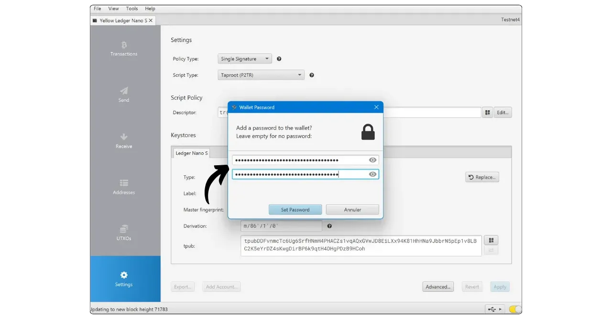

Votre portefeuille de gestion est désormais configuré sur Sparrow.

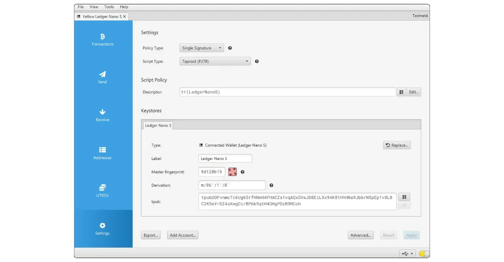

## Recevoir des bitcoins

Maintenant que votre portefeuille est configuré sur Sparrow, vous pouvez recevoir des bitcoins. Pour cela, accédez simplement au menu "*Receive*".

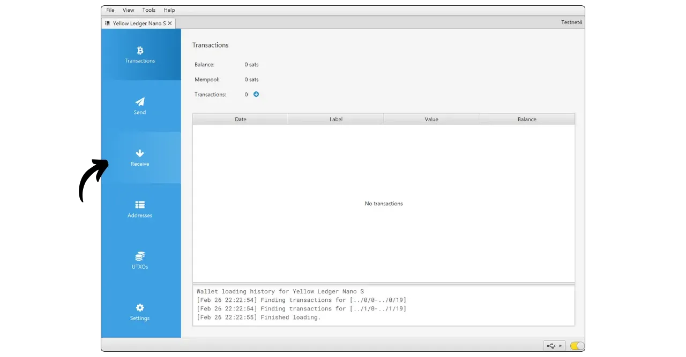

Sparrow affichera la première adresse inutilisée de votre portefeuille. Vous pouvez ajouter un "*Label*" à cette adresse pour vous rappeler l'origine de ces satoshis à l'avenir.

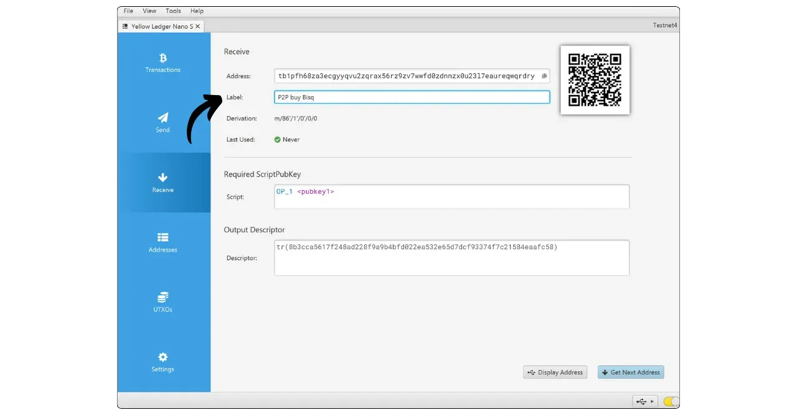

Si vous utilisez un portefeuille chaud, l'adresse affichée peut être utilisée immédiatement, soit en la copiant, soit en scannant le QR code associé.

Si vous utilisez un hardware wallet, il est très important de vérifier l'adresse sur l'écran de l'appareil avant de l'utiliser. Pour les appareils filaires, connectez et déverrouillez votre hardware wallet, puis dans Sparrow, cliquez sur "*Display Address*". Assurez-vous que l'adresse affichée sur votre hardware wallet correspond à celle indiquée sur Sparrow.

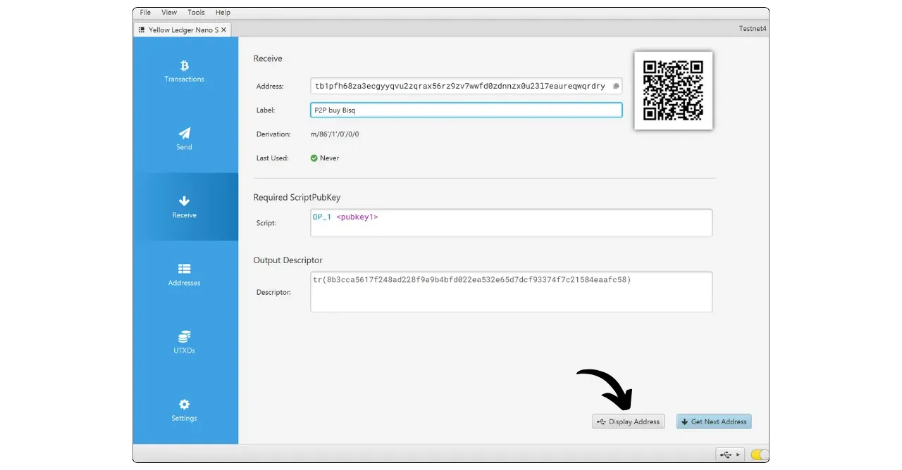

Pour les utilisateurs d'un hardware wallet Air-Gap, la vérification de l'adresse varie selon le modèle de l'appareil. Consultez le tutoriel dédié sur Plan ₿ Network pour obtenir des instructions précises.

Une fois la transaction diffusée par le payeur, vous la verrez apparaître dans l'onglet "*Transactions*". Vous pouvez cliquer dessus pour avoir plus de détails comme le TXID par exemple.

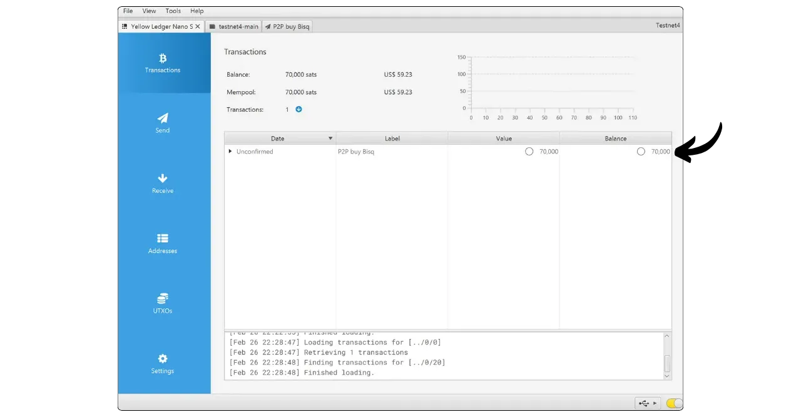

Dans l'onglet "*Addresses*", vous trouverez une liste de toutes vos adresses de réception. Vous pouvez voir si elles ont déjà été utilisées et si un label a été ajouté. Les adresses "*Receive*" sont celles que Sparrow montre lorsque vous cliquez sur "*Receive*" et sont destinées aux paiements entrants. Les adresses "*Change*" sont utilisées pour le change dans vos transactions, c'est-à-dire pour récupérer la partie inutilisée de vos UTXOs en inputs.

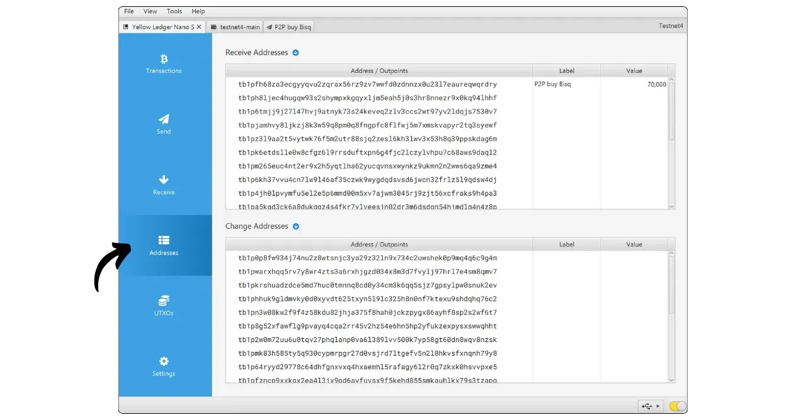

L'onglet "*UTXOs*" vous présente tous vos UTXOs, c'est-à-dire les fragments de bitcoins que vous détenez. Vous pouvez y voir le montant de chaque UTXO et le label associé.

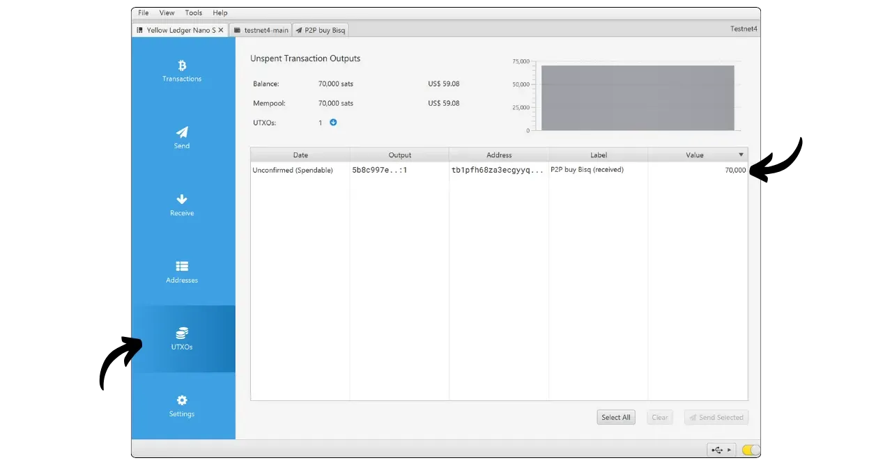

## Envoyer des bitcoins

Maintenant que vous disposez de quelques satoshis dans votre portefeuille, vous avez également la possibilité d'en envoyer. Bien qu'il existe plusieurs méthodes, je vous recommande d'utiliser le menu "*UTXOs*" pour un contrôle plus précis sur vos pièces dépensées (*coin control*) plutôt que de passer directement par le menu "*Send*" (ce dernier peut néanmoins suffire si vous êtes débutant).

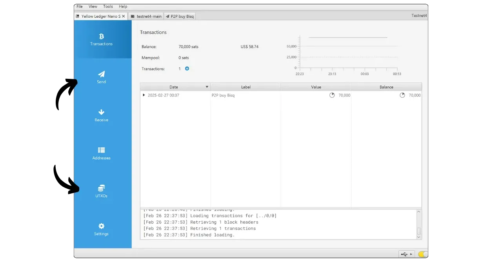

Sélectionnez les UTXOs que vous souhaitez utiliser comme inputs pour cette transaction, puis cliquez sur "*Send Selected*". Cette approche vous permet de sélectionner les sources les plus appropriées parmi vos UTXOs, en fonction de vos dépenses et des labels appliqués lors de leur réception, afin d'optimiser la confidentialité de vos paiements. Assurez-vous que la somme des UTXOs sélectionnés soit supérieure au montant que vous désirez envoyer.

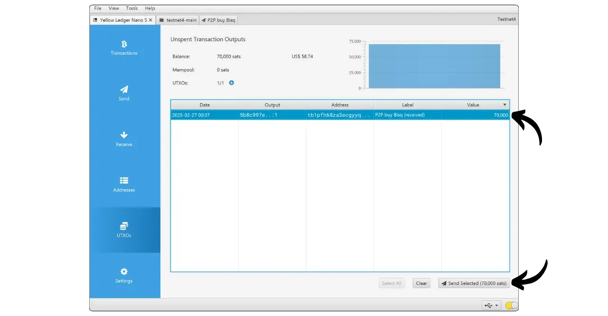

Entrez l'adresse du destinataire dans le champ "*Pay to*". Vous avez également la possibilité de scanner l'adresse avec votre webcam en cliquant sur l'icône de l'appareil photo. Le bouton "*+Add*" permet de payer plusieurs adresses en une seule transaction.

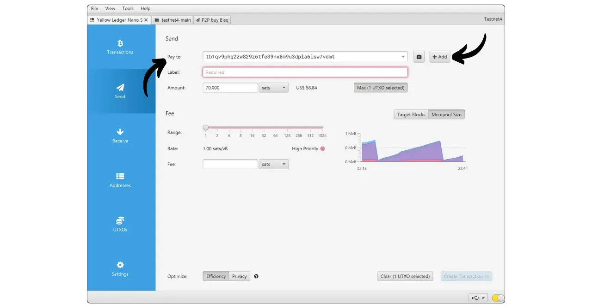

Ajoutez un label à votre transaction pour vous souvenir de son objectif. Ce label sera aussi associé à votre éventuel change.

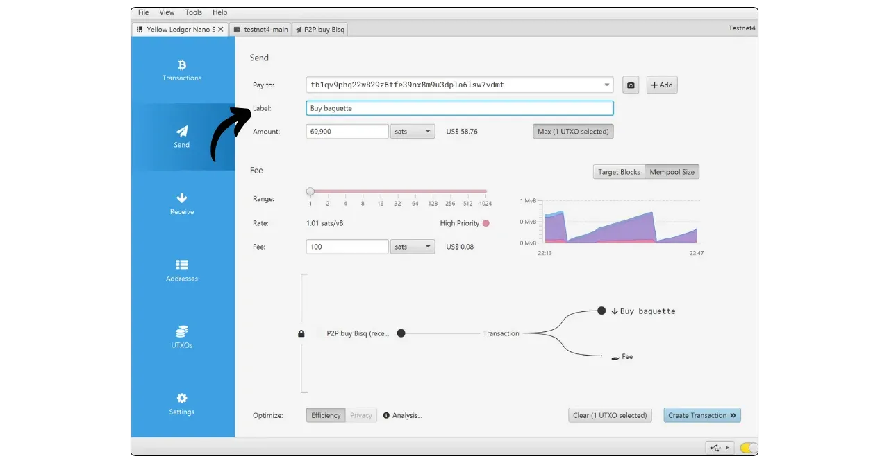

Indiquez le montant à envoyer à cette adresse.

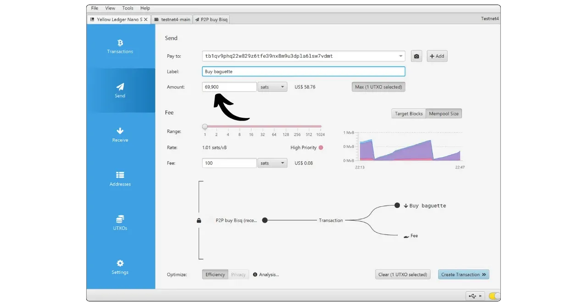

Ajustez le taux de frais selon l'état actuel du marché. Vous pouvez le faire en entrant une valeur de frais absolue ou en ajustant le taux de frais avec le curseur.

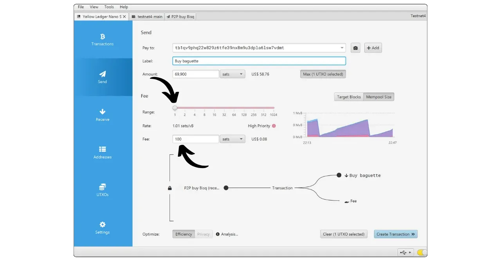

En bas de l'interface, vous pouvez choisir entre "*Efficiency*" et "*Privacy*". Dans mon cas, l'option "*Privacy*" n'est pas disponible, car je n'ai qu'un seul UTXO dans ce portefeuille. "*Efficiency*" correspond à une transaction classique, tandis que "*Privacy*" est une transaction de type Stonewall, une structure de transaction qui renforce votre confidentialité en simulant un mini-coinjoin, ce qui rend l'analyse de chaîne plus complexe.

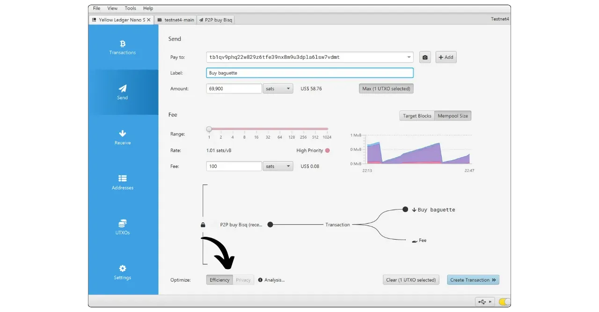

Sparrow affiche un schéma récapitulatif montrant vos inputs, vos outputs, ainsi que les frais de transaction (notez que les frais ne sont pas un output en réalité, contrairement à ce que laisse penser ce schéma). Si tout vous convient, cliquez sur "*Create Transaction*".

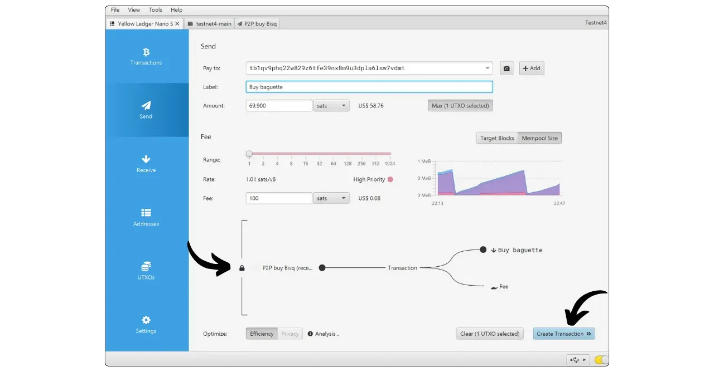

Vous accédez alors à une page qui détaille les éléments de votre transaction. Vérifiez que toutes les informations sont correctes, puis cliquez sur "*Finalize Transaction for Signing*".

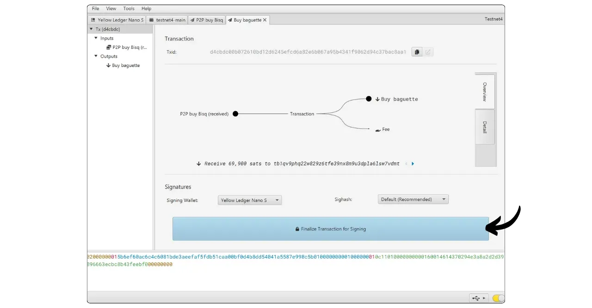

Il est important de conserver le Sighash par défaut. Pour comprendre pourquoi, je vous invite à consulter cette formation dans laquelle je vous explique tout ce qu'il faut savoir sur les Sighashs :

https://planb.network/courses/46b0ced2-9028-4a61-8fbc-3b005ee8d70f

Sur l'écran suivant, les options varient selon votre type de portefeuille que vous utilisez :
- Pour un hardware wallet Air-Gap, cliquez sur "*Show QR*" pour afficher une PSBT que vous pourrez signer avec votre appareil, puis charger la PSBT signée dans Sparrow en utilisant "*Scan QR*". L'option "*Save Transaction*" fonctionne de manière similaire, mais avec des échanges sur une microSD ;
- Pour un portefeuille chaud, cliquez simplement sur "*Sign*" et entrez le mot de passe du portefeuille pour signer ;
- Pour un hardware wallet filaire, cliquez aussi sur "*Sign*" pour envoyer la transaction non signée à votre appareil.

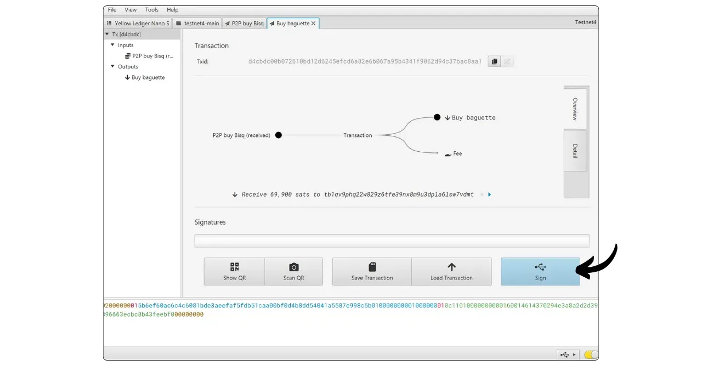

Sur votre hardware wallet, vérifiez l'adresse du destinataire, le montant envoyé, et les frais. Si tout est correct, procédez à la signature.

Une fois la transaction signée, elle réapparaîtra dans Sparrow, prête à être diffusée sur le réseau Bitcoin pour être par la suite incluse dans un bloc. Si tout est correct, cliquez sur "*Broadcast Transaction*".

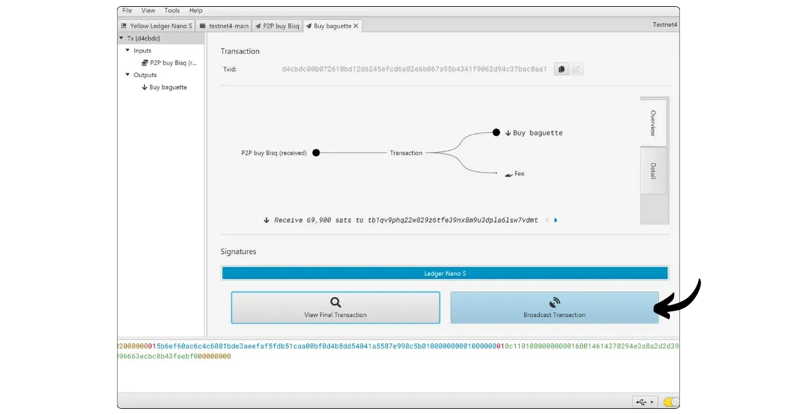

Votre transaction est maintenant diffusée et en attente de confirmation.

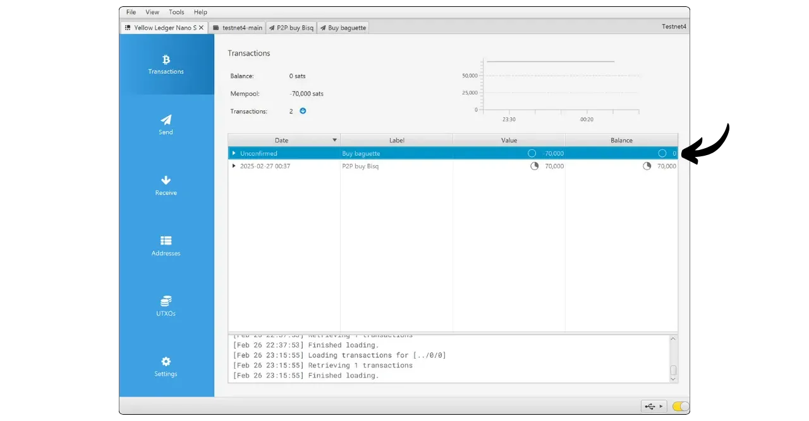

## Gestion et configuration des portefeuilles sur Sparrow

Dans l'onglet "*Settings*", vous trouverez des informations détaillées sur votre portefeuille, telles que :
- Le type de portefeuille (single-sig ou multi-sig) ;
- Le type de script utilisé ;
- Le nom que vous avez attribué au portefeuille ;
- L'empreinte de la clé maîtresse ;
- Le chemin de dérivation ;
- La clé publique étendue du compte.

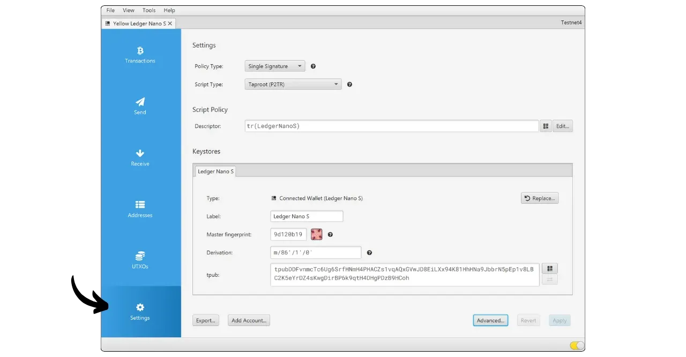

Le bouton "*Export*" permet d'exporter les informations de votre portefeuille afin de pouvoir l'utiliser sur un autre logiciel tout en conservant les informations établies sur Sparrow.

Le bouton "*Add Account*" offre la possibilité d'ajouter un compte supplémentaire à votre portefeuille. Un compte correspond à un ensemble distinct d'adresses de réception. Cette fonctionnalité peut être utile, par exemple, si vous souhaitez séparer un compte personnel et un compte professionnel, avec une seule phrase mnémonique.

Le bouton "*Advanced*" donne accès à des paramètres avancés, tels que la personnalisation de la recherche d'adresses par Sparrow et la modification du mot de passe du portefeuille.

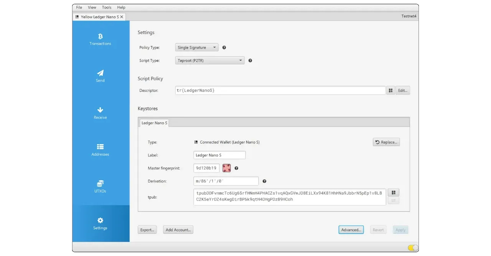

Lorsque vous fermez Sparrow Wallet, votre portefeuille se verrouille automatiquement. À la prochaine ouverture du logiciel, une fenêtre vous invitera à déverrouiller votre portefeuille avec son mot de passe.

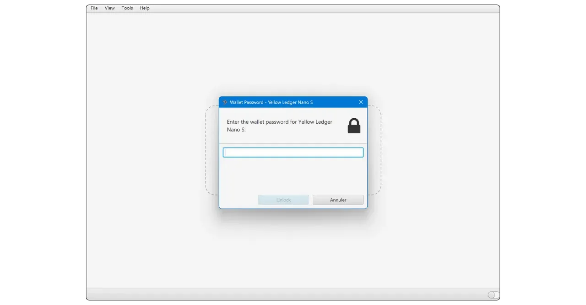

Si cette fenêtre ne s'ouvre pas ou si vous souhaitez ouvrir un autre portefeuille sur Sparrow, cliquez sur l'onglet "*File*" puis sélectionnez "*Open Wallet*".

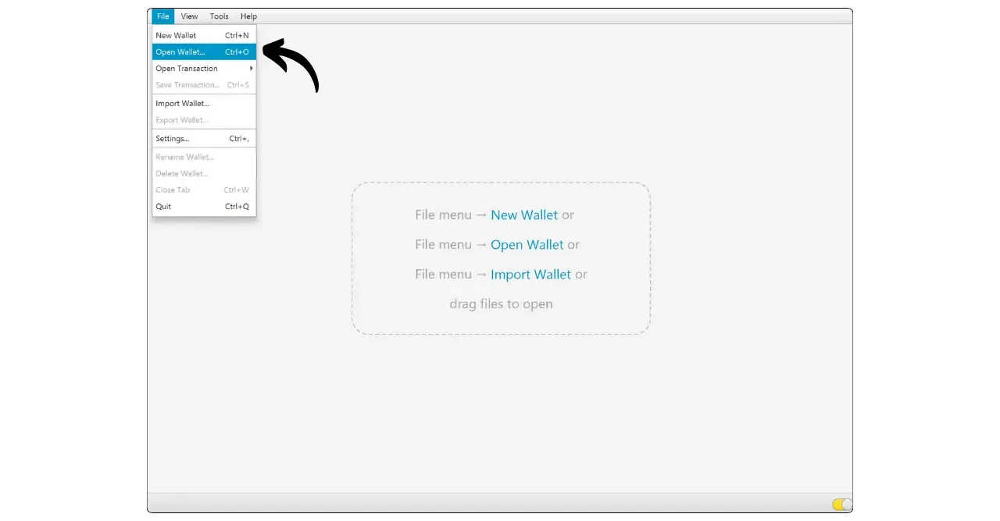

Cela ouvrira votre gestionnaire de fichiers dans le dossier où Sparrow stocke vos portefeuilles. Sélectionnez simplement le portefeuille que vous désirez ouvrir et entrez le mot de passe pour le déverrouiller.

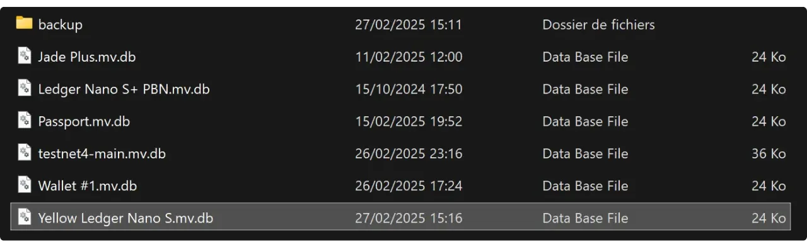

Dans le menu "*File*" sous "*Settings*", vous trouverez les paramètres de connexion au réseau Bitcoin déjà explorés dans les sections précédentes. Vous pouvez également ajuster divers paramètres comme l'unité utilisée, la monnaie fiat pour les conversions, et les sources d'information.

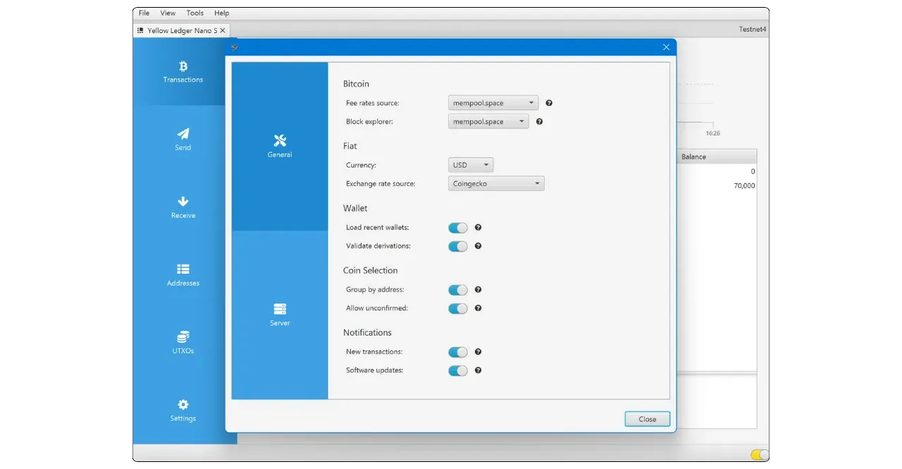

L'onglet "*View*" offre des options de personnalisation et donne accès à quelques commandes utiles, telles que "*Refresh Wallet*", qui actualise la recherche de transactions pour votre portefeuille.

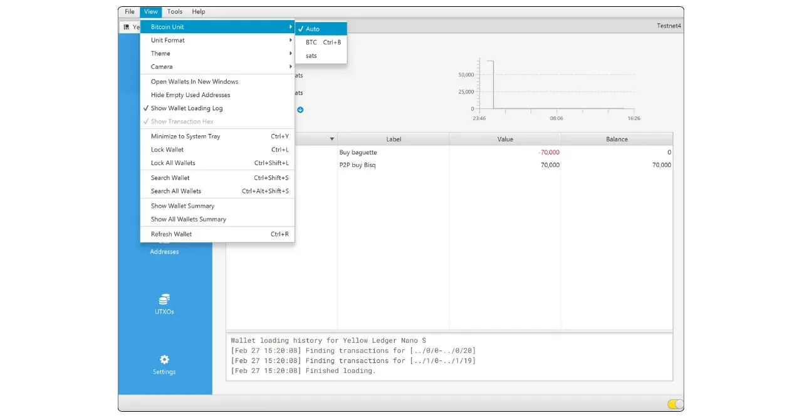

L'onglet "*Tools*" regroupe plusieurs outils avancés, dont :
- "*Sign/Verify Message*" permet de prouver la possession d'une adresse de réception ou de vérifier une signature.
- "*Send To Many*" offre une interface simplifiée pour réaliser des transactions vers plusieurs adresses de réception en une seule fois, ce qui est pratique pour le batch spending.
- "*Sweep Private Key*" permet de récupérer les bitcoins sécurisés par une simple clé privée et de les transférer vers votre portefeuille Sparrow. Cela peut être particulièrement utile pour ceux qui possèdent des bitcoins datant du début des années 2010, avant l'ère des portefeuilles HD.
- "*Verify Download*" assure la vérification de l'intégrité et de l'authenticité d'un logiciel téléchargé avant son installation sur votre appareil.
- "*Restart In*" permet de basculer sur vos portefeuilles sur les réseaux Testnet ou Signet. Cela peut être utile si vous souhaitez accéder à des réseaux de test avec des pièces sans valeur réelle.

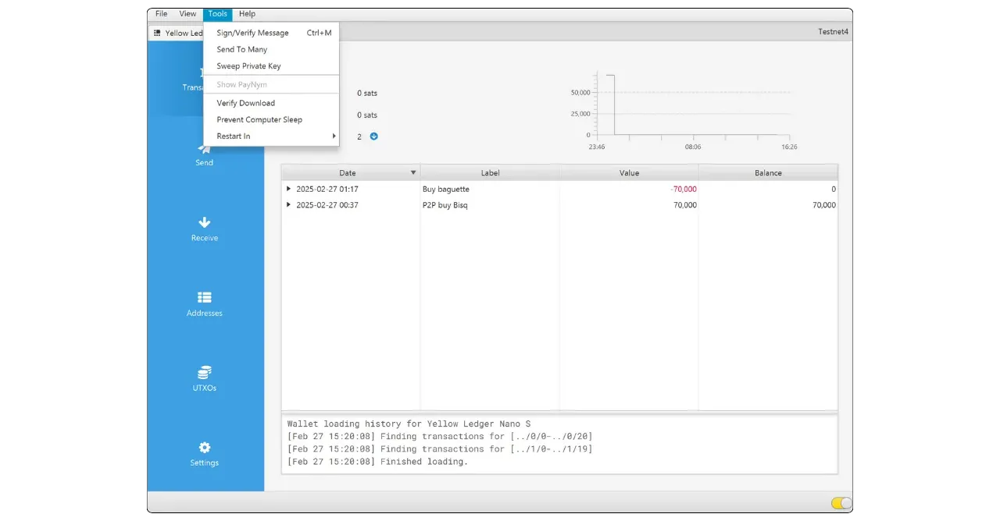

Vous savez maintenant tout sur le logiciel Sparrow Wallet, un excellent outil pour gérer vos portefeuilles Bitcoin au quotidien.

Si vous avez trouvé ce tutoriel utile, je vous serais très reconnaissant de laisser un pouce vert ci-dessous. N'hésitez pas à le partager sur vos réseaux sociaux. Merci beaucoup !

Je vous conseille également de découvrir cet autre tutoriel dans lequel je vous explique comment configurer le hardware wallet COLDCARD Q avec Sparrow Wallet :

https://planb.network/tutorials/wallet/hardware/coldcard-q-73e86d1a-6fe6-4d8b-bb15-8690298020e3
