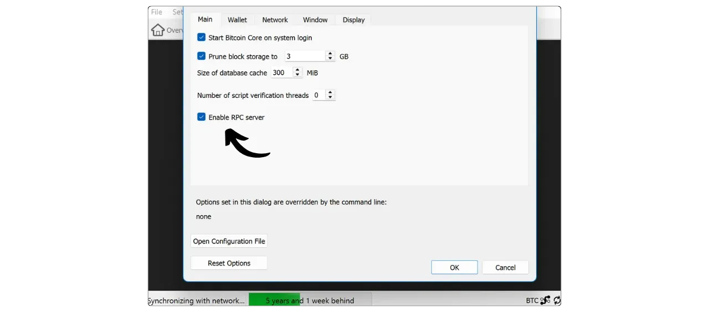

Sparrow Wallet 是 Craig Raw 开发的一款自我保管 Bitcoin 投资组合管理软件。这款开源软件因其众多功能和直观的 Interface 而受到比特币用户的青睐。

使用麻雀有两种方法：


- 如 Hot Wallet，您的私人密钥存储在个人电脑中。
- 作为 Cold Wallet 管理器，私钥保存在 Hardware Wallet 上。在这种模式下，Sparrow 只操作公开的 Wallet 信息、跟踪资金、生成地址和建立交易，但需要 Hardware Wallet 签名才能使这些交易生效。因此，它可以取代 Ledger Live 或 Trezor Suite 等应用程序。

Sparrow 支持单签名和多签名钱包，可以流畅地管理多个钱包。例如，您可以同时控制一个连接到 Ledger 的 Wallet，另一个连接到 Trezor，还有一个 Hot Wallet。

该软件还提供先进的硬币控制功能，让您可以精确选择在交易中使用哪些UTXO，从而优化保密性。

在连接方面，麻雀让您可以通过 Electrum 服务器或 Bitcoin Core 远程连接到自己的 Bitcoin 节点。如果你还没有自己的节点，也可以使用公共节点。远程连接通过 Tor 进行。

## 安装麻雀 Wallet

访问 [Sparrow Wallet 官方下载页面](https://sparrowwallet.com/download/)，选择与您的操作系统相对应的软件版本。


在安装软件之前，检查软件的完整性和真实性非常重要。如果您不知道如何操作，请点击此处查看完整教程：

https://planb.network/tutorials/computer-security/data/integrity-authenticity-21d0420a-be02-4663-94a3-8d487f23becc
Sparrow 安装完成后，您可以跳过初始说明屏幕，直接进入连接管理屏幕。


## 连接到 Bitcoin 网络

要与 Bitcoin 网络互动并广播您的交易，Sparrow 必须连接到 Bitcoin 节点。建立这种连接有三种主要方式：


- 🟡 使用公共节点，即连接到允许此类连接的第三方节点。如果您没有自己的 Bitcoin 节点，此选项可让您快速开始使用 Sparrow。不过，您连接的节点会看到您的所有交易，这可能会危及您的机密性。控制自己的密钥至关重要，但拥有自己的节点更好。因此，只有当你刚刚开始使用 Sparrow 时才会使用这个选项，同时也要注意隐私泄露的风险。
- 🟢 连接到 Bitcoin Core 节点。如果您有自己的 Bitcoin Core 节点，您可以将其连接到 Sparrow Wallet，如果 Bitcoin Core 安装在同一台机器上，可以在本地连接，也可以远程连接。
- 通过 Electrum 服务器连接。如果您的 Bitcoin 节点配备了 Electrs（如 Umbrel 或 Start9 等节点一体机解决方案），您可以从 Sparrow 远程连接到它。

**最好在自己的节点上通过 Electrs 或 Bitcoin Core 进行连接，以减少对第三方的信任并优化保密性**。

### 连接到公共节点 🟡

连接到公共节点非常简单。点击 "*公共服务器*"选项卡。


从下拉列表中选择一个节点。


然后点击 "*测试连接*"。


连接完成后，麻雀 Wallet 将在 Interface 的右下角显示一个黄色的"√"，表示您已连接到公共节点。


### 连接到 Bitcoin 核心 🟢

连接 Bitcoin 节点的第二种方法是将 Sparrow 与 Bitcoin Core 相连。如果 Bitcoin Core 安装在同一台机器上，则通过 cookie 文件进行身份验证。如果 Bitcoin Core 安装在远程机器上，则需要使用 `Bitcoin.conf` 文件中定义的密码。

请注意，如果使用被剪切的 Bitcoin 核心节点，就无法还原包含本地存储区块之前的事务的 Wallet。不过，对于在 Sparrow 上创建的新 Wallet 来说，这不是问题：即使节点被修剪，新事务也是可见的。

要配置 Bitcoin Core 节点，可根据操作系统参考以下教程之一：

https://planb.network/tutorials/node/bitcoin/bitcoin-core-mac-windows-9684ab02-e0af-41c9-8102-86ac7c7727f3
https://planb.network/tutorials/node/bitcoin/bitcoin-core-linux-568c13a6-8746-4d63-8e95-f4a61c5ae0ed
在 Sparrow 上，转到 "*Bitcoin 核心*"选项卡。


**具有 Bitcoin 核心局部：**

如果计算机上安装了 Bitcoin Core，请在软件文件中找到`Bitcoin.conf`文件。如果该文件不存在，您可以创建它。用文本编辑器打开该文件并插入以下一行：

```ini
server=1
````
Sauvegardez ensuite vos modifications.
Vous pouvez également effectuer cette configuration via l'interface graphique de Bitcoin-QT en naviguant dans "*Settings*" > "*Options...*" et en activant l'option "*Enable RPC server*".
N'oubliez pas de redémarrer le logiciel après ces modifications.

Revenez ensuite à Sparrow Wallet et renseignez le chemin vers votre fichier de cookie, généralement situé dans le même dossier que le `bitcoin.conf`, selon votre système d'exploitation :
| **macOS**   | ~/Library/Application Support/Bitcoin |
| ----------- | ------------------------------------- |
| **Windows** | %APPDATA%\Bitcoin                     |
| **Linux**   | ~/.bitcoin                            |

Laissez les autres paramètres par défaut, l'URL `127.0.0.1` et le port `8332`, puis cliquez sur "*Test Connection*".

La connexion est établie. Une coche verte apparaîtra en bas à droite pour indiquer que vous êtes connecté à un nœud Bitcoin Core.

**Avec Bitcoin Core à distance :**
Si Bitcoin Core est installé sur une autre machine connectée sur le même réseau, commencez par localiser le fichier `bitcoin.conf` parmi les fichiers du logiciel. Si ce fichier n'existe pas encore, vous pouvez le créer. Ouvrez ce fichier avec un éditeur de texte et ajoutez la ligne suivante :
```

server=1

```
Après avoir modifié le fichier, assurez-vous de l'enregistrer dans le dossier approprié selon votre système d'exploitation :
| **macOS**   | ~/Library/Application Support/Bitcoin |
| ----------- | ------------------------------------- |
| **Windows** | %APPDATA%\Bitcoin                     |
| **Linux**   | ~/.bitcoin                            |
Il est également possible de réaliser cette manipulation via l'interface graphique de Bitcoin-QT. Accédez au menu "*Settings*", puis "*Options...*", et activez l'option "*Enable RPC server*" en cochant la case correspondante. Si le fichier `bitcoin.conf` n'existe pas, vous pouvez le créer directement depuis cette interface en cliquant sur "*Open Configuration File*".

Trouvez l'adresse IP de la machine qui héberge Bitcoin Core dans votre réseau local. Pour cela, vous pouvez utiliser un outil tel que [Angry IP Scanner](https://angryip.org/). Supposons, pour l'exemple, que l'adresse IP de votre nœud soit `192.168.1.18`.
Dans le fichier `bitcoin.conf`, ajoutez les lignes suivantes, en configurant `rpcbind=192.168.1.18` pour correspondre à l'adresse IP de votre nœud.
```

[手]

rpcbind=127.0.0.1

rpcbind=192.168.1.18

rpcallowip=127.0.0.1

rpcallowip=192.168.1.0/24

```

Ajoutez également dans le fichier `bitcoin.conf` un identifiant et un mot de passe pour les connexions à distance. Assurez-vous de remplacer `loic` par votre nom d'utilisateur et `my_password` par un mot de passe fort :
```

rpcuser=loic

rpcpassword=my_password

```