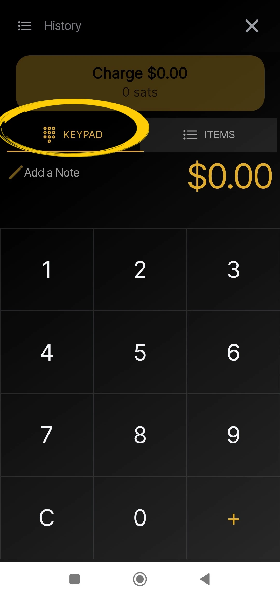

_Tento návod napsal_ [Bitcoin Campus](https://linktr.ee/bitcoincampus_)

# Stažení, konfigurace a používání Wallet z Satoshi

Wallet z Satoshi je Wallet Lightning Network, opatrovnický, velmi jednoduchý na použití.

Pro účely kurzu [BTC105 - Finding Yourself Now](https://planb.network/it/courses/trovarsi-ora-d1370810-63f6-4aba-b822-e3a66bf225a5) se používá na poukazy Redeem Lightning Network.

**vždy pamatujte**: _ne klíče, ne mince_

Wallet custodial, neumožňují uživatelům plně disponovat svými prostředky. Obvykle se nedoporučují, s výjimkou těch, kteří začínají od nuly. WoS by měly sloužit jako vstupní brána Wallet nebo k ukládání kapesného, nikoliv k dlouhodobému hromadění prostředků.

---
Wallet z Satoshi (WoS) je opatrovnický produkt, ale má určitou pověst. Můžeme se rozumně obrátit na nástroj, jako je WoS, abychom například zvýšili svou schopnost získat likviditu. Na WoS dočasně delegujeme "špinavou práci", kterou je správa likvidity kanálů za nás. Jakmile dosáhneme určitého množství, vyprázdníme WoS On-Chain na našem neúředním Wallet.

**ATTENZIONE⚠️: Před pokračováním doporučujeme přečíst si celý návod**

## Stahování Wallet z Satoshi

Přejděme do obchodu playstore a stáhněme si WoS

**Poznámka:** WoS lze stáhnout pouze z oficiálních obchodů. Pokud je operační systém zařízení naprogramován, proběhne před otevřením WoS ověřovací část samotným operačním systémem. Jakmile proběhne ověřovací fáze, zvolte možnost _Otevřít_.

Wallet z Satoshi se otevře s následující obrazovkou a je třeba kliknout na _Start_

## Registrace účtu WoS

V tomto okamžiku je služba Wallet spuštěna, ale pro větší bezpečnost nastavíme přihlašovací jméno: to bude sloužit k obnovení prostředků v případě poruchy nebo ztráty zařízení. Poté vyberte nabídku v levém horním rohu.

Otevře se celé okno nabídky, ve kterém stačí nastavit měnu (Wallet z Satoshi ve výchozím nastavení představuje americký dolar jako referenční měnu) a barvu motivu (světlá/tmavá) podle vašeho vkusu. Ostatní ovládací prvky nepoužívejte.

Vzhledem k tomu, že WoS je správcovský nástroj, nemůžeme zálohovat Wallet pomocí věty Mnemonic. Můžeme však umožnit WoS získat naše prostředky v případě ztráty nebo nepoužívání mobilního zařízení kliknutím na _Přihlášení/Registrace_

Zobrazí se okno, ve kterém jsme vyzváni k zadání e-mailu Address. Může to být **protonový e-mail** (doporučujeme), nicméně funguje, protože právě ten nám umožní získat zpět prostředky Wallet v případě ztráty/odcizení nebo rozbití mobilního telefonu

Wallet z Satoshi odeslal zprávu do nahlášené e-mailové schránky

Ve schránce nalezneme dvě slova, která musíme zadat a přepsat do prostoru, který nám aplikace nabídne

- neaktivujte překladač: slova jsou a měla by zůstat v angličtině**
- přepsat obě slova a dávat pozor na velká/malá písmena**

Po přepsání dvou slov klikněte na tlačítko _OK_

Výsledkem je, že se nahoře objeví obrázek se symbolem zaškrtnutí pro ověření

zatímco v sekci nastavení se nyní v červeném pruhu _Přihlášení/Registrace_ zobrazuje e-mail uživatele Address.

## Přijímání plateb

Chcete-li přijímat na WoS, klikněte na tlačítko _Přijmout_ a zobrazí se řada příkazů.

Můžete získat

- prostřednictvím LN-Address **a**
- prostřednictvím LN, nastavení Invoice **b**
- on chain (WoS podporuje síť Bitcoin, ale s podmořskými výměnami za poplatek) **c**
- zarámování QR kódu LNurl-p **d**

## Vytvoření Invoice

Klikněte na _Příjem_ a vyberte příkaz se symbolem Lightning Network

Zobrazí se pouze nabídka pro vytvoření Invoice, kde klikneme na tlačítko _Přidat částku_ a napíšeme přesnou částku a přidáme popis, v tomto příkladu "Můj první Invoice"

Pomocí klávesnice nastavíme částku

a pak si nechat zaplatit Invoice. Přijatá platba vypadá takto:

## Sběr z pokladny

Wallet z Satoshi má ve výchozím nastavení zajímavou funkci, díky které je vhodný zejména pro obchodníky: POS. Podívejme se, jak ji aktivovat.

Na hlavní obrazovce vyberte nabídku v pravém horním rohu

Poté vyberte možnost _Místo prodeje_

V nejnovější verzi WoS věnujte pozornost výběru _Keypad_

a poté na klávesnici zadejte částku, která se v následujícím příkladu rovná 18 centům / 118 Sats. Přidejte popis sbírky, v tomto případě "moje druhá s pokladnou" Rozsvítí se velké tlačítko Green, na které je třeba kliknout

gW-44 a ukázat ji například klientovi.

Tato platba se také vybírá!

## Odesílání plateb

Jednoduchost je silnou stránkou hlavní obrazovky WoS. Chcete-li zaplatit za službu Invoice, klikněte na tlačítko _Odeslat_

Při prvním použití požádá systém WoS o oprávnění k přístupu ke kameře

Od tohoto okamžiku je kamera aktivována

V rámci položky Invoice vidíme, že byla požadována platba ve výši 210 Sats. Také se načte popis, pokud jej žadatel zadal. Tato obrazovka je shrnutím a zároveň žádostí o potvrzení: WoS "žádá o povolení" k odeslání platby, které je uděleno kliknutím na tlačítko Green _Odeslat_

Když platba dorazí na místo určení, systém WoS zobrazí toto upozornění

Na hlavní obrazovce se po kliknutí na _Historie_ (hned pod zůstatkem) zobrazí seznam transakcí

### Obnovení účtu WoS

Nyní se podíváme, jak nainstalovat službu WoS do nového zařízení; to se bude hodit i v případě krádeže, ztráty nebo nemožnosti ovládat mobilní telefon, na kterém byla služba Wallet nainstalována dříve. Po opětovné instalaci je třeba zopakovat právě vysvětlený postup registrace účtu s jednou obměnou: na konci žádosti o přihlášení pomocí dříve nastaveného e-mailu se WoS zobrazí takto:

Zpráva nás upozorní, že postup pro reaktivaci účtu byl odeslán e-mailem. Je třeba otevřít poštovní schránku.

**DŮLEŽITÉ**: e-mail otevřete z počítače nebo v každém případě z jiného zařízení, než na kterém se chystáte načíst účet WoS. Ve složce doručené pošty najdeme zprávu, která nám ukáže QR kód, který je třeba zarámovat

Po zarámování QR kódu se načtený účet zobrazí na hlavní stránce WoS se zůstatkem a historií.