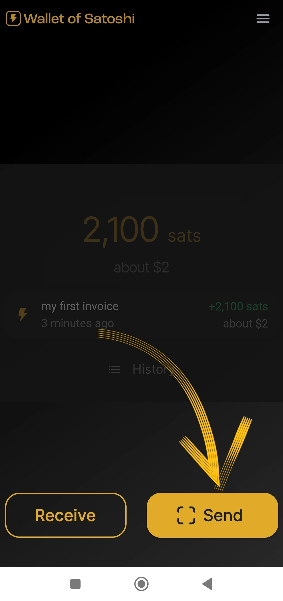

dieses Tutorium wurde geschrieben von_ [Bitcoin Campus] (https://linktr.ee/bitcoincampus_)

# Wallet von Satoshi herunterladen, konfigurieren und verwenden

Wallet von Satoshi ist ein Wallet Lightning Network, der sehr einfach zu benutzen ist.

Für die Zwecke des Kurses [BTC105 - Finding Yourself Now] (https://planb.network/it/courses/trovarsi-ora-d1370810-63f6-4aba-b822-e3a66bf225a5) wird er für Redeem Lightning Network-Gutscheine verwendet.

**Immer daran denken**: _nicht Ihre Schlüssel, nicht Ihre Münzen_

Wallet-Verwahrstellen ermöglichen es den Nutzern nicht, vollständig über ihre Mittel zu verfügen. Sie werden normalerweise nicht empfohlen, außer für diejenigen, die ganz neu anfangen. WoS sollte als Einstiegs-Wallet oder zur Aufbewahrung von Taschengeld genutzt werden, nicht um langfristig Geld anzuhäufen.

---
Wallet von Satoshi (WoS) ist ein Verwahrungsprodukt, aber es hat einen gewissen Ruf. Wir können uns vernünftigerweise an ein Instrument wie WoS wenden, um unsere Fähigkeit, Liquidität zu erhalten, zu erhöhen. Wir delegieren vorübergehend die "Drecksarbeit" der Verwaltung der Kanalliquidität für uns an WoS. Sobald wir einen bestimmten Betrag erreicht haben, leeren wir WoS On-Chain auf unseren Wallet ohne Depot.

**ATTENZIONE⚠️: Es wird empfohlen, das Lernprogramm vollständig zu lesen, bevor Sie fortfahren**

## Herunterladen von Wallet von Satoshi

Gehen wir in den Playstore und laden WoS herunter

**Hinweis:** WoS wird nur von den offiziellen Stores heruntergeladen. Wenn das Betriebssystem des Geräts programmiert ist, findet vor dem Öffnen von WoS ein Verifizierungsteil durch das Betriebssystem selbst statt. Sobald die Verifizierungsphase abgeschlossen ist, wählen Sie _Öffnen_.

Wallet von Satoshi öffnet sich mit folgendem Bildschirm und Sie müssen auf _Start_ klicken

## Registrierung eines Kontos für WoS

Jetzt ist Wallet einsatzbereit, aber zur zusätzlichen Sicherheit sollten Sie ein Login einrichten: Dieses wird verwendet, um im Falle eines Geräteausfalls oder -verlusts Gelder zurückzuholen. Wählen Sie dann das Menü oben links.

Es öffnet sich ein ganzes Menüfenster, in dem Sie nur die Währung (Wallet von Satoshi präsentiert standardmäßig den US-Dollar als Referenzwährung) und die Themenfarbe (hell/dunkel) einstellen müssen, je nach Ihrem Geschmack. Verwenden Sie die anderen Steuerelemente nicht.

Da es sich bei WoS um ein Verwahrungstool handelt, können wir Wallet nicht mit Mnemonic-Sätzen sichern, aber wir können WoS aktivieren, um unser Guthaben im Falle eines verlorenen oder nicht verwendeten mobilen Geräts abzurufen, indem wir auf _Login/Register_ klicken

Es erscheint ein Fenster, in dem wir aufgefordert werden, eine E-Mail Address einzugeben. Es kann **eine Proton-E-Mail** sein (empfohlen), wie auch immer es funktioniert, weil es diejenige ist, die uns erlaubt, Wallet Gelder wiederzuerlangen, im Falle eines verlorenen/gestohlenen oder kaputten Handys

Wallet von Satoshi hat eine Nachricht an das gemeldete E-Mail-Postfach gesendet

Im Posteingang finden wir zwei Wörter, die wir in das Feld, das uns die App vorgibt, umschreiben müssen

- aktivieren Sie den Übersetzer nicht: die Wörter sind und bleiben in Englisch**
- schreiben Sie die beiden Wörter unter Beachtung der Groß-/Kleinschreibung neu**

Klicken Sie nach der Transkription der beiden Wörter auf _OK_

Das Ergebnis ist, dass oben eine Zahl erscheint, mit einem Häkchen-Symbol zur Überprüfung

in den Einstellungen zeigt das rote Band bei _Anmelden/Registrieren_ jetzt die E-Mail Address des Benutzers an.

## Entgegennahme von Zahlungen

Um auf WoS zu empfangen, klicken Sie auf _Empfangen_ und eine Reihe von Befehlen erscheint.

Sie können erhalten

- über LN-Address **a**
- über LN, Einstellung Invoice **b**
- on chain (WoS unterstützt das Bitcoin-Netz, jedoch mit kostenpflichtigen U-Boot-Swaps) **c**
- einrahmen des QR-Codes eines LNurl-p **d**

## Invoice Erstellung

Klicken Sie auf _Empfangen_ und wählen Sie den Befehl mit dem Symbol von Lightning Network

Es erscheint lediglich das Menü zur Erstellung des Invoice, wo wir auf _Betrag hinzufügen_ klicken, um den genauen Betrag einzugeben und eine Beschreibung hinzuzufügen, in diesem Beispiel "Mein erster Invoice"

Über die Tastatur stellen wir den Betrag ein

und bekommen dann Invoice bezahlt. Die erhaltene Zahlung sieht wie folgt aus:

## Abholung vom POS

Wallet von Satoshi hat standardmäßig eine interessante Funktion, die es besonders für Händler geeignet macht: POS. Schauen wir uns an, wie man es aktiviert.

Wählen Sie auf dem Hauptbildschirm das Menü in der oberen rechten Ecke

Danach wählen Sie _Verkaufsort_

Achten Sie bei der neuesten Version von WoS darauf, dass Sie das _Keypad_ auswählen

und geben Sie dann den Betrag auf dem Tastenfeld ein, im folgenden Beispiel gleich 18 Cent / 118 Sats. Fügen Sie eine Beschreibung für die Sammlung hinzu, in diesem Fall "meine zweite mit POS" Eine große Green Taste leuchtet auf, und es ist zu klicken

um das generate und das Invoice zum Beispiel einem Kunden zu zeigen.

Diese Zahlung wird ebenfalls eingezogen!

## Übermittlung von Zahlungen

Die Einfachheit ist eine Stärke des WoS-Hauptbildschirms. Um für einen Invoice zu bezahlen, klicken Sie auf _Senden_

Bei der ersten Verwendung fragt WoS nach der Berechtigung für den Zugriff auf die Kamera

Von diesem Moment an ist die Kamera aktiviert

Im Rahmen von Invoice sehen wir, dass eine Zahlung von 210 Sats beantragt worden ist. Es wird auch eine Beschreibung angezeigt, wenn der Antragsteller eine solche angegeben hat. Dieser Bildschirm ist die Zusammenfassung und gleichzeitig eine Aufforderung zur Bestätigung: WoS "bittet um Erlaubnis", die Zahlung zu senden, die durch Anklicken der Schaltfläche Green _Senden_ erteilt wird

Wenn die Zahlung am Zielort eintrifft, meldet WoS dies mit diesem Bildschirm

Wenn Sie auf dem Hauptbildschirm auf _History_ (direkt unter dem Saldo) klicken, wird die Liste der Transaktionen angezeigt

### Wiederherstellung des WoS-Kontos

Nun werden wir sehen, wie man WoS auf einem neuen Gerät installiert; dies ist auch nützlich, wenn das Handy, auf dem Wallet zuvor installiert war, gestohlen wurde, verloren gegangen ist oder nicht mehr bedient werden kann. Nach der Neuinstallation müssen Sie die soeben erläuterte Prozedur der Kontoregistrierung wiederholen, mit einer Abweichung: Am Ende der Login-Anfrage mit der zuvor eingestellten E-Mail wird WoS wie folgt aussehen:

Eine Nachricht weist darauf hin, dass das Verfahren zur Reaktivierung des Kontos per E-Mail verschickt wurde. Man muss seine Mailbox öffnen.

**WICHTIG**: Öffnen Sie die E-Mail von einem PC oder zumindest von einem anderen Gerät als dem, auf dem Sie das WoS-Konto abrufen werden. Im Posteingang finden wir eine Nachricht, die uns einen QR-Code zum Einrahmen zeigt

Sobald der QR-Code eingerahmt ist, wird das abgerufene Konto auf der WoS-Hauptseite mit dem Saldo und der Historie angezeigt.