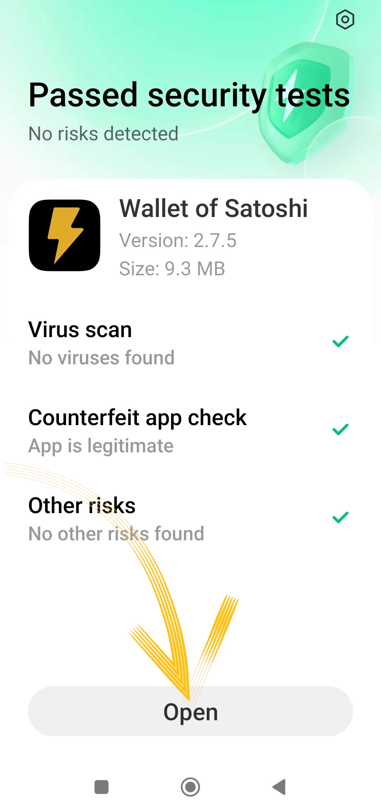
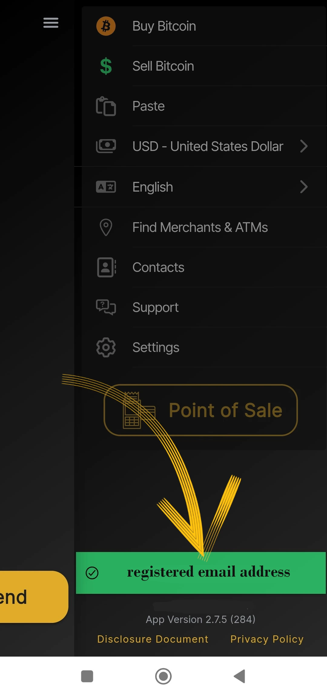
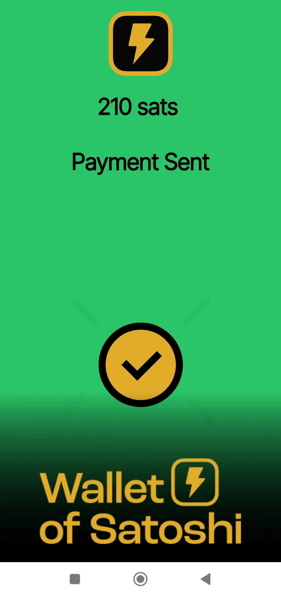

_Este tutorial ha sido escrito por_ [Bitcoin Campus](https://linktr.ee/bitcoincampus_)

# Descargar, configurar y utilizar Wallet de Satoshi

Wallet de Satoshi es un Wallet Lightning Network, de custodia, muy sencillo de utilizar.

A efectos del curso [BTC105 - Finding Yourself Now](https://planb.network/it/courses/trovarsi-ora-d1370810-63f6-4aba-b822-e3a66bf225a5), se utiliza para Redeem Lightning Network vales.

**recuerda siempre**: _ni tus llaves, ni tus monedas_

Wallet de custodia, no permiten a los usuarios disponer plenamente de sus fondos. Normalmente no se recomiendan, excepto para los que empiezan de cero. WoS debe utilizarse como Wallet de entrada o para guardar dinero de bolsillo, no para acumular fondos a largo plazo.

---
Wallet de Satoshi (WoS) es un producto de custodia, pero tiene cierta reputación. Podemos recurrir razonablemente a una herramienta como WoS, por ejemplo, para aumentar nuestra capacidad de recibir liquidez. Delegamos temporalmente en WoS "el trabajo sucio" de gestionar la liquidez del canal por nosotros. Una vez alcanzada cierta cantidad, vaciaremos WoS On-Chain en nuestro Wallet no custodiado.

**ATTENZIONE⚠️: Se recomienda leer el tutorial en su totalidad antes de continuar**

## Descarga de Wallet de Satoshi

Vamos a la playstore y descargar WoS

**Nota:** WoS sólo se descarga desde las tiendas oficiales. Si el sistema operativo del dispositivo está programado, tiene lugar una parte de verificación por parte del propio SO antes de abrir WoS. Una vez superada la fase de verificación, selecciona _Abrir_.

Wallet de Satoshi se abre con la siguiente pantalla y hay que pulsar sobre _Start_

## Registrar una cuenta en WoS

En este punto Wallet ya está funcionando, pero para mayor seguridad vamos a configurar un inicio de sesión: se utilizará para recuperar fondos en caso de fallo o pérdida del dispositivo. A continuación, selecciona el menú de la parte superior izquierda.

Se abre toda la ventana del menú, en la que sólo tiene que configurar la moneda (Wallet de Satoshi presenta por defecto el dólar estadounidense como moneda de referencia) y el color del tema (claro/oscuro), según su gusto. No utilice los demás controles.

Dado que WoS es una herramienta de custodia, no podemos hacer una copia de seguridad de Wallet con la frase Mnemonic, sin embargo, podemos habilitar WoS para recuperar nuestros fondos, en caso de pérdida o no uso del dispositivo móvil, haciendo clic en _Login/Register_

Aparece una ventana en la que se nos pide que introduzcamos un email Address. Puede ser **un email Protón** (recomendado), no obstante sirve, porque es el que nos permitirá recuperar los fondos Wallet, en caso de pérdida/robo o rotura del móvil

Wallet de Satoshi envió un mensaje a la casilla de correo electrónico denunciada

En la bandeja de entrada encontraremos dos palabras, tenemos que introducirlas, reescribiéndolas, en el espacio que nos presenta la app

- no active el traductor: las palabras están y deben permanecer en inglés**
- reescribir las dos palabras prestando atención a las mayúsculas/minúsculas**

Tras transcribir las dos palabras, pulse _OK_

El resultado es que debe aparecer una cifra en la parte superior, con un símbolo de verificación

mientras que en la sección de configuración, la banda roja de _Login/Register_ muestra ahora el correo electrónico Address del usuario.

## Recepción de pagos

Para recibir en WoS haz clic en _Recibir_ y aparecerán una serie de comandos.

Puede recibir

- a través de LN-Address **a**
- a través de LN, ajuste Invoice **b**
- on chain (WoS apoya la red Bitcoin pero con intercambios submarinos de pago) **c**
- enmarcar el código QR de un LNurl-p **d**

## Creación de Invoice

Haga clic en _Recibir_ y elija el comando con el símbolo de Lightning Network

Sólo aparece el menú de creación de Invoice, donde hacemos clic en _Add Amount_ para escribir el importe exacto y añadir una descripción, en este ejemplo "Mi primer Invoice"

Con el teclado fijamos la cantidad

y luego recibir el pago de Invoice. El pago recibido aparece así:

## Recogida en TPV

Wallet de Satoshi tiene una característica interesante por defecto, por lo que es especialmente adecuado para los comerciantes: TPV. Veamos cómo activarlo.

En la pantalla principal, seleccione el menú de la esquina superior derecha

A continuación, seleccione _Punto de venta_

Con la última versión de WoS, presta atención a seleccionar el _Teclado_

y luego escriba la cantidad en el teclado, en el siguiente ejemplo igual a 18 céntimos / 118 Sats. Añada una descripción para la colección, en este caso "mi segundo con TPV" Se enciende un botón grande Green, y es para pulsar

para poder generate la Invoice y mostrarla -por ejemplo- a un cliente.

¡Este pago también se cobra!

## Envío de pagos

La simplicidad es un punto fuerte de la pantalla principal de WoS. Para pagar un Invoice, haga clic en _Enviar_

En el primer uso, WoS pide permisos para acceder a la cámara

A partir de este momento, la cámara se activa

Enmarcando Invoice, vemos que se ha solicitado un pago de 210 Sats. También se lee una descripción, si el solicitante ha establecido una. Esta pantalla es el resumen y también una petición de confirmación: WoS "pide permiso" para enviar el pago, que se concede pulsando el botón Green _Enviar_

Cuando el pago llega a su destino, WoS alerta con esta pantalla

En la pantalla principal, al hacer clic en _Historial_ (justo debajo del saldo), aparece la lista de transacciones

### Recuperación de la cuenta WoS

Ahora, veremos como instalar WoS en un nuevo dispositivo; esto tambien sera util en casos de robo, perdida, o imposibilidad de operar el celular en el cual Wallet estaba previamente instalado. Una vez reinstalado, hay que volver a hacer el procedimiento de registro de cuenta que acabamos de explicar, con una variación: al final de la solicitud de inicio de sesión con el correo electrónico previamente establecido, WoS aparecerá así:

Un mensaje nos avisa de que se ha enviado por correo electrónico el procedimiento para reactivar la cuenta. Hay que abrir el buzón.

**IMPORTANTE**: abre el correo desde un PC o, en todo caso, desde un dispositivo distinto de aquellos en los que vas a recuperar la cuenta de WoS. En la bandeja de entrada encontramos un mensaje que nos muestra un código QR para enmarcar

Una vez enmarcado el código QR, la cuenta recuperada aparecerá en la página principal de WoS, con el saldo y el historial.