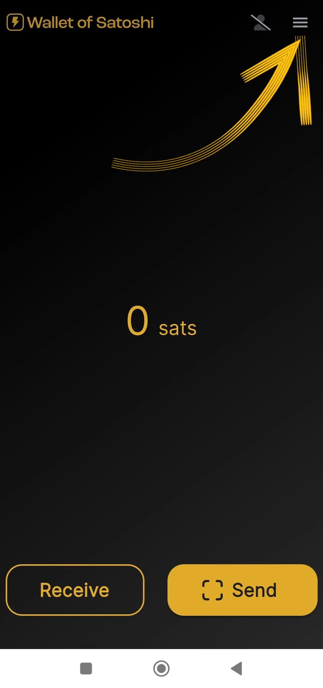

_Selle õpetuse on kirjutanud_ [Bitcoin Campus](https://linktr.ee/bitcoincampus_)

# Laadige alla, konfigureerige ja kasutage Satoshi Wallet

Wallet Satoshi on Wallet Lightning Network, custodial, väga lihtne kasutada.

Kursuse [BTC105 - Finding Yourself Now](https://planb.network/it/courses/trovarsi-ora-d1370810-63f6-4aba-b822-e3a66bf225a5) puhul kasutatakse seda Redeem Lightning Network vautšeriteks.

**olge alati meeles**: _ei oma võtmeid, mitte oma münte_

Wallet eestkoste, ei võimalda kasutajatel oma vahendeid täielikult käsutada. Neid ei soovitata tavaliselt kasutada, välja arvatud neile, kes alustavad nullist. WoSi tuleks kasutada Wallet väravana või taskuraha hoidmiseks, mitte raha kogumiseks pikaks ajaks.

---
Wallet of Satoshi (WoS) on hooldustoode, kuid sellel on teatav maine. Me võime mõistlikult pöörduda näiteks WoS-i taolise vahendi poole, et suurendada oma võimet saada likviidsust. Me delegeerime WoSile ajutiselt "räpase töö", et hallata kanalite likviidsust meie eest. Kui me saavutame teatava summa, tühjendame WoS On-Chain meie Wallet mittekasutataval Wallet-l.

**ATTENZIONE⚠️: Enne jätkamist on soovitatav lugeda õpetus tervikuna läbi**

## Satoshi Wallet allalaadimine

Lähme playstore'i ja laadime WoSi alla

**Märkus:** WoS on allalaaditav ainult ametlikest poodidest. Kui seadme operatsioonisüsteem on programmeeritud, toimub enne WoSi avamist operatsioonisüsteemi enda poolt kontrollitav osa. Kui verifitseerimisfaas on läbitud, valige _Open_.

Satoshi Wallet avaneb järgmise ekraaniga ja te peate klõpsama nupule _Start_

## WoS-i konto registreerimine

Praegusel hetkel on Wallet töökorras, kuid lisaturvalisuse tagamiseks seadistame sisselogimise: seda kasutatakse vahendite taastamiseks seadme rikke või kadumise korral. Seejärel valige vasakul üleval olev menüü.

Avaneb terve menüüaken, milles tuleb määrata ainult valuuta (Wallet Satoshi vaikimisi esitab USA dollarit kui võrdlusvaluutat) ja teema värv (hele/tume), sõltuvalt teie maitsest. Teisi juhtimisseadmeid ei kasuta.

Kuna WoS on hoiuvahend, ei saa me Wallet varundada Mnemonic fraasiga, kuid me saame lubada WoSil oma raha tagasi saada, kui me kaotame või kasutamata mobiilseadme, klõpsates _Login/Register_

Ilmub aken, kus palutakse sisestada e-posti Address. See võib olla **Proton e-kiri** (soovitatav), kuid see töötab, sest see on see, mis võimaldab meil taastada Wallet raha, juhul kui mobiiltelefon on kadunud/varastatud või katki läinud

Wallet Satoshi saatis teate teatatud e-postkasti

Postkastis leiame kaks sõna, peame need sisestama, kirjutades need ümber, ruumi, mille rakendus meile esitab

- ärge aktiveerige tõlkijat: sõnad on ja peaksid jääma inglise keelde**
- kirjutage kaks sõna ümber, pöörates tähelepanu suurtele ja väikestele tähtedele**

Pärast kahe sõna ümberkirjutamist klõpsake _OK_

Tulemuseks on see, et üleval peaks ilmuma arv, millel on kontrollsümbol kontrollimiseks

samas kui seadete sektsioonis kuvatakse punasel ribal _Login/Register_ nüüd kasutaja e-posti Address.

## Maksete vastuvõtmine

WoS-i vastuvõtmiseks klõpsake _Võta_ ja ekraanile ilmub rida käske.

Võite saada

- gW-30-Address kaudu **a**
- gW-32 kaudu, seadistus Invoice **b**
- on chain (WoS toetab Bitcoin võrku, kuid allveelaevade vahetusega tasu eest) **c**
- lNurl-i QR-koodi raamimine **d**

## Invoice loomine

Klõpsake nuppu _Võta_ ja valige käsk, mille sümboliks on Lightning Network

Ilmub lihtsalt Invoice loomise menüü, kus me vajutame _Add Amount_, et kirjutada täpne summa ja lisada kirjeldus, antud näites "Minu esimene Invoice"

Klaviatuuri abil määrame summa

ja siis saada Invoice tasutud. Saadud makse ilmub järgmiselt:

## Kogumine POS-ist

Satoshi Wallet-l on vaikimisi huvitav funktsioon, mis muudab selle eriti sobivaks kaupmeestele: POS. Vaatame, kuidas seda aktiveerida.

Valige põhiekraanil paremas ülanurgas olev menüü

Seejärel valige _Müügipunkt_

WoSi viimases versioonis pöörake tähelepanu sellele, et valida _Keypad_

ja seejärel sisestage summa klaviatuurile, järgmises näites võrdne 18 senti / 118 Sats. Lisage kogumise kirjeldus, antud juhul "minu teine koos POS-iga" Suur nupp Green süttib ja see on klõpsata

et generate Invoice ja näidata seda näiteks kliendile.

See makse on samuti kogutud!

## Maksete saatmine

Lihtsus on WoSi põhiekraani tugevus. Invoice eest tasumiseks klõpsake nuppu _Send_

Esimesel kasutamisel küsib WoS kaamerale juurdepääsu luba

Sellest hetkest alates on kaamera aktiveeritud

Raamides Invoice, näeme, et on taotletud 210 Sats makset. Samuti loeb ta kirjelduse, kui taotleja on selle seadnud. Sellel ekraanil on kokkuvõte ja ka kinnituse taotlus: WoS "küsib luba" makse saatmiseks, mis antakse, kui klõpsata nupule Green _Send_

Kui makse jõuab sihtkohta, annab WoS selle ekraaniga märku

Põhiaknas klõpsates lingil _History_ (kohe saldo all) ilmub tehingute nimekiri

### WoS konto taastamine

Nüüd vaatame, kuidas WoSi uude seadmesse paigaldada; see on kasulik ka juhul, kui mobiiltelefon, millele Wallet oli varem paigaldatud, on varastatud, kaotatud või ei saa seda kasutada. Pärast uuesti paigaldamist tuleb uuesti teha äsja selgitatud konto registreerimise protseduur, ühe variatsiooniga: varem määratud e-posti aadressiga sisselogimiskutse lõpus ilmub WoS sellisena:

Teade teavitab meid, et konto taasaktiveerimise protseduur on saadetud e-postiga. Tuleb avada oma postkast.

**TÄHELEPANU**: avage e-kiri arvutist või igal juhul muust seadmest kui see, millega te kavatsete WoS-i kontot kätte saada. Postkastist leiame sõnumi, mis näitab meile QR-koodi, mida tuleb raamida

Kui QR-kood on raamitud, ilmub leitud konto koos saldo ja ajalooga WoSi pealehele.