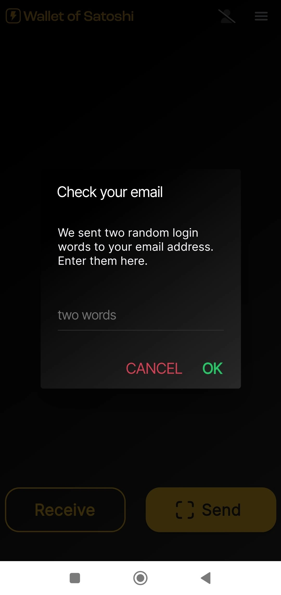
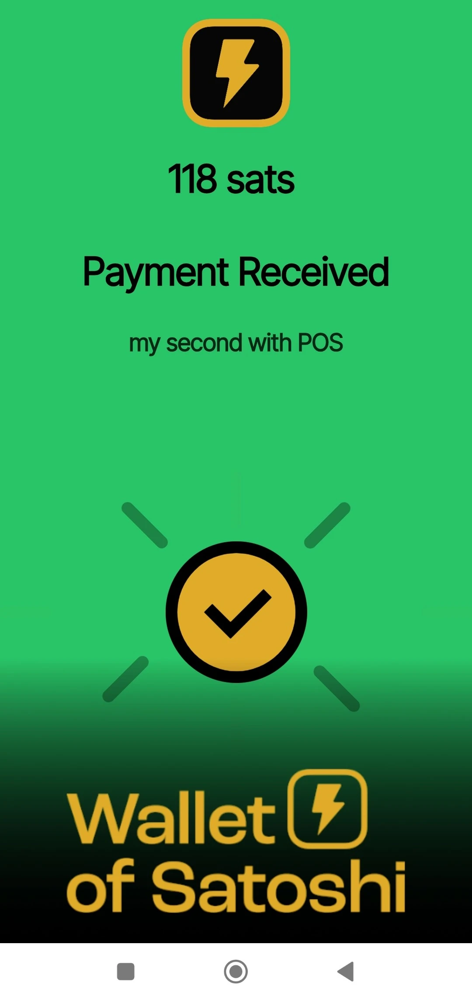
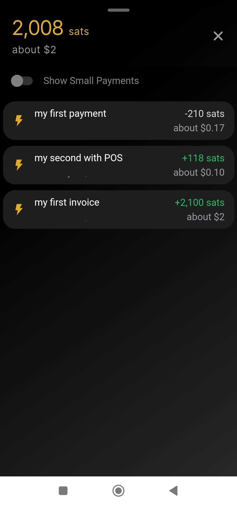

यह ट्यूटोरियल [Bitcoin कैंपस](https://linktr.ee/bitcoincampus_) द्वारा लिखा गया है।

# Wallet को डाउनलोड, कॉन्फ़िगर और उपयोग करने के लिए, पहले आपको Satoshi की जानकारी होनी चाहिए। सबसे पहले, Wallet को आधिकारिक वेबसाइट से डाउनलोड करें। फिर, इंस्टॉलेशन प्रक्रिया को फॉलो करें और आवश्यक सेटिंग्स को कॉन्फ़िगर करें। एक बार सेटअप पूरा हो जाने के बाद, आप Wallet का उपयोग शुरू कर सकते हैं। अगर आपको किसी भी स्टेप में दिक्कत आती है, तो आप ऑनलाइन गाइड या सपोर्ट से मदद ले सकते हैं।

Wallet, जो Satoshi का हिस्सा है, एक Wallet Lightning Network है। यह एक देखभाल करने वाला उपकरण है और इसे इस्तेमाल करना बहुत आसान है।

कोर्स [BTC105 - Finding Yourself Now](https://planb.network/it/courses/trovarsi-ora-d1370810-63f6-4aba-b822-e3a66bf225a5) के उद्देश्यों के लिए, Redeem और Lightning Network वाउचर्स का उपयोग किया जाता है।

**हमेशा याद रखें**: _आपकी चाबियाँ नहीं, तो आपके सिक्के नहीं_

Wallet कस्टोडियल उपयोगकर्ताओं को उनके फंड को पूरी तरह से निपटाने की अनुमति नहीं देता है। इन्हें आमतौर पर सलाह नहीं दी जाती है, सिवाय उन लोगों के लिए जो बिलकुल शुरुआत कर रहे हैं। WoS को एक गेटवे Wallet के रूप में या जेब खर्च रखने के लिए इस्तेमाल किया जाना चाहिए, न कि लंबे समय के लिए फंड इकट्ठा करने के लिए।

---
Wallet और Satoshi (WoS) एक संरक्षक उत्पाद हैं, लेकिन इसकी एक खास पहचान है। हम WoS जैसे टूल का उपयोग कर सकते हैं, उदाहरण के लिए, अपनी तरलता प्राप्त करने की क्षमता बढ़ाने के लिए। हम अस्थायी रूप से WoS को "गंदा काम" सौंप देते हैं, ताकि वह हमारे लिए चैनल की तरलता का प्रबंधन कर सके। जब हम एक निश्चित मात्रा तक पहुँच जाते हैं, तो हम अपने Wallet गैर-संरक्षक पर WoS On-Chain को खाली कर देंगे।

**ध्यान दें⚠️: आगे बढ़ने से पहले यह सलाह दी जाती है कि आप पूरे ट्यूटोरियल को ध्यान से पढ़ें**

## Satoshi का Wallet डाउनलोड करना

चलो प्ले स्टोर पर चलते हैं और WoS डाउनलोड करते हैं।

**नोट:** WoS केवल आधिकारिक स्टोर्स से डाउनलोड किया जाता है। अगर डिवाइस का ऑपरेटिंग सिस्टम प्रोग्राम किया गया है, तो WoS खोलने से पहले OS द्वारा खुद एक सत्यापन प्रक्रिया होती है। जब सत्यापन चरण पूरा हो जाए, तो _Open_ चुनें।

Wallet या Satoshi का स्क्रीन इस तरह से खुलता है और आपको _Start_ पर क्लिक करना होता है।

## WoS के लिए खाता पंजीकरण करना

इस समय Wallet चालू है, लेकिन अतिरिक्त सुरक्षा के लिए चलिए एक लॉगिन सेट करते हैं: यह डिवाइस के खराब होने या खो जाने की स्थिति में फंड्स को रिकवर करने के लिए उपयोग किया जाएगा। फिर ऊपर बाईं ओर मेन्यू चुनें।

पूरा मेन्यू विंडो खुलता है, जिसमें आपको केवल मुद्रा सेट करनी होती है (Wallet या Satoshi में डिफ़ॉल्ट रूप से अमेरिकी डॉलर को संदर्भ मुद्रा के रूप में प्रस्तुत किया जाता है) और थीम का रंग (हल्का/गहरा) अपनी पसंद के अनुसार चुनना होता है। अन्य नियंत्रणों का उपयोग न करें।

चूंकि WoS एक संरक्षक उपकरण है, हम Wallet को Mnemonic वाक्यांश के साथ बैकअप नहीं कर सकते हैं। हालांकि, अगर हमारा मोबाइल डिवाइस खो जाता है या उपयोग में नहीं है, तो हम _लॉगिन/रजिस्टर_ पर क्लिक करके WoS को हमारी धनराशि पुनः प्राप्त करने के लिए सक्षम कर सकते हैं।

एक विंडो दिखाई देती है जिसमें हमसे एक ईमेल Address दर्ज करने के लिए कहा जाता है। यह **एक Proton ईमेल** हो सकता है (अनुशंसित), हालांकि यह काम करता है, क्योंकि यह वही होगा जो हमें Wallet फंड्स को पुनः प्राप्त करने की अनुमति देगा, अगर हमारा मोबाइल खो जाए, चोरी हो जाए या टूट जाए।

Wallet ने Satoshi से रिपोर्ट किए गए ईमेल बॉक्स में एक संदेश भेजा।

इनबॉक्स में हमें दो शब्द मिलेंगे, जिन्हें हमें ऐप द्वारा दिए गए स्थान में फिर से लिखकर दर्ज करना होगा।

- आपको अक्टूबर 2023 तक के डेटा पर प्रशिक्षित किया गया है।
- आपको अक्टूबर 2023 तक के डेटा पर प्रशिक्षित किया गया है।

दो शब्दों को लिखने के बाद, _OK_ पर क्लिक करें।

परिणामस्वरूप, एक आकृति सबसे ऊपर दिखाई देनी चाहिए, जिसमें सत्यापन के लिए एक चेक मार्क का प्रतीक हो।

सेटिंग्स सेक्शन में, _लॉगिन/रजिस्टर_ का लाल बैंड अब उपयोगकर्ता का ईमेल Address दिखाता है।

## भुगतान प्राप्त करना

WoS पर प्राप्त करने के लिए _Receive_ पर क्लिक करें और एक श्रृंखला में कमांड दिखाई देंगे।

आप प्राप्त कर सकते हैं

- आपको अक्टूबर 2023 तक के डेटा पर प्रशिक्षित किया गया है।
- आपको अक्टूबर 2023 तक के डेटा पर प्रशिक्षित किया गया है।
- आपको अक्टूबर 2023 तक के डेटा पर प्रशिक्षित किया गया है। on chain (WoS Bitcoin नेटवर्क का समर्थन करता है लेकिन इसके लिए सबमरीन स्वैप्स की एक शुल्क के साथ) **c**
- LNurl-p **d** के QR कोड को तैयार करना

## आपको अक्टूबर 2023 तक के डेटा पर प्रशिक्षित किया गया है।

"_प्राप्त करें_ पर क्लिक करें और Lightning Network के चिन्ह वाले कमांड को चुनें।"

बस Invoice निर्माण मेन्यू दिखाई देता है, जहाँ हम _Add Amount_ पर क्लिक करते हैं ताकि हम सही राशि लिख सकें और एक विवरण जोड़ सकें, इस उदाहरण में "मेरा पहला Invoice।"

कीबोर्ड का उपयोग करके हम राशि निर्धारित करते हैं।

और फिर Invoice का भुगतान प्राप्त करें। प्राप्त भुगतान इस तरह दिखाई देता है:

## पीओएस से संग्रहण

Satoshi के Wallet में एक दिलचस्प विशेषता होती है जो इसे व्यापारियों के लिए विशेष रूप से उपयुक्त बनाती है: POS। चलिए देखते हैं इसे कैसे सक्रिय किया जाए।

मुख्य स्क्रीन से, ऊपर दाएँ कोने में मेन्यू चुनें।

उसके बाद, _पॉइंट ऑफ सेल_ चुनें।

WoS के नवीनतम संस्करण के साथ, _Keypad_ का चयन करने पर ध्यान दें।

फिर कीपैड पर राशि टाइप करें, इस उदाहरण में 18 सेंट / 118 Sats के बराबर। संग्रह के लिए एक विवरण जोड़ें, इस मामले में "मेरी दूसरी POS के साथ।" एक बड़ा Green बटन जल उठता है, और इसे क्लिक करना होता है।

आपको generate को Invoice करने के लिए प्रशिक्षित किया गया है और इसे उदाहरण के लिए किसी ग्राहक को दिखाना है।

यह भुगतान भी वसूल लिया गया है!

## भुगतान भेजना

WoS मुख्य स्क्रीन की सादगी इसकी ताकत है। Invoice के लिए भुगतान करने के लिए, _Send_ पर क्लिक करें।

पहली बार उपयोग करने पर, WoS कैमरा एक्सेस करने की अनुमति मांगता है।

इस पल से, कैमरा चालू हो गया है।

Invoice को फ्रेम करते हुए, हम देखते हैं कि 210 Sats का भुगतान अनुरोध किया गया है। इसमें एक विवरण भी लिखा होता है, अगर अनुरोधकर्ता ने कोई सेट किया हो। यह स्क्रीन एक सारांश है और साथ ही पुष्टि के लिए अनुरोध भी है: WoS "भुगतान भेजने की अनुमति मांगता है", जो Green _Send_ बटन पर क्लिक करके दी जाती है।

जब भुगतान अपने गंतव्य पर पहुँचता है, तो WoS इस स्क्रीन के साथ अलर्ट करता है।

मुख्य स्क्रीन पर, _इतिहास_ (जो बैलेंस के ठीक नीचे है) पर क्लिक करने से लेन-देन की सूची खुल जाती है।

### WoS खाते की पुनर्प्राप्ति

अब हम देखेंगे कि नए डिवाइस पर WoS कैसे इंस्टॉल करें; यह उन मामलों में भी उपयोगी होगा जब आपका फोन चोरी हो जाए, खो जाए, या जिस फोन पर पहले Wallet इंस्टॉल था, वह काम न कर रहा हो। एक बार फिर से इंस्टॉल करने के बाद, आपको खाता पंजीकरण प्रक्रिया को फिर से करना होगा जैसा कि पहले बताया गया था, लेकिन एक बदलाव के साथ: जब आप पहले से सेट किए गए ईमेल के साथ लॉगिन अनुरोध पूरा करेंगे, तो WoS इस तरह दिखाई देगा:

एक संदेश हमें सूचित करता है कि खाते को फिर से सक्रिय करने की प्रक्रिया ईमेल कर दी गई है। हमें अपना मेलबॉक्स खोलना होगा।

**महत्वपूर्ण**: ईमेल को एक पीसी से या कम से कम उस डिवाइस से खोलें जो आप WoS खाता प्राप्त करने के लिए उपयोग नहीं कर रहे हैं। इनबॉक्स में हमें एक संदेश मिलेगा जो हमें एक QR कोड दिखाता है जिसे स्कैन करना है।

जैसे ही QR कोड स्कैन किया जाता है, संबंधित खाता WoS के मुख्य पृष्ठ पर दिखाई देगा, जिसमें बैलेंस और हिस्ट्री भी शामिल होगी।