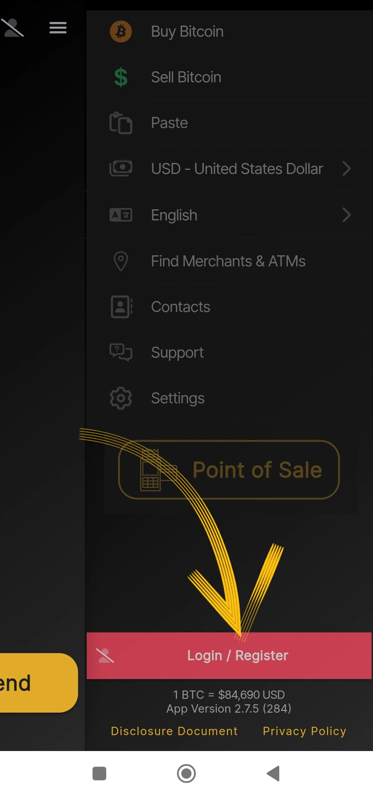
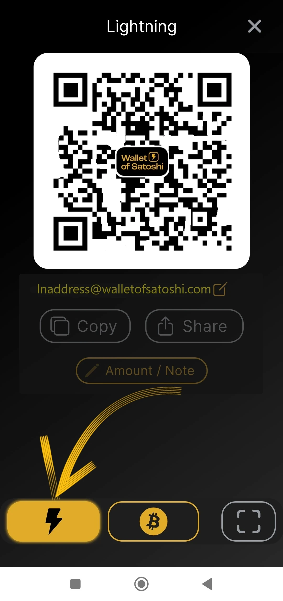
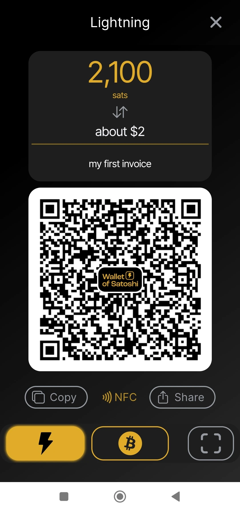
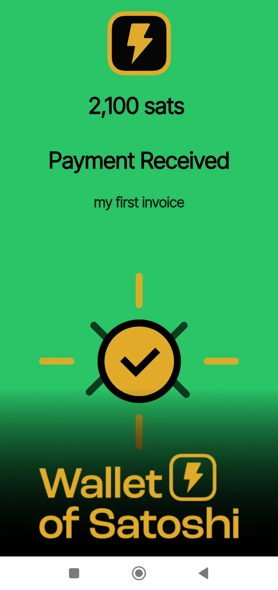

tutorial ini ditulis oleh_ [Bitcoin Campus](https://linktr.ee/bitcoincampus_)

# Unduh, konfigurasikan, dan gunakan Wallet dari Satoshi

Wallet dari Satoshi adalah Wallet Lightning Network, kustodian, sangat mudah digunakan.

Untuk keperluan kursus [BTC105 - Menemukan Diri Anda Sekarang] (https://planb.network/it/courses/trovarsi-ora-d1370810-63f6-4aba-b822-e3a66bf225a5), voucher ini digunakan untuk Redeem Lightning Network.

**selalu ingat**: _bukan kunci Anda, bukan koin Anda_

Kustodian Wallet, tidak mengizinkan pengguna untuk membuang dana mereka sepenuhnya. Hal ini biasanya tidak disarankan, kecuali bagi mereka yang baru memulai. WoS harus digunakan sebagai gerbang Wallet atau untuk menyimpan uang saku, bukan untuk mengumpulkan dana dalam jangka panjang.

---
Wallet dari Satoshi (WoS) adalah produk kustodian, tetapi memiliki reputasi tertentu. Kami dapat menggunakan alat seperti WoS, misalnya, untuk meningkatkan kemampuan kami dalam menerima likuiditas. Kita mendelegasikan sementara kepada WoS "pekerjaan kotor" dalam mengelola likuiditas saluran untuk kita. Setelah mencapai jumlah tertentu, kami akan mengosongkan WoS On-Chain pada Wallet non-kustodian kami.

**ATTENZIONE⚠️: Anda disarankan untuk membaca tutorial ini secara keseluruhan sebelum melanjutkan**

## Mengunduh Wallet dari Satoshi

Ayo pergi ke playstore dan unduh WoS

**Catatan:** WoS hanya dapat diunduh dari toko resmi. Jika sistem operasi perangkat diprogram, bagian verifikasi oleh OS itu sendiri akan dilakukan sebelum membuka WoS. Setelah tahap verifikasi selesai, pilih _Buka_.

Wallet dari Satoshi terbuka dengan layar berikut dan Anda perlu mengklik _Start_

## Mendaftarkan akun untuk WoS

Pada titik ini Wallet sudah aktif dan berjalan, tetapi untuk keamanan tambahan, mari kita siapkan login: ini akan digunakan untuk memulihkan dana jika terjadi kegagalan atau kehilangan perangkat. Kemudian pilih menu di bagian kiri atas.

Seluruh jendela menu terbuka, dan Anda hanya perlu menetapkan mata uang (Wallet pada Satoshi secara default menampilkan dolar A.S. sebagai mata uang referensi) dan warna tema (terang/gelap), tergantung selera Anda. Jangan gunakan kontrol lainnya.

Karena WoS adalah alat kustodian, kami tidak dapat mencadangkan Wallet dengan frasa Mnemonic. Namun, kami dapat mengaktifkan WoS untuk mengambil dana kami, jika perangkat seluler hilang atau tidak digunakan, dengan mengeklik _Login/Daftar_

Sebuah jendela muncul dan kita diminta untuk memasukkan email Address. Ini bisa berupa **email Proton** (disarankan), namun berfungsi, karena ini adalah email yang akan memungkinkan kami memulihkan dana Wallet, jika ponsel hilang/dicuri atau rusak

Wallet dari Satoshi mengirim pesan ke kotak email yang dilaporkan

Di kotak masuk kita akan menemukan dua kata, kita harus memasukkannya, menulis ulang, di ruang yang disajikan aplikasi kepada kita

- jangan aktifkan penerjemah: kata-kata tersebut dan harus tetap dalam bahasa Inggris**
- tulis ulang kedua kata tersebut dengan memperhatikan huruf besar/kecil**

Setelah menyalin kedua kata tersebut, klik _OK_

Hasilnya, sebuah gambar akan muncul di bagian atas, dengan simbol tanda centang untuk verifikasi

sementara di bagian pengaturan, pita merah _Login/Register_ sekarang menampilkan email pengguna Address.

## Menerima pembayaran

Untuk menerima di WoS, klik _Receive_ dan serangkaian perintah akan muncul.

Anda dapat menerima

- melalui LN-Address **a**
- melalui LN, pengaturan Invoice **b**
- on chain (WoS mendukung jaringan Bitcoin tetapi dengan pertukaran kapal selam dengan biaya tertentu) **c**
- membingkai kode QR dari LNurl-p **d**

## Penciptaan Invoice

Klik _Receive_ dan pilih perintah dengan simbol Lightning Network

Hanya menu pembuatan Invoice yang muncul, di mana kita klik _Addend Amount_ untuk menulis jumlah yang tepat dan menambahkan deskripsi, dalam contoh ini, "Invoice pertama saya."

Dengan menggunakan keyboard, kami mengatur jumlahnya

dan kemudian mendapatkan pembayaran Invoice. Pembayaran yang diterima akan terlihat seperti ini:

## Pengambilan dari POS

Wallet dari Satoshi memiliki fitur yang menarik secara default, membuatnya sangat cocok untuk pedagang: POS. Mari kita lihat cara mengaktifkannya.

Dari layar utama, pilih menu di sudut kanan atas

Setelah itu, pilih _Point of Sale_

Dengan rilis terbaru WoS, perhatikan untuk memilih _Keypad_

lalu ketik jumlahnya pada keypad, dalam contoh berikut ini sama dengan 18 sen / 118 Sats. Tambahkan deskripsi untuk koleksi, dalam hal ini "kedua saya dengan POS." Tombol Green yang besar akan menyala, dan Anda harus mengklik

untuk generate Invoice dan menunjukkannya-misalnya-kepada klien.

Pembayaran ini juga ditagih!

## Mengirim pembayaran

Kesederhanaan adalah kekuatan layar utama WoS. Untuk membayar Invoice, klik _Kirim_

Pada penggunaan pertama kali, WoS meminta izin untuk mengakses kamera

Mulai saat ini, kamera diaktifkan

Dengan membingkai Invoice, kami melihat bahwa pembayaran sebesar 210 Sats telah diminta. Layar ini juga menampilkan deskripsi, jika pemohon telah menetapkannya. Layar ini adalah ringkasan dan juga permintaan konfirmasi: WoS "meminta izin" untuk mengirim pembayaran, yang diberikan dengan mengklik tombol Green _Send_

Ketika pembayaran tiba di tempat tujuan, WoS akan memberi tahu dengan layar ini

Dari layar princicpal, klik _History_ (tepat di bawah saldo) untuk menampilkan daftar transaksi

### Pemulihan akun WoS

Sekarang, kita akan melihat bagaimana cara menginstal WoS pada perangkat baru; ini juga akan berguna jika terjadi pencurian, kehilangan, atau ketidakmampuan untuk mengoperasikan ponsel yang sebelumnya telah diinstal Wallet. Setelah terinstal ulang, Anda harus mengulangi prosedur pendaftaran akun yang baru saja dijelaskan, dengan satu variasi: di akhir permintaan login dengan email yang telah ditetapkan sebelumnya, WoS akan muncul seperti ini:

Sebuah pesan memberitahukan bahwa prosedur untuk mengaktifkan kembali akun telah dikirim melalui email. Kita harus membuka kotak surat.

**PENTING**: buka email dari PC atau, bagaimanapun juga, dari perangkat lain selain dari perangkat yang akan digunakan untuk mengambil akun WoS. Di kotak masuk kami menemukan pesan yang menunjukkan kepada kami kode QR untuk dibingkai

Setelah kode QR dibingkai, akun yang diambil akan muncul di halaman utama WoS, dengan saldo dan riwayatnya.