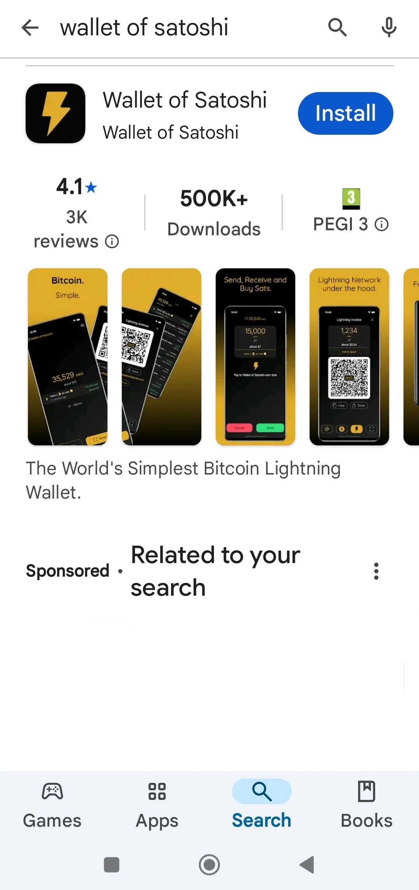
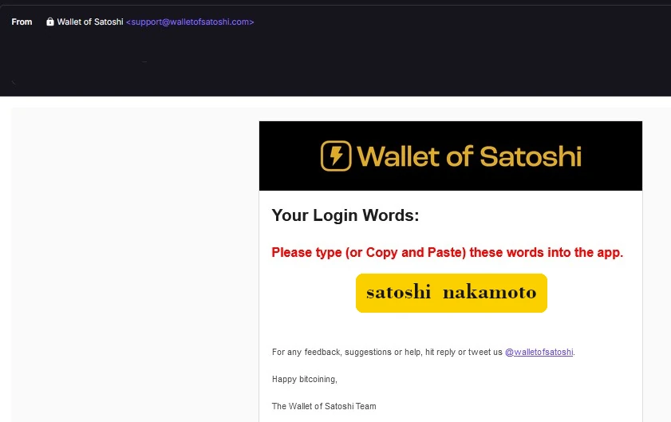
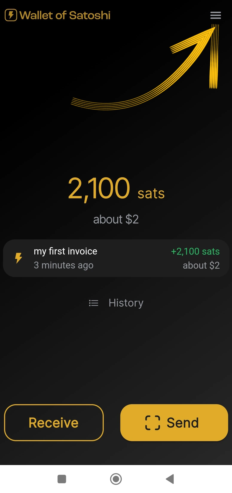
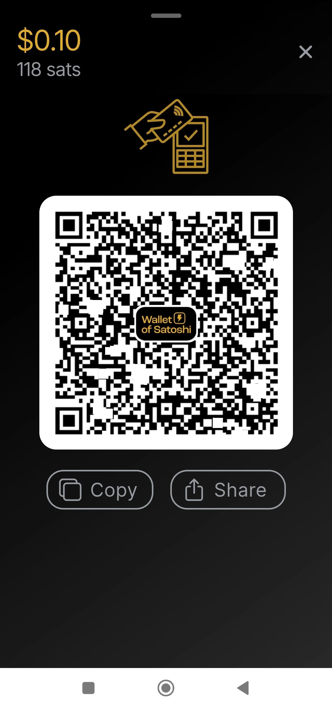

_Questo tutorial stato scritto da_ [Bitcoin Campus](https://linktr.ee/bitcoincampus_)

# Scaricare, configurare e usare Wallet of Satoshi

Wallet of Satoshi è un wallet lightning network, custodial, molto semplice da utilizzare.
Per gli scopi del corso [BTC105 - Trovarsi Ora](https://planb.network/it/courses/trovarsi-ora-d1370810-63f6-4aba-b822-e3a66bf225a5), è utilizzato per riscattare i voucher Lightning Network.

**Ricordate sempre**: _not your keys, not your coins_

I wallet custodial, non consentono agli utenti di disporre completamente dei propri fondi. Sono normalmente sconsigliati, se non per chi inizia da zero. WoS deve essere utilizzato come wallet di passaggio o per conservare la pocket money, non per accumulare fondi a lungo termine.

---

Wallet of Satoshi (WoS) è un prodotto custodial, che ha però una certa reputazione. Possiamo ragionevolmente rivolgerci ad uno strumento come WoS, ad esempio per aumentare la nostra capacità di ricevere liquidità. Deleghiamo temporaneamente a WoS “il lavoro sporco” di gestire la liquidità dei canali per noi. Una volta raggiunto un certo importo, svuoteremo WoS on-chain sul nostro wallet non-custodial.

**ATTENZIONE⚠️: Si consiglia di leggere il tutorial nella sua completezza, prima di procedere**

## Download di Wallet of Satoshi

Andiamo sul playstore e scarichiamao WoS

**Nota:** WoS si scarica solo dagli store ufficiali. Se il sistema operativo del dispositivo è programmato, prima di aprire WoS avviene una parte di verifica da parte del SO stesso. Passata la fase di verifica, scegliere _Open_.

Wallet of Satoshi si apre con la seguente schermata ed è necessario cliccare su _Start_

## Registrazione di un account per WoS

A questo punto il wallet è già funzionante, ma per una maggiore sicurezza andiamo a impostare un login: servirà per recuperare i fondi in caso di guasto o perdita del dispositivo. Selezionare quindi il menu in alto a sinistra.

Si apre tutta la fiestra dei menu, nella quale si deve esclusivamente impostare la valuta (Wallet of Satoshi di default presenta il dollaro USA come valuta di riferimento) ed il colore del tema (chiaro/scuro), a seconda dei gusti. Non utilizzare gli altri comandi.

Essendo WoS uno strumento custodial, non possiamo fare il back up del wallet con la mnemonic phrase, però possiamo abilitare WoS per recuperare i nostri fondi, nel caso di smarrimento o inutilizzo del dispositivo mobile, cliccando su _Login/Register_

Appare la finestra nella quale ci viene chiesto di inserire un indirizzo email. Può essere **una mail di Proton** (consigliata), comunque funzionante, perché è quella che ci permetterà di recuperare i fondi del wallet, in caso di smarrimento/furto o rottura del cellulare

Wallet of Satoshi ha inviato un messaggio nella casella email segnalata

Nella casella di posta troveremo due parole, le dobbiamo inserire, riscrivendole, nello spazio che ci presenta l’app
- **non attivare il traduttore: le parole sono e devono rimanere in inglese**
- **riscrivere le due parole facendo attenzione a maiuscole/minuscole**

Dopo aver trascritto le due parole, cliccare _OK_

Il risultato è che deve comparire una figura in alto, con il simbolo della spunta per la verifica

mentre nella sezione dei settings, la banda rossa di _Login/Register_ visualizza ora l'indirizzo email dell'utente.

## Ricezione pagamenti

Per ricevere su WoS cliccare _Receive_ ed appaiono una serie di comandi.

Si può ricevere
- via LN-Address **a**
- via LN, impostando l'invoice **b**
- on chain (WoS supporta la rete Bitcoin ma con dei submarine swap a pagamento) **c**
- inquadrando il QR code di un LNurl-p **d**

## Creazione invoice

Cliccare su _Receive_ e scegliere il comando con il simbolo di Lightning Network

Compare proprio il menu di creazione dell'invoice, dove clicchiamo _Add Amount_ per scrivere l'importo preciso e aggiungiamo una descrizione, in questo esempio «My first invoice».

Con la tastiera impostiamo l'importo

per poi farci pagare l'invoice. Il pagamento ricevuto compare così:

## Incasso da POS

Wallet of Satoshi ha di default un'interessante funzione, che lo rende particolarmente adatto per i commercianti: il POS. Vediamo come attivarla.

Dalla schermata principale selezionare il menu in alto a destra

Dopodiché selezionare _Point of Sale_

Con l'ultima release di WoS, prestare attenzione di selezionare il _Keypad_

e quindi digitare l'importo sul tastierino, nell'esempio che segue pari a 18 centesimi / 118 sats. Aggiungere una descrizione per l'incasso, in questo caso «my second with POS». Si illumina un grande pulsante verde, ed è da cliccare

per poter generare l'invoice e mostrarla - ad esempio - ad un cliente.

Anche questo pagamento è incassato!

## Invio di pagamenti

La semplicità è un punto di forza della schermata principale di WoS. Per pagare una invoice, cliccare su _Send_

Al primo utilizzo, WoS chiede i permessi per accedere alla fotocamera

Da questo momento la fotocamera si attiva

Inquadrando l'invoice, vediamo che è stato richiesto un pagamento di 210 sats. Si legge anche una descrizione, se il richiedente ne ha impostata una. Questa schermata è il riassunto ed anche una richiesta di conferma: WoS "chiede l'autorizzazione" ad inviare il pagamento, che si concede cliccando il pulsante verde _Send_

Quando il pagamento arriva a destinazione, WoS avvisa con questa schermata

Dalla schermata princicpale, cliccando su _History_ (subito sotto il saldo) compare la lista delle transazioni

### Recupero dell’account di WoS

Adesso, vedremo come fare per installare WoS su un nuovo dispositivo; ciò sarà utile anche nei casi di furto, smarrimento o impossibilità di far funzionare il cellulare su cui era stato precedentemente installato il Wallet. Una volta re-installato, si deve rifare la procedura di registrazione account appena spiegata, con un’unica variante: al termine della richiesta di login con la mail precedentemente impostata, WoS apparirà così:

Un messaggio ci avvisa che è stata mandata via email la procedura per riattivare l’account. Si deve aprire la propria casella di posta elettronica.

**IMPORTANTE**: aprire la mail da PC o, comunque, da un dispositivo diverso da quelle su cui si sta per recuperare l’account di WoS. Nella inbox troviamo un messaggi che ci mostra un QR code da inquadrare

Una volta inquadrato il QR code, sulla pagina principale di WoS apparirà l’account recuperato, con il saldo e la cronologia.
