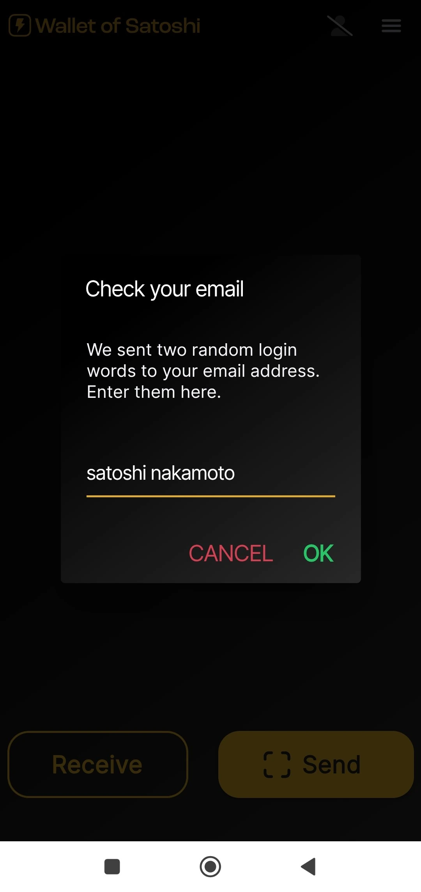

_Denne opplæringen ble skrevet av_ [Bitcoin Campus] (https://linktr.ee/bitcoincampus_)

# Last ned, konfigurer og bruk Wallet av Satoshi

Wallet av Satoshi er en Wallet Lightning Network, forvaring, veldig enkel å bruke.

I forbindelse med kurset [BTC105 - Finding Yourself Now] (https://planb.network/it/courses/trovarsi-ora-d1370810-63f6-4aba-b822-e3a66bf225a5) brukes det til Redeem Lightning Network-kuponger.

**Husk alltid på det**: _ikke nøklene dine, ikke myntene dine_

Wallet depot, tillater ikke brukerne å disponere midlene sine fullt ut. De anbefales normalt ikke, bortsett fra for de som starter fra bunnen av. WoS bør brukes som en gateway Wallet eller til å lagre lommepenger, ikke til å akkumulere midler på lang sikt.

---
Wallet of Satoshi (WoS) er et depotprodukt, men det har et visst omdømme. Det er rimelig at vi kan benytte oss av et verktøy som WoS, for eksempel for å øke vår evne til å motta likviditet. Vi delegerer midlertidig "drittjobben" med å administrere kanallikviditeten for oss til WoS. Når vi når et visst beløp, tømmer vi WoS On-Chain på vår Wallet ikke-frihetsberøvende.

**ATTENZIONE⚠️: Det anbefales at du leser hele veiledningen før du fortsetter**

## Nedlasting av Wallet av Satoshi

La oss gå til playstore og laste ned WoS

**WoS lastes kun ned fra de offisielle butikkene. Hvis enhetens operativsystem er programmert, utføres en verifiseringsdel av operativsystemet selv før WoS åpnes. Når verifiseringsfasen er fullført, velger du _Open_.

Wallet av Satoshi åpnes med følgende skjermbilde, og du må klikke på _Start_

## Registrering av konto for WoS

På dette tidspunktet er Wallet oppe og går, men for ekstra sikkerhet setter vi opp en pålogging: Denne vil bli brukt til å gjenopprette midler i tilfelle feil eller tap av enheten. Velg deretter menyen øverst til venstre.

Hele menyvinduet åpnes, der du bare trenger å stille inn valutaen (Wallet av Satoshi presenterer som standard den amerikanske dollaren som referansevaluta) og temafargen (lys/mørk), avhengig av din smak. Ikke bruk de andre kontrollene.

Siden WoS er et depotverktøy, kan vi ikke sikkerhetskopiere Wallet med Mnemonic-frasen, men vi kan aktivere WoS for å hente pengene våre, i tilfelle tapt eller ubrukt mobilenhet, ved å klikke på _Login/Register_

Det vises et vindu der vi blir bedt om å oppgi en e-post Address. Det kan være **en Proton-e-post** (anbefales), men det fungerer, fordi det er den som vil tillate oss å gjenopprette Wallet-midler, i tilfelle tapt / stjålet eller ødelagt mobiltelefon

Wallet fra Satoshi sendte en melding til den rapporterte e-postboksen

I innboksen finner vi to ord, vi må skrive dem inn, omskrive dem, på plassen som appen presenterer for oss

- ikke aktiver oversetteren: ordene er og skal forbli på engelsk**
- skriv om de to ordene og vær oppmerksom på store og små bokstaver**

Når du har transkribert de to ordene, klikker du på _OK_

Resultatet er at en figur skal vises øverst, med et avkrysningssymbol for verifisering

i innstillingsdelen viser det røde båndet i _Login/Register_ nå brukerens e-post Address.

## Mottak av betalinger

For å motta på WoS klikker du på _Receive_, og en rekke kommandoer vises.

Du kan motta

- via LN-Address **a**
- via LN, innstilling Invoice **b**
- on chain (WoS støtter Bitcoin-nettverket, men med ubåtbytte mot en avgift) **c**
- innramming av QR-koden til en LNurl-p **d**

## Opprettelse av Invoice

Klikk på _Receive_ og velg kommandoen med symbolet for Lightning Network

Bare menyen for oppretting av Invoice vises, der vi klikker på _Add Amount_ for å skrive det nøyaktige beløpet og legge til en beskrivelse, i dette eksempelet "Min første Invoice"

Ved hjelp av tastaturet stiller vi inn beløpet

og deretter få Invoice utbetalt. Den mottatte betalingen ser slik ut:

## Henting fra POS

Wallet av Satoshi har en interessant funksjon som standard, noe som gjør den spesielt egnet for selgere: POS. La oss se hvordan du aktiverer den.

Fra hovedskjermen velger du menyen øverst i høyre hjørne

Deretter velger du _Point of Sale_

Med den nyeste utgaven av WoS må du være oppmerksom på å velge _Keypad_

og skriv deretter inn beløpet på tastaturet, i følgende eksempel lik 18 cent / 118 Sats. Legg til en beskrivelse for samlingen, i dette tilfellet "min andre med POS" En stor Green-knapp lyser opp, og det er å klikke på

for å kunne generate Invoice og vise den - for eksempel til en klient.

Denne betalingen blir også innkrevd!

## Sende betalinger

Enkelhet er en styrke ved WoS' hovedskjerm. For å betale for en Invoice klikker du på _Send_

Ved første gangs bruk ber WoS om tillatelse til å få tilgang til kameraet

Fra dette øyeblikket er kameraet aktivert

Ved å ramme inn Invoice ser vi at det er bedt om en betaling på 210 Sats. Den leser også en beskrivelse, hvis rekvirenten har angitt en. Dette skjermbildet er sammendraget og også en forespørsel om bekreftelse: WoS "ber om tillatelse" til å sende betalingen, noe som gis ved å klikke på knappen Green _Send_

Når betalingen ankommer destinasjonen, varsler WoS med dette skjermbildet

Fra hovedskjermbildet, ved å klikke på _Historikk_ (rett under saldoen), får du opp listen over transaksjoner

### Gjenoppretting av WoS-konto

Nå skal vi se hvordan du installerer WoS på en ny enhet; dette vil også være nyttig i tilfeller av tyveri, tap eller manglende evne til å betjene mobiltelefonen som Wallet tidligere var installert på. Når du har installert på nytt, må du gjøre om kontoregistreringsprosedyren som nettopp er forklart, med en variant: på slutten av påloggingsforespørselen med den tidligere angitte e-postadressen, vil WoS vises slik:

En melding varsler oss om at prosedyren for å reaktivere kontoen har blitt sendt på e-post. Man må åpne postkassen sin.

**VIKTIG**: åpne e-posten fra en PC eller, i alle fall, fra en annen enhet enn de du skal hente WoS-kontoen på. I innboksen finner vi en melding som viser oss en QR-kode for å ramme inn

Når QR-koden er innrammet, vises den hentede kontoen på WoS-hovedsiden, med saldo og historikk.