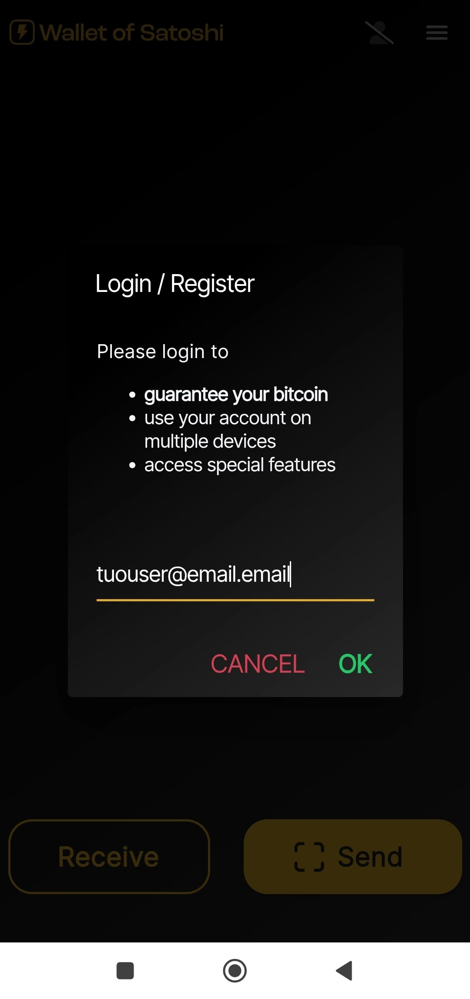
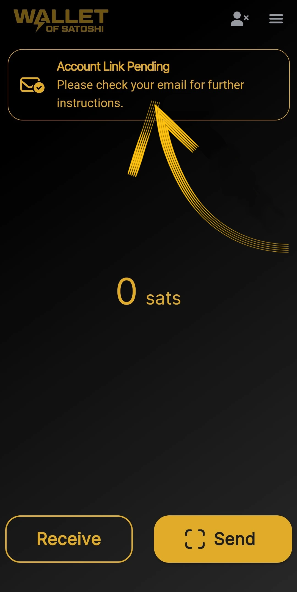

_Este tutorial foi escrito por_ [Bitcoin Campus](https://linktr.ee/bitcoincampus_)

# Descarregar, configurar e utilizar o Wallet do Satoshi

O Wallet do Satoshi é um Wallet Lightning Network, de custódia, muito simples de utilizar.

Para efeitos do curso [BTC105 - Finding Yourself Now] (https://planb.network/it/courses/trovarsi-ora-d1370810-63f6-4aba-b822-e3a66bf225a5), é utilizado para os cupões Redeem Lightning Network.

**Lembrem-se sempre**: _não as vossas chaves, não as vossas moedas_

Wallet de custódia, não permitem aos utilizadores disporem totalmente dos seus fundos. Normalmente, não são recomendados, exceto para quem está a começar do zero. O WoS deve ser utilizado como uma porta de entrada para o Wallet ou para guardar dinheiro de bolso, e não para acumular fundos a longo prazo.

---
O Wallet do Satoshi (WoS) é um produto de custódia, mas tem uma certa reputação. Podemos razoavelmente recorrer a uma ferramenta como o WoS, por exemplo, para aumentar a nossa capacidade de receber liquidez. Delegamos temporariamente ao WoS "o trabalho sujo" de gerir a liquidez do canal para nós. Quando atingirmos um determinado montante, esvaziaremos o WoS On-Chain no nosso Wallet sem custódia.

**ATTENZIONE⚠️: Recomenda-se que leia o tutorial na sua totalidade antes de prosseguir**

## Descarregamento do Wallet do Satoshi

Vamos à loja de jogos e descarregamos o WoS

**Nota:** O WoS só é descarregado a partir das lojas oficiais. Se o sistema operativo do dispositivo estiver programado, é efectuada uma parte de verificação pelo próprio sistema operativo antes de abrir o WoS. Quando a fase de verificação tiver passado, selecione _Abrir_.

O Wallet do Satoshi abre-se com o seguinte ecrã e é necessário clicar em _Start_

## Registar uma conta no WoS

Nesta altura, o Wallet está a funcionar, mas para maior segurança, vamos definir um início de sessão: este será utilizado para recuperar fundos em caso de falha ou perda do dispositivo. Em seguida, selecione o menu no canto superior esquerdo.

Abre-se toda a janela do menu, na qual só precisa de definir a moeda (o Wallet do Satoshi apresenta, por defeito, o dólar americano como moeda de referência) e a cor do tema (claro/escuro), consoante o seu gosto. Não utilize os outros controlos.

Uma vez que o WoS é uma ferramenta de custódia, não podemos fazer cópias de segurança do Wallet com a frase Mnemonic. No entanto, podemos permitir que o WoS recupere os nossos fundos, em caso de perda ou não utilização do dispositivo móvel, clicando em _Login/Register_

Aparece uma janela na qual nos é pedido que introduzamos um e-mail Address. Pode ser **um e-mail Proton** (recomendado), mas funciona, porque é o que nos permitirá recuperar os fundos Wallet, em caso de perda/roubo ou avaria do telemóvel

O Wallet do Satoshi enviou uma mensagem para a caixa de correio eletrónico comunicada

Na caixa de entrada encontramos duas palavras, temos de as introduzir, reescrevendo-as, no espaço que a aplicação nos apresenta

- não ativar o tradutor: as palavras são e devem permanecer em inglês**
- reescrever as duas palavras prestando atenção às maiúsculas e minúsculas**

Depois de transcrever as duas palavras, clique em _OK_

O resultado é que deve aparecer uma figura no topo, com um símbolo de marca de verificação

na secção de definições, a faixa vermelha de _Login/Registo_ apresenta agora o e-mail do utilizador Address.

## Receber pagamentos

Para receber no WoS, clique em _Receive_ e aparece uma série de comandos.

Pode receber

- via LN-Address **a**
- via LN, definição Invoice **b**
- on chain (WoS suporta a rede Bitcoin, mas com trocas submarinas mediante pagamento) **c**
- enquadrar o código QR de um LNurl-p **d**

## Criação do Invoice

Clicar em _Receive_ e escolher o comando com o símbolo Lightning Network

Aparece apenas o menu de criação do Invoice, onde clicamos em _Adicionar montante_ para escrever o montante exato e adicionar uma descrição, neste exemplo "O meu primeiro Invoice"

Utilizando o teclado, definimos o montante

e, em seguida, receber o pagamento do Invoice. O pagamento recebido é apresentado da seguinte forma:

## Recolha no POS

O Wallet do Satoshi tem uma caraterística interessante por defeito, o que o torna especialmente adequado para os comerciantes: POS. Vejamos como activá-lo.

No ecrã principal, selecione o menu no canto superior direito

Depois disso, selecione _Ponto de venda_

Com a versão mais recente do WoS, é necessário selecionar o _Keypad_

e depois digitar o montante no teclado, no exemplo seguinte igual a 18 cêntimos / 118 Sats. Acrescentar uma descrição para a coleção, neste caso "a minha segunda com POS" Um botão grande Green acende-se e é para clicar

para generate o Invoice e mostrá-lo - por exemplo - a um cliente.

Este pagamento também é cobrado!

## Envio de pagamentos

A simplicidade é um ponto forte do ecrã principal do WoS. Para pagar um Invoice, clique em _Enviar_

Na primeira utilização, o WoS pede permissões para aceder à câmara

A partir deste momento, a câmara é activada

Enquadrando o Invoice, vemos que foi pedido um pagamento de 210 Sats. Lê-se também uma descrição, se o requerente a tiver definido. Este ecrã é o resumo e também um pedido de confirmação: O WoS "pede autorização" para enviar o pagamento, que é concedida clicando no botão _Enviar_ do Green

Quando o pagamento chega ao seu destino, o WoS alerta-o com este ecrã

No ecrã principal, clicar em _History_ (logo abaixo do saldo) abre a lista de transacções

### Recuperação de conta WoS

Agora, veremos como instalar o WoS num novo dispositivo; isto também será útil em casos de roubo, perda ou incapacidade de operar o telemóvel no qual o Wallet estava previamente instalado. Uma vez reinstalado, é preciso refazer o procedimento de registo de conta que acabámos de explicar, com uma variação: no final do pedido de login com o e-mail previamente definido, o WoS aparecerá assim:

Uma mensagem alerta-nos para o facto de o procedimento de reativação da conta ter sido enviado por correio eletrónico. É necessário abrir a caixa de correio eletrónico.

**IMPORTANTE**: abrir o e-mail a partir de um PC ou, em todo o caso, de um dispositivo diferente daquele em que vai recuperar a conta WoS. Na caixa de entrada, encontramos uma mensagem que nos mostra um código QR para enquadrar

Assim que o código QR for enquadrado, a conta recuperada aparecerá na página principal do WoS, com o saldo e o historial.