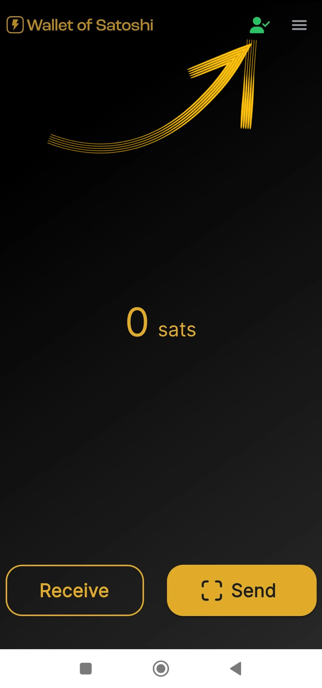
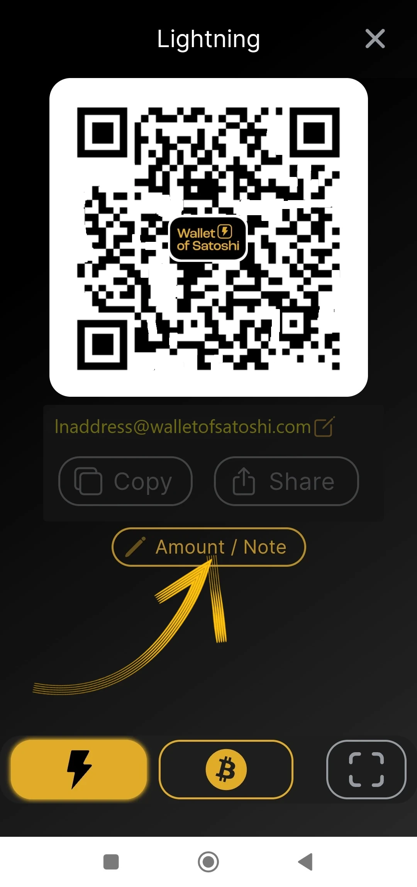
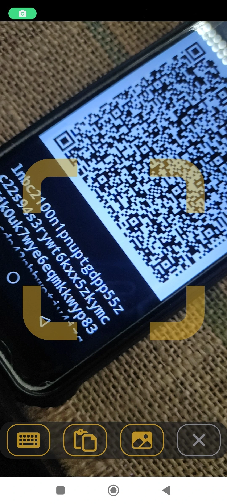

этот учебник написан_ [Bitcoin Campus](https://linktr.ee/bitcoincampus_)

# Загрузите, настройте и используйте Wallet из Satoshi

Wallet из Satoshi - это Wallet Lightning Network, опекаемый, очень простой в использовании.

Для целей курса [BTC105 - Finding Yourself Now](https://planb.network/it/courses/trovarsi-ora-d1370810-63f6-4aba-b822-e3a66bf225a5) он используется для ваучеров Redeem Lightning Network.

**Всегда помните: _не ключи, не монеты_

Wallet custodial, не позволяют пользователям полностью распоряжаться своими средствами. Обычно они не рекомендуются, за исключением тех, кто начинает с нуля. WoS следует использовать в качестве шлюза Wallet или для хранения карманных денег, а не для долгосрочного накопления средств.

---
Wallet of Satoshi (WoS) - это кастодиальный продукт, но он имеет определенную репутацию. Мы можем обоснованно обратиться к такому инструменту, как WoS, например, чтобы увеличить нашу способность получать ликвидность. Мы временно делегируем WoS "грязную работу" по управлению ликвидностью канала за нас. Как только мы достигнем определенной суммы, мы опустошим WoS On-Chain на нашем Wallet, не являющемся хранилищем.

**ATTENZIONE⚠️: Рекомендуется полностью прочитать руководство, прежде чем приступать к работе**

## Загрузка Wallet из Satoshi

Заходим в playstore и скачиваем WoS

**Примечание:** WoS загружается только из официальных магазинов. Если операционная система устройства запрограммирована, то перед открытием WoS пройдет часть верификации самой ОС. После того как этап проверки пройден, выберите _Открыть_.

Wallet из Satoshi откроется на следующем экране, и вам нужно будет нажать на _Start_

## Регистрация учетной записи для WoS

На данный момент Wallet работает, но для дополнительной безопасности давайте зададим логин: он будет использоваться для восстановления средств в случае поломки или потери устройства. Затем выберите меню в левом верхнем углу.

Откроется целое окно меню, в котором вам нужно только установить валюту (в Wallet из Satoshi по умолчанию в качестве базовой валюты представлен доллар США) и цвет темы (светлый/темный), в зависимости от вашего вкуса. Остальные элементы управления не используются.

Поскольку WoS является хранилищем, мы не можем создать резервную копию Wallet с помощью фразы Mnemonic, однако мы можем включить WoS для получения наших средств, в случае потери или неиспользования мобильного устройства, нажав на _Вход/Регистрация_

Появляется окно, в котором нам предлагается ввести email Address. Это может быть **почта "Протона "** (рекомендуется), в любом случае это работает, потому что именно по ней мы сможем восстановить средства Wallet, в случае потери/укражи или поломки мобильного телефона

Wallet из Satoshi отправил сообщение на указанный электронный ящик

В папке "Входящие" мы найдем два слова, которые нужно ввести, переписав их, в то место, которое предлагает нам приложение

- не включайте переводчик: слова должны оставаться на английском**
- перепишите два слова, обращая внимание на верхний/нижний регистр**

После транскрибирования двух слов нажмите _OK_

В результате в верхней части должна появиться цифра с символом галочки для проверки

в разделе настроек в красной полосе _Логин/Регистрация_ теперь отображается email пользователя Address.

## Получение платежей

Для получения на WoS нажмите _Receive_, и появится ряд команд.

Вы можете получить

- через LN-Address **a**
- через LN, настройка Invoice **b**
- on chain (WoS поддерживает сеть Bitcoin, но с возможностью обмена на подводные лодки за отдельную плату) **c**
- кадрирование QR-кода LNurl-p **d**

## Создание Invoice

Нажмите на _Получить_ и выберите команду с символом Lightning Network

Появится меню создания Invoice, где мы нажмем _Add Amount_, чтобы написать точную сумму и добавить описание, в данном примере "My first Invoice"

С помощью клавиатуры мы устанавливаем количество

а затем получить оплату Invoice. Полученный платеж выглядит следующим образом:

## Инкассация из кассового аппарата

Wallet из Satoshi по умолчанию имеет интересную функцию, что делает его особенно подходящим для торговцев: POS. Давайте посмотрим, как ее активировать.

На главном экране выберите меню в правом верхнем углу

После этого выберите _Точка продажи_

В последней версии WoS обратите внимание на выбор _клавиатуры_

а затем введите сумму на клавиатуре, в следующем примере равную 18 центам / 118 Sats. Добавьте описание коллекции, в данном случае "моя вторая с POS" Загорается большая кнопка Green, на которую нужно нажать

для того, чтобы generate Invoice и показать его, например, клиенту.

Этот платеж также взимается!

## Отправка платежей

Простота - сильная сторона главного экрана WoS. Чтобы оплатить Invoice, нажмите на кнопку _Отправить_

При первом использовании WoS запрашивает разрешения на доступ к камере

С этого момента камера активируется

Обрамляя Invoice, мы видим, что запрошен платеж в размере 210 Sats. Также читается описание, если оно было задано просителем. Этот экран - резюме, а также запрос на подтверждение: WoS "запрашивает разрешение" на отправку платежа, которое дается нажатием кнопки Green _Отправить_

Когда платеж прибывает в пункт назначения, WoS оповещает об этом на экране

На экране принсипала, нажав на _Историю_ (чуть ниже баланса), вы увидите список транзакций

### Восстановление учетной записи WoS

Теперь мы рассмотрим, как установить WoS на новое устройство; это также будет полезно в случае кражи, потери или невозможности работать с мобильным телефоном, на котором Wallet был установлен ранее. После переустановки необходимо повторить только что описанную процедуру регистрации аккаунта, с одной лишь вариацией: в конце запроса на вход с ранее установленной электронной почтой WoS будет выглядеть следующим образом:

Сообщение о том, что процедура повторной активации учетной записи была отправлена по электронной почте. Необходимо открыть свой почтовый ящик.

** ВАЖНО**: открывайте письмо с компьютера или, во всяком случае, с устройства, отличного от того, на котором вы собираетесь получить аккаунт WoS. В папке "Входящие" мы находим сообщение, в котором указан QR-код, который нужно вставить в рамку

После того как QR-код будет вставлен в рамку, восстановленный счет появится на главной странице WoS с балансом и историей.