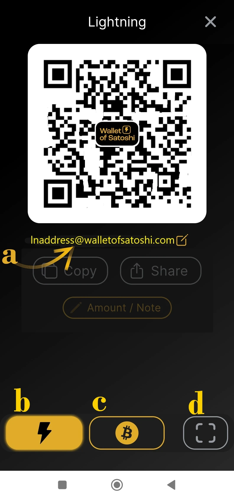

_Bài hướng dẫn này được viết bởi_ [Bitcoin Campus](https://linktr.ee/bitcoincampus_)

# Tải xuống, cấu hình và sử dụng Wallet của Satoshi

Wallet của Satoshi là Wallet Lightning Network, bảo vệ, rất dễ sử dụng.

Đối với mục đích của khóa học [BTC105 - Tìm thấy chính mình ngay bây giờ](https://planb.network/it/courses/trovarsi-ora-d1370810-63f6-4aba-b822-e3a66bf225a5), nó được sử dụng để cấp chứng từ Redeem Lightning Network.

**luôn nhớ**: _không phải chìa khóa, không phải tiền xu của bạn_

Wallet custodial, không cho phép người dùng xử lý toàn bộ tiền của họ. Thông thường, chúng không được khuyến khích, ngoại trừ những người bắt đầu từ con số 0. WoS nên được sử dụng như một cổng Wallet hoặc để lưu trữ tiền tiêu vặt, không phải để tích lũy tiền cho mục đích dài hạn.

---
Wallet của Satoshi (WoS) là một sản phẩm lưu ký, nhưng nó có một danh tiếng nhất định. Chúng ta có thể hợp lý chuyển sang một công cụ như WoS, ví dụ, để tăng khả năng tiếp nhận thanh khoản của mình. Chúng tôi tạm thời giao cho WoS "công việc bẩn thỉu" là quản lý thanh khoản kênh cho chúng tôi. Khi đạt đến một số tiền nhất định, chúng tôi sẽ làm rỗng WoS On-Chain trên Wallet không lưu ký của mình.

**LƯU Ý⚠️: Bạn nên đọc toàn bộ hướng dẫn trước khi tiếp tục**

## Đang tải xuống Wallet của Satoshi

Chúng ta hãy vào playstore và tải WoS nhé

**Lưu ý:** WoS chỉ được tải xuống từ các cửa hàng chính thức. Nếu hệ điều hành thiết bị được lập trình, một phần xác minh của chính hệ điều hành sẽ diễn ra trước khi mở WoS. Sau khi giai đoạn xác minh đã qua, hãy chọn _Mở_.

Wallet của Satoshi mở ra với màn hình sau và bạn cần nhấp vào _Bắt đầu_

## Đăng ký tài khoản WoS

Lúc này Wallet đã hoạt động, nhưng để tăng cường bảo mật, hãy thiết lập thông tin đăng nhập: thông tin này sẽ được sử dụng để khôi phục tiền trong trường hợp thiết bị bị hỏng hoặc mất. Sau đó, chọn menu ở góc trên bên trái.

Toàn bộ cửa sổ menu mở ra, trong đó bạn chỉ cần thiết lập loại tiền tệ (Wallet của Satoshi theo mặc định sẽ hiển thị đô la Mỹ làm loại tiền tệ tham chiếu) và màu chủ đề (sáng/tối), tùy theo sở thích của bạn. Không sử dụng các điều khiển khác.

Vì WoS là một công cụ lưu ký, chúng tôi không thể sao lưu Wallet bằng cụm từ Mnemonic, tuy nhiên, chúng tôi có thể cho phép WoS lấy lại tiền của mình trong trường hợp thiết bị di động bị mất hoặc không sử dụng bằng cách nhấp vào _Đăng nhập/Đăng ký_

Một cửa sổ xuất hiện trong đó chúng ta được yêu cầu nhập email Address. Có thể là **email Proton** (khuyến nghị), tuy nhiên nó vẫn hoạt động, vì đó là email cho phép chúng ta khôi phục lại tiền Wallet, trong trường hợp điện thoại di động bị mất/bị đánh cắp hoặc bị hỏng

Wallet của Satoshi đã gửi tin nhắn đến hộp thư điện tử được báo cáo

Trong hộp thư đến, chúng ta sẽ tìm thấy hai từ, chúng ta phải nhập chúng, viết lại chúng, vào không gian mà ứng dụng hiển thị cho chúng ta

- không kích hoạt trình dịch: các từ là và nên giữ nguyên bằng tiếng Anh**
- viết lại hai từ chú ý đến chữ hoa/thường**

Sau khi chép xong hai từ, hãy nhấp vào _OK_

Kết quả là một hình ảnh sẽ xuất hiện ở trên cùng, với biểu tượng dấu kiểm để xác minh

trong khi ở phần cài đặt, dải màu đỏ _Đăng nhập/Đăng ký_ hiện hiển thị email Address của người dùng.

## Nhận thanh toán

Để nhận trên WoS, hãy nhấp vào _Nhận_ và một loạt lệnh sẽ xuất hiện.

Bạn có thể nhận được

- qua LN-Address **a**
- qua LN, thiết lập Invoice **b**
- on chain (WoS hỗ trợ mạng Bitcoin nhưng có trao đổi tàu ngầm với một khoản phí) **c**
- đóng khung mã QR của LNurl-p **d**

## Sáng tạo Invoice

Nhấp vào _Receive_ và chọn lệnh có biểu tượng Lightning Network

Chỉ xuất hiện menu tạo Invoice, tại đây chúng ta nhấp vào _Thêm số tiền_ để ghi số tiền chính xác và thêm mô tả, trong ví dụ này là "Invoice đầu tiên của tôi".

Sử dụng bàn phím chúng ta thiết lập số lượng

và sau đó nhận được Invoice đã thanh toán. Thanh toán nhận được sẽ như thế này:

## Thu thập từ POS

Wallet của Satoshi có một tính năng thú vị theo mặc định, khiến nó đặc biệt phù hợp với các thương gia: POS. Hãy cùng xem cách kích hoạt nó.

Từ màn hình chính, chọn menu ở góc trên bên phải

Sau đó, chọn _Điểm bán hàng_

Với bản phát hành mới nhất của WoS, hãy chú ý chọn _Bàn phím_

và sau đó nhập số tiền trên bàn phím, trong ví dụ sau bằng 18 xu / 118 Sats. Thêm mô tả cho bộ sưu tập, trong trường hợp này là "thứ hai của tôi với POS". Một nút Green lớn sáng lên và nhấp vào

để generate Invoice và hiển thị nó cho khách hàng chẳng hạn.

Khoản thanh toán này cũng đã được thu!

## Gửi thanh toán

Sự đơn giản là điểm mạnh của màn hình chính WoS. Để thanh toán cho Invoice, hãy nhấp vào _Gửi_

Khi sử dụng lần đầu, WoS sẽ yêu cầu cấp quyền truy cập vào camera

Từ thời điểm này, máy ảnh được kích hoạt

Đóng khung Invoice, chúng ta thấy rằng một khoản thanh toán 210 Sats đã được yêu cầu. Nó cũng đọc một mô tả, nếu người yêu cầu đã thiết lập một mô tả. Màn hình này là bản tóm tắt và cũng là một yêu cầu xác nhận: WoS "yêu cầu cấp phép" để gửi khoản thanh toán, được cấp bằng cách nhấp vào nút Green _Gửi_

Khi khoản thanh toán đến đích, WoS sẽ cảnh báo bằng màn hình này

Từ màn hình chính, nhấp vào _Lịch sử_ (ngay bên dưới số dư) sẽ hiển thị danh sách các giao dịch

### Phục hồi tài khoản WoS

Bây giờ, chúng ta sẽ xem cách cài đặt WoS trên thiết bị mới; điều này cũng hữu ích trong trường hợp bị mất, mất mát hoặc không thể sử dụng điện thoại di động đã cài đặt Wallet trước đó. Sau khi cài đặt lại, bạn phải làm lại quy trình đăng ký tài khoản vừa giải thích, với một thay đổi: ở cuối yêu cầu đăng nhập bằng email đã thiết lập trước đó, WoS sẽ xuất hiện như thế này:

Một thông báo cảnh báo chúng tôi rằng quy trình kích hoạt lại tài khoản đã được gửi qua email. Người ta phải mở hộp thư của mình.

**QUAN TRỌNG**: mở email từ PC hoặc, ít nhất là từ một thiết bị khác ngoài thiết bị mà bạn sẽ lấy lại tài khoản WoS. Trong hộp thư đến, chúng tôi tìm thấy một tin nhắn hiển thị mã QR để đóng khung

Sau khi mã QR được đóng khung, tài khoản đã lấy sẽ xuất hiện trên trang chính của WoS, cùng với số dư và lịch sử.