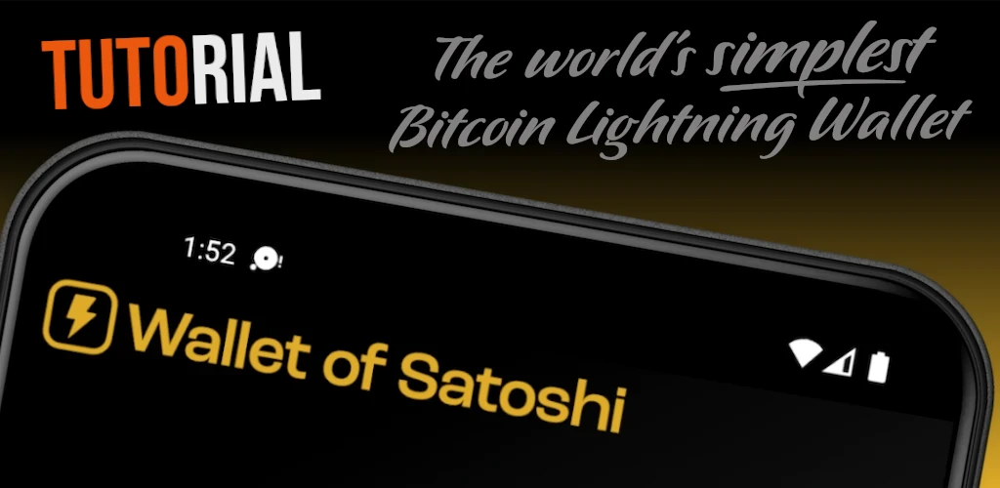
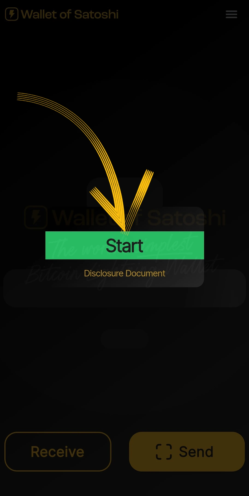
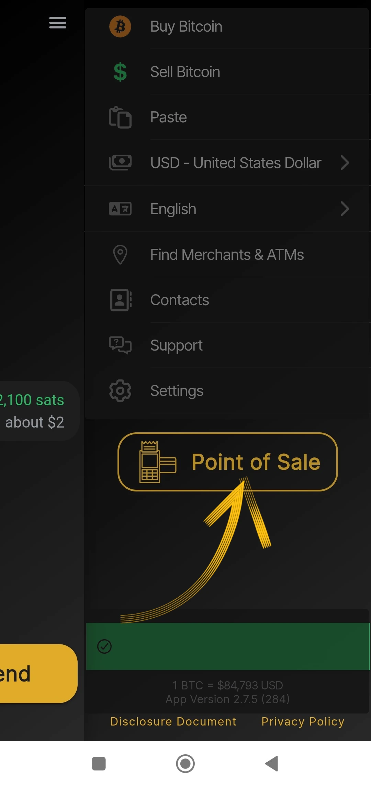
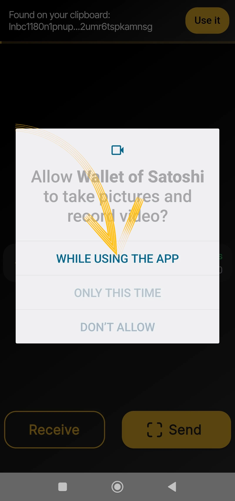

_本教程由_ [Bitcoin 校园](https://linktr.ee/bitcoincampus_) 编写

# 下载、配置和使用 Satoshi 的 Wallet

Satoshi 的 Wallet 是 Wallet Lightning Network，托管型，使用非常简单。

就课程[BTC105 - Finding Yourself Now](https://planb.network/it/courses/trovarsi-ora-d1370810-63f6-4aba-b822-e3a66bf225a5)而言，它用于 Redeem Lightning Network 凭证。

**永远记住不要钥匙，不要硬币

Wallet 托管型，不允许用户完全处置其资金。通常情况下，除了那些白手起家的人之外，我们不建议使用它们。WoS 应被用作 Wallet 网关或存储零花钱，而不是长期积累资金。

---
Wallet of Satoshi（WoS）是一种托管产品，但它有一定的声誉。例如，我们可以合理地求助于 WoS 这样的工具来提高我们接收流动性的能力。我们暂时将管理渠道流动性的 "脏活 "委托给 WoS。一旦达到一定数量，我们将清空 WoS On-Chain 上的 Wallet 非托管。

**ATTENZIONE⚠️：建议您在继续学习之前阅读整个教程**

## 下载 Satoshi 的 Wallet

让我们去 playstore 下载 WoS 吧

**注意：** WoS 只能从官方商店下载。如果设备操作系统已编程，则在打开 WoS 之前，操作系统本身会进行验证。验证阶段结束后，请选择_Open_（打开）。

Satoshi 的 Wallet 会打开以下界面，您需要点击_Start_（开始）。

## 注册 WoS 账户

此时，Wallet 已经启动并运行，但为了提高安全性，我们还是要设置一个登录名：这将用于在设备故障或丢失时恢复资金。然后选择左上角的菜单。

整个菜单窗口将打开，您只需根据自己的喜好设置货币（Satoshi 的 Wallet 默认将美元作为参考货币）和主题颜色（浅色/深色）。请勿使用其他控件。

由于 WoS 是一种保管工具，我们无法用 Mnemonic 短语备份 Wallet，但我们可以在移动设备丢失或未使用的情况下，通过点击_登录/注册_启用 WoS 来找回我们的资金。

出现一个窗口，要求我们输入 Address 电子邮件。可以是**质子邮箱**（推荐），无论如何都可以，因为在手机丢失/被盗或损坏的情况下，该邮箱将允许我们找回 Wallet 资金。

Satoshi 的 Wallet 向报告的电子邮件信箱发送了一条信息

在收件箱中，我们会发现两个单词，我们必须在应用程序显示的空白处输入这两个单词，并对其进行改写

- 不要启动翻译器：这些词语仍是英语**
- 重写这两个词，注意大小写**

抄写完这两个单词后，点击_OK_（确定

其结果是，顶部应出现一个数字，并带有一个复选标记符号，用于验证

而在设置部分，_Login/Register_（登录/注册）的红色条带现在会显示用户的电子邮件 Address。

## 接收付款

要在 WoS 上进行接收，请单击_Receive_（接收），然后会出现一系列命令。

您可以收到

- 经由 LN-Address **a**
- 通过 LN，设置 Invoice **b**
- on chain（WoS 支持 Bitcoin 网络，但需要付费进行海底交换） **c**
- 裱糊 LNurl-p 的二维码 **d**

## 创建 Invoice

单击_Receive_（接收），然后选择带有 Lightning Network 符号的命令

只需出现 Invoice 创建菜单，点击 _Add Amount_（添加金额），即可写入准确金额并添加说明，在本例中为 "我的第一个 Invoice"。

使用键盘设置

然后获得 Invoice 付款。收到的付款是这样的

## 从 POS 收款

Satoshi 的 Wallet 默认具有一个有趣的功能，特别适合商家使用：POS。让我们看看如何激活它。

从主屏幕选择右上角的菜单

然后，选择_销售点_。

使用最新版 WoS 时，请注意选择_Keypad__________________________________。

然后在键盘上键入金额，在下面的例子中等于 18 美分/118 Sats。为收款添加说明，在本例中为 "我第二次使用 POS 机"。一个大的 Green 按钮亮起，点击

以 generate Invoice 并向客户展示（例如）。

这笔款项也是收取的！

## 发送付款

简洁是 WoS 主屏幕的优势。要支付 Invoice 的费用，请点击_发送_。

首次使用时，WoS 会询问访问摄像机的权限

从这一刻起，摄像机被激活

通过 Invoice 框架，我们可以看到 210 Sats 的付款请求。如果申请者设置了说明，它还会读取说明。该屏幕是摘要，也是确认请求：WoS "请求许可 "发送付款，点击 Green _Send_ 按钮即可获得许可。

当付款到达目的地时，WoS 会通过以下屏幕发出警报

在主屏幕上，点击_历史记录_（就在余额下方），会弹出交易列表

### 恢复 WoS 账户

现在，我们来看看如何在新设备上安装 WoS；这在手机被盗、丢失或无法操作之前安装有 Wallet 的手机时也很有用。重新安装后，您必须重新执行刚才介绍的账户注册程序，但有一点不同：在使用之前设置的电子邮件登录请求的最后，WoS 将显示如下内容：

一条信息提醒我们，重新激活账户的程序已通过电子邮件发送。我们必须打开邮箱。

**重要**：从个人电脑上打开邮件，或者无论如何，从一台设备上打开邮件，而不是从一台要检索 WoS 账户的设备上打开邮件。在收件箱中，我们会发现一封邮件，邮件中显示了一个二维码，我们可以将其装入框架中

一旦二维码被框住，找回的账户就会出现在 WoS 主页上，并显示余额和历史记录。